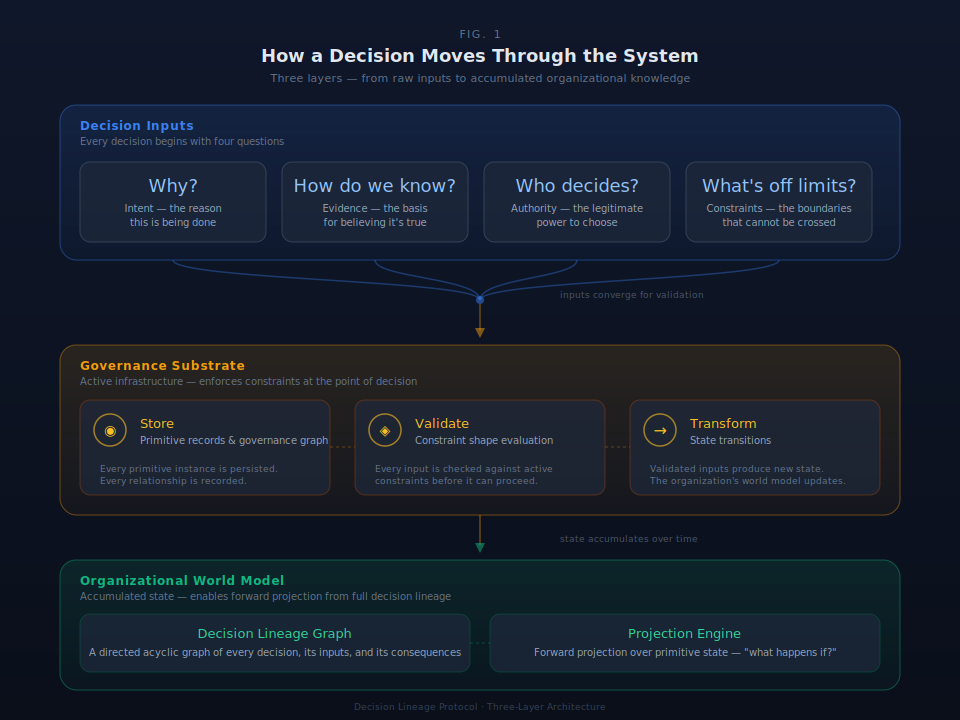

# §1 Problem Architecture

This section establishes the foundational problem that DLP addresses: organizations produce decisions but do not capture the reasoning, authority, evidence, and constraints that produced them. Three independent empirical research programs validate this failure from different directions. The Conant-Ashby theorem and Ashby's Law of Requisite Variety establish why the failure is structural and what infrastructure is required to correct it.

```
                        DECISION LINEAGE PROTOCOL

    ┌───────────────────────────────────────────────────┐
    │                                                   │
    │   DECISIONS                                       │
    │   Intent + Evidence + Authority + Constraints     │
    │                                                   │
    └──────────────────────┬────────────────────────────┘
                           │
                           ▼
    ┌───────────────────────────────────────────────────┐
    │                                                   │
    │   SUBSTRATE                                       │
    │   State(t) → [Trigger + Action] → State(t+1)     │
    │                                                   │
    │   Nine primitives provide governance context      │
    │   Truth types classify epistemic status            │
    │   Behavioral invariants enforce integrity          │
    │                                                   │
    └──────────────────────┬────────────────────────────┘
                           │
                           ▼
    ┌───────────────────────────────────────────────────┐
    │                                                   │
    │   ORGANIZATIONAL WORLD MODEL                      │
    │   Accumulated state transformations with lineage  │
    │   Queryable decision history                      │
    │   Deviation measurement against intent             │
    │   Forward projection over primitive state          │
    │                                                   │
    └───────────────────────────────────────────────────┘
```

*Figure 1.1: Architecture shape. Decisions enter the substrate with primitive context — intent, evidence, authority, constraints. The substrate records each decision as a state transformation with full lineage. The accumulated record becomes the organizational world model: a queryable representation of who decided what, based on what evidence, under what authority, subject to what constraints, and how outcomes compared to intent.*



### §1.1 Problem Definition and Infrastructure Gap

The Decision Lineage Protocol exists to address a structural infrastructure failure: organizations lack mechanisms to capture decision reasoning at the moment of action. This gap produces three cascading failures:

1. **Rationality amnesia**: The reasoning, evidence, alternatives, and constraints that produced a decision cannot be recovered after the fact. Post-hoc reconstruction depends on participant memory, which is systematically unreliable. Organizations cannot accurately explain their own decisions.

2. **Authority obscurity**: Decisions occur without clear recording of who had the authority to decide. Approval workflows record that someone signed; they do not record whether that person had delegated authority to decide on that issue under those constraints.

3. **Accountability vacuity**: Audit trails show what happened; they do not show the reasoning that produced it. Compliance checking verifies that steps were completed, not that steps were grounded in adequate evidence and exercised within proper authority bounds.

The substrate addresses this infrastructure gap by requiring prospective capture — the substrate is present at the moment of decision, recording intent, evidence, authority, and constraints as the decision occurs, not after it.

### §1.2 Three-Program Empirical Convergence

#### §1.2.1 Organizational Bullshit Perception Scale (Ferreira et al. 2022)

The OBPS identifies three independent, empirically validated dimensions of organizational truth-indifference:

- **Regard for truth**: Organizations produce statements without systematic grounding in evidence. Impressive language substitutes for substantiated claims. The substrate responds by making Evidence (§4) a primitive that every decision must engage with, classified by truth type (§6).

- **The Boss**: Hierarchical authority substitutes for truth. The source of a statement replaces verification as the criterion for acceptance. The substrate responds by making Authority (§4) explicit and traceable through delegation chains, making authority visible and reviewable.

- **Bullshit language**: Organizational vocabulary serves impression management rather than clear communication. Jargon obscures meaning. The substrate responds by deliberately bounding the governance vocabulary to nine named primitives: Intent, Commitment, Capacity, Work, Evidence, Decision, Authority, Account, Constraint — each with defined composition rules, resistant to abstraction drift.

#### §1.2.2 Botshit: AI Amplifying Truth-Indifference (McCarthy et al. 2024)

McCarthy et al. identify a specific organizational failure: humans uncritically propagate AI-generated content into decision streams without systematic verification. The distinction from AI hallucination is organizational, not technical: the human adds credibility (their authority, their organizational role) to content they have not independently verified. The AI's truth-indifference is laundered through human authority.

The substrate response is architectural asymmetry: all AI-generated content enters as Derived (§6, truth type) — marked as machine-inference — and requires explicit human promotion to Declared or Authoritative status. No architectural path exists for AI output to bypass human epistemic judgment and enter as Authoritative. The substrate distinguishes Derived (machine inference) from Declared (human assertion) from Authoritative (verified fact), making the epistemic status of every decision input visible.

#### §1.2.3 Corporate Bullshit Receptivity (Littrell 2025)

Littrell's CBSR breaks the assumption that "human-in-the-loop" provides a structural governance guarantee. Individual humans vary measurably in their ability to detect corporate bullshit. High-CBSR individuals do not filter truth-indifference; they amplify it. The implication: governance structures cannot depend on the capacity of particular humans to detect falsehood.

The substrate response: structural requirements independent of individual cognitive tendencies. Behavioral invariants (§5) impose the same evidence declaration, authority tracing, and constraint identification regardless of the actor's BS receptivity. B8 ensures that governance signals route to an authority on the governance chain (someone with responsibility), not to the nearest available human. The governance structure does not depend on any individual's capacity to detect truth-indifference.

### §1.3 Cybernetic Derivation: Conant-Ashby and Ashby's Law

#### §1.3.1 The Conant-Ashby Theorem

Conant and Ashby (1970) proved that every good regulator of a system must contain a model of that system. This is a mathematical theorem, not a design recommendation. A regulatory system without a model of the system it regulates cannot achieve effective control because its responses will not be informed by the actual state of the regulated system.

Applied to organizations: organizations are self-regulating systems making decisions about resource allocation, strategy, personnel, and risk. Effective organizational regulation requires a model of organizational decision state — who decided what, based on what evidence, under what constraints, with what authority, and how outcomes compared to intent. Most organizations lack this integrated model. They have fragments (financial systems, CRM, project management) but no unified representation of organizational decision state.

#### §1.3.2 Ashby's Law of Requisite Variety

Ashby's Law: V(R) ≥ V(D). The variety of the regulator must equal or exceed the variety of the disturbances it faces. Applied to organizational governance: the governance infrastructure must have enough independent dimensions to represent the variety of decisions the organization makes.

Current governance infrastructure is dimensionally sparse:
- **Compliance checklists**: Single dimension (step completed/not completed). Does not capture evidence quality, authority verification, or constraint satisfaction.
- **Approval workflows**: Two dimensions (who signed, what they signed). Does not capture authority legitimacy, decision context, or evidence basis.
- **Audit trails**: Sequence of actions. Does not capture rationale, authority chain, or constraint engagement.

The nine DLP primitives (Intent, Commitment, Capacity, Work, Evidence, Decision, Authority, Account, Constraint) provide the irreducible minimum governance variety. Nine independent dimensions, each answering a governance question no other primitive addresses. Removal testing (§4.2) confirms that losing any primitive creates an unrepresentable decision context. The variety gap closes through nine-dimensional governance, not through better training or more oversight.

### §1.4 The DLP Response: Substrate as Infrastructure

The substrate does not address truth-indifference through cultural change, training programs, or AI detection tools. It makes truth-indifference structurally expensive by requiring every decision to engage with evidence, authority, and constraints at the moment of action.

The mechanism is analogous to double-entry bookkeeping. Double-entry does not prevent financial fraud. It makes fraud structurally expensive by requiring every transaction to balance across two accounts — creating a structural engagement with financial reality at every entry point. The substrate creates the same structural engagement with decision reality: every state transformation must declare its evidence, trace its authority, identify its constraints, and link to the account context against which it is evaluated. You can still make a bad decision. You cannot make an invisible one.

| Empirical Failure | Substrate Mechanism |
|---|---|
| **Truth-indifference** (Frankfurt; Ferreira F1) | Evidence primitive + truth type system (§6). Every decision declares its evidentiary basis as Authoritative, Declared, or Derived. The decision-maker must declare their relationship to evidence — truth-indifferent state transformations cannot pass through the substrate without that declaration. |
| **Authority substitutes for truth** (Ferreira F2) | Authority primitive + behavioral invariant B5 (§5). Every decision traces to its authorization source through a delegation chain terminating at a root authority. "The boss said so" is visible as a Declared evidence type — recorded and auditable, but not Authoritative until independently substantiated. |
| **Jargon obscures** (Ferreira F3) | Nine primitives in organizational language. The governance vocabulary is deliberately small, concrete, and semantically bounded (§4). Each primitive answers one governance question. The vocabulary resists abstraction drift because the primitive set is closed and irreducible. |
| **AI amplifies truth-indifference** (McCarthy) | Truth type system (§6): all AI-generated content enters as Derived and requires explicit human promotion to Declared or Authoritative. No architectural path exists for AI output to bypass staging. The substrate captures structured context at decision time rather than retrieving unstructured content from contaminated archives. |
| **Variable human reliability** (Littrell) | Structural requirements independent of individual cognitive tendencies. The substrate imposes the same evidence declaration, authority tracing, and constraint identification regardless of the actor's BS receptivity. Behavioral invariant B8 (§5) ensures that governance signals — deviation alerts, constraint violations, flagged anomalies — route to an authority on the governance chain, not to the nearest available human. The structure does not depend on any individual's capacity to detect truth-indifference. |

*Table 1.4.1: Empirical failure → substrate mechanism. Each independently validated organizational failure maps to a specific infrastructure response.*

The remainder of this document specifies the mechanism. §4 defines the nine irreducible primitives and their composition mechanics. §5 specifies the ten behavioral invariants that constrain valid state transformations. §6 formalizes the truth type system that classifies the epistemic status of every governed object. §7 defines the Minimum Viable Record — what must be captured for each primitive instance to be auditable. Together, they constitute the decision infrastructure that the empirical evidence shows does not exist and that the cybernetic diagnosis shows must.

The architecture is not a compliance tool. It is a world model — an infrastructure for organizational self-knowledge. §3 specifies the world model architecture. §8 formalizes the control-theoretic derivation that connects the problem identified here to the mechanism specified there.

## Scope

This section establishes the problem and empirical grounding. It does NOT specify: the substrate mechanism (§4–§7), the world model architecture (§3 and §8), the behavioral invariants that enforce the mechanism (§5), or implementation details (§26+). The diagnosis of truth-indifference is research-grounded; the response is architecturally specified in subsequent sections.

## Locked Design Positions

**Locked.** Problem diagnosis grounded in three independent empirical programs. Cybernetic derivation from Conant-Ashby and Ashby's Law. Infrastructure response: nine primitives as requisite variety claim. All substrate mechanisms map empirical failures to specific infrastructure responses.

## Implementation Requirements

SDK implementations MUST implement all nine primitives (Intent, Commitment, Capacity, Work, Evidence, Decision, Authority, Account, Constraint). SDK implementations MUST enforce the behavioral invariants (§5) that constrain primitive relationships. SDK implementations MUST classify evidence by truth type (§6).
