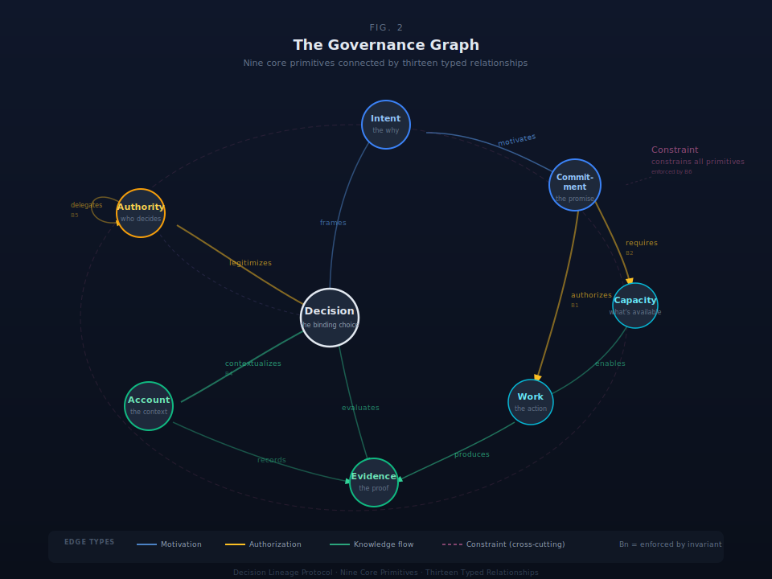
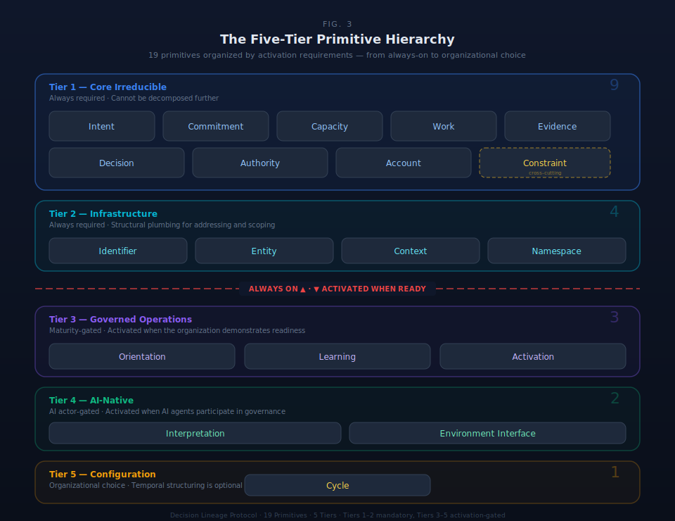

# §4 The Irreducible Primitives

The Decision Lineage Protocol rests on nineteen primitives organized into five tiers. The nine Tier 1 primitives are irreducible: each answers a governance question that no other primitive addresses. The remaining ten provide infrastructure, operational sophistication, AI-native capability, and temporal configuration. Together, the nineteen primitives constitute the complete governance grammar. This section defines all nineteen primitives, demonstrates the irreducibility of the core nine, specifies how primitives compose, and formalizes the five-tier hierarchy.

### §4.1 The Nine Core Primitives

#### Table 4.1.1: Core Primitive Summary

| Primitive | Definition | Governance Question |
|-----------|-----------|-------------------|
| **Intent** | The expressed objective that motivates governance action | Why is this being done? |
| **Commitment** | The formal acceptance of responsibility toward an objective | Who agreed to do what, and when? |
| **Capacity** | The verified resources available to execute work | Can we actually do this? |
| **Work** | An executable unit with defined inputs, process, and outputs | What transforms inputs to outputs? |
| **Evidence** | A data artifact that supports, refutes, or contextualizes a governance claim | How do we know? |
| **Decision** | The choice point where options are evaluated and one is selected | Which path, and on what basis? |
| **Authority** | The delegated right to make binding decisions within a defined scope | Who is allowed to decide this? |
| **Account** | The persistent record of governance state — who committed to what, when, and with what outcome | What is the current state, and how did we get here? |
| **Constraint** | A rule that applies universally, regardless of who invokes it | Is this permitted? |

#### Intent

Intent captures the expressed desire or objective that motivates a decision or action. It is the "why" behind governance — without it, decisions and commitments exist but cannot be traced to purpose.

*Semantic boundary:* Intent specifies direction; Commitment accepts responsibility for pursuing it. An intent can exist without anyone committing to it. Multiple intents can motivate the same commitment, and a single intent can motivate commitments across organizational boundaries.

#### Commitment

Commitment is the formal acceptance of responsibility to complete work toward an objective. It creates the binding relationship between an actor and an outcome.

*Semantic boundary:* Commitment is acceptance of responsibility; Capacity is the ability to fulfill that responsibility. A commitment without verified capacity is an impossible promise — the behavioral invariant B2 (§5) prevents this structurally. Commitment is also distinct from Work: committing to an outcome does not yet mean executing toward it.

#### Capacity

Capacity represents the verified resources — time, skill, budget, authority scope — available to execute work. It answers the feasibility question that commitment alone cannot.

*Semantic boundary:* Capacity is the ability to act; Authority is the right to act. An actor can have capacity (skills, time) without authority (permission), and vice versa. Capacity is also distinct from Work: capacity is what makes work feasible, not the work itself.

#### Work

Work is the executable unit with defined inputs, process, and outputs. It is the locus of transformation — where capacity is consumed and evidence is produced.

*Semantic boundary:* Work is execution; Decision is selection. Work produces evidence; Decision evaluates it. Every work item must trace to a commitment (B1), ensuring no shadow work exists outside the governance perimeter.

#### Evidence

Evidence is a data artifact that supports, refutes, or contextualizes a governance claim. Every evidence artifact carries an epistemic classification — its truth type (§6) — distinguishing Authoritative evidence (human-verified, immutable), Declared evidence (human-asserted, attestation-backed), Derived evidence (machine-generated, requires promotion), and Opaque evidence (boundary-enforced, structurally uninspectable — §6.1). The behavioral invariant B3 (§5) enforces this classification on every instance.

*Semantic boundary:* Evidence is the artifact; the Truth Type System (§6) classifies its epistemic status. Evidence is also distinct from Account: evidence is a datum that supports or refutes; an account is the persistent record of state that contextualizes decisions.

#### Decision

Decision is the choice point where multiple options are evaluated and one is selected. It is the atomic governance act — the moment where evidence, authority, and intent converge into a binding selection.

*Semantic boundary:* Decision is the selection act; Authority is the right to make that selection. A decision without authority is illegitimate. A decision without an account context is unverifiable — B4 (§5) prevents this. Decision is also distinct from Intent: intent frames what to pursue; decision determines how to pursue it.

#### Authority

Authority is the delegated right to make binding decisions within a defined scope. Every authority instance either is a root authority (e.g., a board of directors) or traces through a delegation chain to one (B5).

*Semantic boundary:* Authority is the right to decide; Capacity is the ability to execute. Authority can be delegated through chains of arbitrary depth — the protocol enforces chain integrity (B5), not chain length. Profiles (§21) may configure warnings at unusual delegation depth for their organizational context, but no protocol-level depth limit exists.

#### Account

Account is the persistent record of governance state: who committed to what, when, and with what outcome. It provides the state context against which decisions are evaluated and from which audit trails are constructed.

*Semantic boundary:* Account is the state record; Evidence is a data artifact within it. Account provides the historical and current context that makes decisions verifiable — B4 (§5) requires every decision to link to an account. Account is not merely a log — it is the substrate's representation of organizational state.

#### Constraint

Constraint expresses rules that apply universally, regardless of who invokes them. Compliance requirements, physical laws, organizational policies, and regulatory mandates are all Constraints. Unlike Authority, which differentiates between actors, Constraint binds all actors equally.

Constraints are implemented as SHACL shapes in a dedicated shapes graph, separate from the class ontology. The shapes graph operates under the Closed World Assumption: what is not explicitly permitted is prohibited. At runtime, the shapes graph validates primitive instances against constraint definitions, and violations produce Evidence records (validation reports with truth type Authoritative). This separation enables profile layering — different substrate profiles (§21) apply different constraint sets to the same primitive classes without modifying class definitions. Each constraint specifies an enforcement mode: Blocking (prevents the operation), Warning (allows but alerts), Logging (records silently), or Advisory (suggests alternatives).

*Semantic boundary:* Constraint is the rule; Authority is the right. Constraint answers "is this permitted regardless of who is asking?" — Authority answers "who is allowed to decide?" A constraint applies to all actors uniformly; an authority delegation applies to specific actors within specific scopes.

### §4.2 Irreducibility

The nine core primitives were validated through the Concept Stress Testing Protocol using three attack vectors.

**Removal test.** Each primitive is individually necessary. Removing Intent eliminates the ability to capture purpose. Removing Commitment breaks the responsibility chain. Removing Capacity makes feasibility unverifiable. Removing Work eliminates the transformation record. Removing Evidence removes the epistemic basis for claims. Removing Decision eliminates the choice record. Removing Authority makes legitimacy unverifiable. Removing Account destroys the state record. Removing Constraint leaves universal rules without enforcement.

**Merger test.** No viable mergers exist among the nine. Each primitive occupies an orthogonal semantic position: Intent and Commitment cannot merge (aspiration vs. responsibility), Authority and Capacity cannot merge (right vs. ability), Work and Decision cannot merge (execution vs. selection), Evidence and Account cannot merge (datum vs. state record).

**Sufficiency test.** The original eight primitives left one governance question unanswered: "Is this permitted regardless of who is asking?" This universal-rules gap was filled by Constraint as the ninth primitive. No additional gaps have been identified, including the evaluation of Communication Acts as a potential tenth — Communication Acts resolve as a composition pattern over existing primitives, not an independent governance question.

### §4.3 Composition Mechanics

Primitives compose through directed relationships forming a governance graph — not a linear pipeline. The pedagogical simplification "Intent drives Commitment, which requires Capacity, which enables Work, which produces Evidence, which informs Decision, which Authority legitimizes, which Account records, all bound by Constraint" obscures three structural properties of the actual composition.

**Multiple entry points.** Governance does not always begin with Intent. An external Constraint activation (a new regulation) can trigger governance action without anyone first forming an intent. An Authority delegation can restructure decision rights without a preceding commitment. An Evidence artifact (an audit finding) can force decisions without a motivating intent. The graph has nine potential entry points, not one.

**Many-to-many connections.** A single Decision evaluates Evidence from multiple Work streams, each authorized by different Commitments backed by different Capacity allocations. A single Intent can motivate Commitments across organizational boundaries. Multiple Authorities can co-legitimize a Decision (dual authorization). The cross-primitive relationship table (§4.4) specifies the full cardinality structure.

**Constraint orthogonality.** Constraint does not occupy a position in the graph — it overlays the entire graph. Any primitive instance can be a constraint target (B6). Constraints bind universally, cutting across the motivational, executional, and evaluative dimensions of governance simultaneously.

The composition graph is queryable through the dual-language query layer (§28): Cypher (Apache AGE) for graph traversal of lineage chains, SQL for relational aggregation of primitive properties.

### §4.4 Cross-Primitive Relationships

#### Table 4.4.1: Cross-Primitive Relationship Inventory

| Relationship | From | To | Cardinality | Invariant | Description |
|---|---|---|---|---|---|
| motivates | Intent | Commitment | M:M | — | Intents frame the purpose behind commitments |
| frames | Intent | Decision | M:M | — | Intents provide the evaluative context for decisions |
| requires | Commitment | Capacity | 1:M | B2 | Every commitment must be backed by at least one capacity allocation |
| authorizes | Commitment | Work | 1:M | B1 | Every work item traces to exactly one authorizing commitment |
| enables | Capacity | Work | M:M | — | Capacity allocations make work items feasible |
| produces | Work | Evidence | 1:M | — | Work execution generates evidence artifacts |
| evaluates | Decision | Evidence | M:M | — | Decisions weigh evidence; evidence informs multiple decisions |
| contextualizes | Account | Decision | 1:M | B4 | Every decision is recorded within exactly one account context |
| records | Account | Evidence | 1:M | — | Accounts accumulate evidence artifacts over time |
| legitimizes | Authority | Decision | M:M | — | Authority grants the right to make binding decisions |
| delegates | Authority | Authority | 1:M | B5 | Delegation chains must terminate at a root authority |
| governs | Authority | Primitive | 1:M | — | Authority scopes governance over primitive instances |
| constrains | Constraint | Primitive | M:M | B6 | Constraints bind target primitives with a specified enforcement mode |

**Reading this table.** Rows with an invariant reference represent structurally enforced relationships — the substrate validates them on every write operation (§5). Rows without invariant references represent semantically meaningful relationships that the governance model tracks but does not enforce at the primitive level.

**Cardinality notation.** `1:M` means one source instance relates to many target instances. `M:M` means many-to-many. Where an invariant imposes a minimum (e.g., B2 requires ≥1 Capacity per Commitment), the invariant column identifies the enforcement rule.

**Graph, not pipeline.** This table represents a directed graph with thirteen edge types. Intent connects to both Commitment (motivates) and Decision (frames). Authority connects to Decision (legitimizes), Authority (delegates), and Primitive (governs). Account connects to both Decision (contextualizes) and Evidence (records). Constraint connects to every primitive type (constrains). No single traversal order captures the full structure.

### §4.5 Five-Tier Hierarchy

Primitives organize into five tiers of decreasing architectural necessity. The tiering is not a convenience grouping — it reflects a formal hierarchy of dependence: higher-tier primitives exist only because lower tiers create the conditions requiring them.

#### Table 4.5.1: Complete Primitive Inventory

| Tier | Name | Count | Primitives | Necessity Condition |
|---|---|---|---|---|
| **1** | **Irreducible Core** | **9** | Intent, Commitment, Capacity, Work, Evidence, Decision, Authority, Account, Constraint | Always required. Cannot be removed, merged, or derived. |
| **2** | **Unconditional Infrastructure** | **4** | Identifier, Entity, Context, Namespace | Required for any substrate deployment. Tier 1 cannot be instantiated without Tier 2. |
| **3** | **Governed Operation** | **3** | Orientation, Learning, Activation | Conditionally required when governance maturity exceeds basic capture. |
| **4** | **AI-Native Extensions** | **2** | Interpretation, Environment Interface | Required for AI participation in governance. Unnecessary in purely human systems. |
| **5** | **Operational Configuration** | **1** | Cycle | Required for temporal governance legibility across substrates. |

**Total: 19 primitives across 5 tiers.**

#### Table 4.5.2: Tier Boundary Criteria

| Boundary | Discriminating Test | What Changes |
|---|---|---|
| **Tier 1 ↔ Tier 2** | Can this primitive exist without the other? | Tier 1 defines governance semantics. Tier 2 provides deployment mechanics. The concerns are orthogonal: Intent exists conceptually without Identifier, but cannot be *instantiated* without it. |
| **Tier 2 ↔ Tier 3** | Does basic governance require this? | Tiers 1–2 provide complete governance capture and query. Tier 3 adds cognitive sophistication: pre-decisional framing (Orientation), institutional adaptation (Learning), and readiness tracking (Activation). |
| **Tier 3 ↔ Tier 4** | Does this require AI participation? | Tier 3 applies to both human and AI governance actors. Tier 4 exists because AI participates in decision chains and requires formal meaning-resolution (Interpretation) and external system awareness (Environment Interface). |
| **Tier 4 ↔ Tier 5** | Is this structurally required or a temporal legibility choice? | Tier 4 is structurally required when AI participates. Tier 5 (Cycle) provides temporal governance as a first-class queryable primitive rather than leaving implementations to encode periodicity as ad-hoc constraint logic. |

### §4.6 Tier Specifications

#### §4.6.1 Tier 2: Unconditional Infrastructure

Tier 2 primitives provide the deployment mechanics without which Tier 1 cannot be instantiated. Every substrate deployment requires all four.

**Identifier.** The addressing primitive. Every governed object has an Identifier — a unique reference (UUID, URI) providing addressability, version tracking, and cross-reference capability. Without Identifier, primitives exist in semantic space but cannot be referenced, queried, or linked.

**Entity.** The ownership primitive. Every governed object belongs to an Entity — a person, role, system, or organizational unit. Entity supports recursive structure (entities contain entities, following the recursion principle) and maps to legal personality where applicable. Without Entity, primitives cannot be attributed to organizational actors.

**Context.** The situational primitive. Every governance action occurs in a Context — temporal, spatial, environmental, and relational framing. Without Context, primitives exist in isolation: decisions without circumstances, evidence without provenance conditions.

**Namespace.** The scoping primitive. Namespace provides a four-scope governance model for concept definitions:

| Scope | Governance | Example |
|---|---|---|
| **Core** | Protocol-level, immutable after lock | The nine primitives, behavioral invariants |
| **Domain** | Curated by domain authorities | GAGAS terminology, COSO controls vocabulary |
| **Tenant** | Managed by organizational steward | Organization-specific decision categories |
| **Sandbox** | Time-bounded, graduation required | New concepts under evaluation |

Concepts graduate upward through the scopes (sandbox → tenant → domain) via evidence accumulation and authority approval, following the claims graduation model (§6.5). The concept registry uses URI patterns enabling cross-domain alignment.

**Disambiguation.** These four Namespace scopes are governance scopes within the Namespace primitive — they control who can define concepts and how those definitions evolve. They are not related to the five primitive tiers (Tier 1–5), which organize the 19 primitives into an activation hierarchy. The scopes govern term definitions; the tiers govern primitive availability.

#### §4.6.2 Tier 3: Governed Operation

Tier 3 primitives represent cognitive processes that precede or follow from the Tier 1 decision cycle. They are conditionally required when governance maturity exceeds basic capture. Orientation precedes Decision. Learning follows from Evidence. Activation tracks readiness to engage the cycle.

**Orientation.** The pre-decisional cognitive stance — how a system perceives its position relative to its environment. Orientation establishes the interpretive frame through which evidence is understood and decisions are contextualized.

Orientation is distinct from Intent. Orientation integrates environmental signals, prior experience, and pattern recognition *before* decision commitment. Intent specifies direction *after* orientation has established the cognitive frame. The distinction holds across five independent analytical frameworks: Boyd's OODA loop (Orient as the "schwerpunkt," distinct from Decide), Endsley's Situation Awareness (Level 2 Comprehension as the pre-decisional integration layer), Klein's Recognition-Primed Decision model (assessment phase precedes decision generation), VSM System 4 (environmental scanning before policy formulation), and Weick's Sensemaking (meaning construction precedes action). The two primitives vary independently: orientation can shift without intent changing, and intent can change without full re-orientation.

**Learning.** The institutional mechanism converting dissonance — misalignment between orientation and outcomes — into structural change. Learning operates through a four-stage mechanism across organizational levels:

| Stage | Mechanism | Organizational Level |
|---|---|---|
| Intuition → Interpretation | Recognition of pattern mismatches; articulation of implicit understanding into explicit form | Individual / Small Group |
| Interpretation → Integration | Collaborative dialogue to test candidate reframes; development of alternative mental models | Group |
| Integration → Institutionalization | Embedding new understanding in structures (policies, routines, tools) | Organization |
| Dual-Mode Governance | Explicit tension management between Exploration (discovery, variation) and Exploitation (refinement, efficiency) | Cross-level |

All four stages must operate at their respective organizational levels. Feedback loops must close across levels (institutionalization feeds back to individual intuition). Tacit-to-explicit conversion requires collaborative processing, not individual reflection alone. Exploitation without exploration produces organizational brittleness.

**Activation.** The pre-kinetic readiness state — whether conditions for governance action are met. Activation tracks friction metrics and produces work handoff contracts when readiness conditions are satisfied.

Activation is distinct from both Decision and Work. An organization can be activated (ready to act) without having decided what to do (Decision) or begun doing it (Work). Activation occupies a unique semantic position: readiness that is neither choice nor effort.

#### §4.6.3 Tier 4: AI-Native Extensions

Tier 4 primitives exist because AI systems participate in governance. In a purely human organization, Tiers 1–3 are sufficient. AI participation introduces two requirements: meaning resolution under uncertainty and external system awareness.

**Interpretation.** The agent/human handoff point for meaning resolution in governance contexts. When an AI system processes governance data, Interpretation captures what the AI understood, at what confidence level, and under what assumptions. Interpretation handles eight resolution types: classification, extraction, recommendation, analysis, generation, translation, prediction, and gap identification.

All AI interpretations enter the truth type system as Derived evidence and land in staging. Promotion to Declared or Authoritative requires human review. A stakes-by-novelty routing matrix determines review intensity:

| | Low Novelty | High Novelty |
|---|---|---|
| **Low Stakes** | Citation Fidelity (verification) | Pattern Anomaly Flag (escalation) |
| **High Stakes** | Reasoning Integrity (logic review) | Judgment Alignment (expert interpretation) |

Red-zone proposals (high stakes, high novelty) are rejected if approved without evidence of review — the rubber-stamp detection invariant prevents governance theater.

**Environment Interface.** The boundary primitive enabling substrate awareness of external systems, data sources, and environmental conditions. Environment Interface is the sensor surface where the substrate's domain-agnostic interior meets specific external domains.

The architectural role is bidirectional:

| Direction | What Flows | Example |
|---|---|---|
| **Inward** (sensing) | External domain structure enters substrate as ontology alignment proposals | Stripe invoice fields → Ontology Alignment (§19) → primitive mappings |
| **Outward** (observation) | Substrate extension state is queried as perimeter topology | DBI perimeter query (§10) → active methodology translations and their graduation stages |

Environment Interface is the formal hook through which the Dimensional Business Index (§10) observes the substrate's perimeter topology. It maps to Policy Projection Domains 5 (Access, Identity & Boundary) and 6 (Exception, Escalation & Override), governing the substrate's boundary with external systems. Full field-level specification is defined in the Minimum Viable Record (§7).

#### §4.6.4 Tier 5: Operational Configuration

**Cycle.** Temporal governance pattern enabling periodic structures — fiscal years, review cycles, audit windows, budget periods — as first-class governance objects.

Cycle is not a convenience primitive. Without it, every substrate implementation invents ad-hoc temporal conventions: encoded as constraint logic, embedded in application code, or implicit in workflow configuration. These ad-hoc representations make cross-substrate temporal queries impossible. When two substrate instances encode "Q1 review cycle" differently, no governance query can span both.

Cycle makes temporal governance legible: a queryable, first-class primitive that enables cross-substrate temporal alignment. Organizations that govern in periodic terms — virtually all of them — require native temporal governance rather than encoding periodicity as constraint logic scattered across the governance graph.

### §4.7 Tier Governance

#### Activation Rules

| Transition | Trigger | What Activates |
|---|---|---|
| Deploy substrate | Automatic | Tiers 1 + 2 (mandatory for every deployment) |
| Advance beyond capture | Organizational readiness | Tier 3 (pre-decisional framing, institutional learning, readiness tracking) |
| Enable AI participation | AI actors join governance chains | Tier 4 (formal interpretation handling, environmental awareness) |
| Configure temporal patterns | Organizational choice | Tier 5 (periodic governance structures as first-class objects) |

#### Graduation Model Correspondence

The tier activation boundaries map to the A → B → C graduation model (§12):

| Graduation Stage | Minimum Tier Requirement | Governance Capability |
|---|---|---|
| **A (Capture)** | Tiers 1–2 | Full decision capture, lineage query, basic governance. DLP-Core operating alone. |
| **B (Advise)** | Tiers 1–3 | Capture + pre-decisional intelligence, institutional learning, readiness tracking. DLP-World-Model engaged. |
| **C (Orchestrate)** | Tiers 1–4 | Full AI participation in governance chains with formal interpretation and environmental awareness. |
| **Configured** | Tiers 1–5 | Temporal governance patterns as first-class primitives. |

#### Tier Invariants

1. **No higher tier may violate a lower tier's constraints.** Tier 3 Learning cannot override Tier 1 behavioral invariants. Tier 4 Interpretation cannot create Authoritative truth — all AI-generated content enters as Derived (§6).

2. **Each tier is independently testable.** A substrate deployment can be verified at each tier level without requiring higher tiers to be activated.

3. **Tier boundaries are stable across profiles.** EAS, BAS, and PAS (§21) all use the same five tiers. Profile differences appear in which tiers are activated and how primitives within tiers are configured, not in the tier structure itself.

4. **Tier 1 primitives correspond to organizational invariances.** The nine conservation laws (§9) are properties of Tier 1 specifically — the governance quantities preserved across every state transformation. Higher-tier primitives operate within the invariant frame established by Tier 1, not outside it.

## Scope

This section specifies the nineteen primitives and the five-tier hierarchy. It does NOT specify: the behavioral invariants that constrain primitives (§5), the truth type system that classifies evidence (§6), the minimum viable record requirements (§7), or the detailed field specifications (§28).

## Locked Design Positions

**Locked.** Nineteen primitives across five tiers. The nine Tier 1 primitives are irreducible. The tier hierarchy is stable across all profiles.

## Implementation Requirements

SDK implementations MUST instantiate all Tier 1 primitives. SDK implementations MUST enforce the tier hierarchy: Tiers 1 and 2 mandatory; Tiers 3–5 optionally activated based on organizational context.
