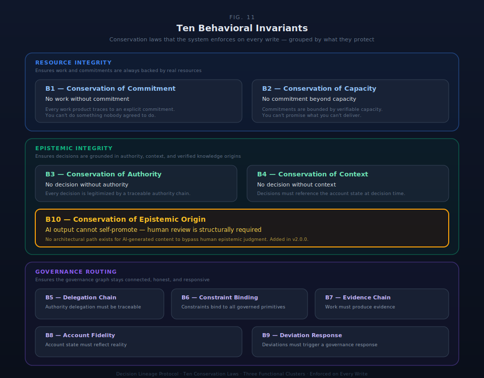

# §5 Protocol Behavioral Invariants

Ten behavioral invariants constrain how primitives may relate to each other. Each invariant enforces a relationship between primitives that must hold for governance to be structurally sound. If any single invariant is removed, a specific governance failure occurs that no other invariant or combination of invariants can prevent.

The invariants are the mechanical enforcement of the conservation laws identified in §9. They define the rules the protocol guarantees; substrate implementations determine how those guarantees are met.

### Research Grounding

Each invariant is independently necessary. The governance failure it prevents cannot be compensated by any other invariant.

| ID | Governance Failure Class | Why No Other Invariant Compensates | Research Grounding |
|---|---|---|---|
| **B1** | Unbounded effort without agreement | B2 checks feasibility but not authorization — capacity-verified work can still be unauthorized | COSO control activities (controls require formal commitment); VSM S3 (resource allocation requires negotiated agreements) |
| **B2** | Impossible promises without detection | B1 checks authorization but not feasibility — authorized work can still be infeasible | Ashby's Law of Requisite Variety (controller capacity must match disturbance); Simon satisficing (bounded rationality skips availability checks) |
| **B3** | Unmarked AI outputs corrupting canonical record | B4 provides decision context but not epistemic classification — you know when evidence was recorded but not whether to trust it | SAS 142 digital evidence standards (audit evidence requires epistemic provenance); AI governance literature (distinguishing AI from human output is the foundational requirement) |
| **B4** | Opaque decisions without verifiable context | B3 marks evidence quality but doesn't require decision-time state — you know the evidence quality but not the circumstances of the decision | Decision provenance (accountability requires reconstructable decision context); process accountability (WHO/WHAT/WHEN/WHY requires state at decision time) |
| **B10** | AI outputs promoted without human epistemic judgment | B3 classifies evidence by origin but does not enforce the promotion gateway — evidence carries its truth type, but nothing prevents a system pathway from advancing Derived to Declared without human review. B10 is a specialization of B3 for AI actors: it makes explicit that the truth type boundary between Derived and Declared/Authoritative requires human action, not just human policy. | EU AI Act transparency requirements (AI outputs must be identifiable and reviewable); NIST AI RMF (human oversight of AI-generated content); SAS 142 (digital evidence requires human professional judgment for epistemic classification) |
| **B5** | Unlegitimized binding actions | B6 binds rules to objects but doesn't trace who has the right to act — you know what rules apply but not who is authorized | Principal-Agent Theory (agency requires verifiable delegation); VSM S5 (organizational identity requires traceable authority to root) |
| **B6** | Rules disconnected from governed objects | B5 traces authority chains but doesn't bind rules to objects — you know who is authorized but not what rules govern them | Conservation law enforcement (same rule must produce same prohibition); VSM S2 (coordination requires constraints that bind, not suggest) |
| **B7** | Problems invisible to governance | B8 routes signals but cannot create them — routing is useless without a mechanism to raise signals in the first place | Edmondson psychological safety (raising concerns requires a legitimate channel); Morrison organizational silence (architecture must not be the barrier to surfacing) |
| **B8** | Signals captured but never reaching authority | B7 enables flagging but doesn't ensure delivery — signals exist but reach no one with jurisdiction | the algedonic channel (emergency signals bypass hierarchy to reach whoever can act); IIA Three Lines Model (risk signals require defined routing pathways) |
| **B9** | Emergence captured but never operationalized | None of B1–B8 converts emergence into organizational action — signals, evidence, and authority function but insights remain inert | Klein RPD (recognition must convert to action); Nonaka SECI (explicit knowledge must be acted upon, not merely recorded) |

### Collective Properties

**Mutual independence.** Each row produces a distinct failure class. The "Why No Other Invariant Compensates" column confirms that no invariant's function can be performed by another.

**B10 relationship to B3.** B10 is a specialization of B3 for AI actors. B3 requires every Evidence instance to carry a truth type — it classifies epistemic origin. B10 requires that the transition from Derived (AI-generated) to Declared or Authoritative requires explicit human action — it enforces the promotion gateway. Without B10, B3 could be trivially satisfied by a system that labels AI output as Derived but then auto-promotes it to Declared through a workflow that does not require human epistemic judgment. B10 closes this gap. The two invariants have distinct enforcement shapes: B10-AIOutputDerived (Pass 1, always Blocking — AI output must enter as Derived) and B10-PromotionRequiresHuman (Pass 2, SPARQL — promotion transitions on AI-originated Evidence must have a human actor as the promoting decision-maker).

**Group completeness.** The three groups — resource integrity (B1–B2), epistemic integrity (B3–B4, B10), and governance routing (B5–B9) — cover the three dimensions of governance failure: doing the wrong work, trusting the wrong data, and routing governance incorrectly. No fourth dimension has been identified.

**S5 correspondence.** The ten invariants collectively formalize the S5 (Policy) function. S5 defines the invariances that cannot be violated regardless of operational pressures. B1–B10 are the mechanical specification of that policy function: the relationships between primitives that must hold for governance to be structurally sound.

### Conservation Law Correspondence

Each behavioral invariant is the enforcement mechanism for a conservation law identified in §9. The conservation laws define what must be preserved across every governance state transformation. The invariants define how that preservation is mechanically enforced.

| Conservation Law (§9) | What Is Preserved | Invariant | Enforcement |
|---|---|---|---|
| Organizational direction (Intent) | Purpose persists through governance actions | B9 | Emergence converts to Decision, closing the loop to organizational purpose |
| Binding force (Commitment) | Responsibility cannot vanish | B1, B2 | Work requires Commitment (B1); Commitment requires Capacity (B2) |
| Feasibility truth (Capacity) | Feasibility cannot be wished away | B2 | Commitments are backed by verified capacity |
| State transformation fidelity (Work) | Transformations are authorized | B1 | Work traces to a commitment — no unauthorized state changes |
| Epistemic status (Evidence) | Proof quality is intrinsic to the record | B3 | Every evidence artifact carries its epistemic classification |
| Option space completeness (Decision) | Full state is visible at decision time | B4 | Decisions link to the account providing state context |
| Scope preservation (Authority) | Delegation scope is recorded | B5 | Authority chains terminate at a traceable root |
| State fidelity (Account) | State is verifiable, not narrative | B4 | Decision context is a recorded account, not a post-hoc reconstruction |
| Rule universality (Constraint) | Same rule produces same prohibition | B6 | Constraints bind to governed objects mechanically |
| Emergency signaling (Algedonic) | Problems can always reach authority | B7, B8 | All objects are flaggable (B7); signals route to the authority chain (B8) |
| AI epistemic boundary (Evidence) | AI-generated content cannot self-promote to canonical status | B10 | Promotion from Derived to Declared/Authoritative requires human action — the epistemic boundary between machine inference and organizational knowledge is architecturally enforced |

The relationship between layers: Organizational symmetry (§9.1) → Conservation law (§9.2) → Behavioral invariant (§5, this section) → SHACL shape (shapes graph) → Substrate enforcement (§26).

### §5.1 Invariant Definitions

The ten invariants partition into three functional groups. Each group addresses a distinct class of governance failure.

**Group 1: Resource Integrity** — Ensure work and commitments are grounded in reality.

| ID | Rule | Constraint | Failure Without |
|---|---|---|---|
| **B1** | Work requires Commitment | Every Work instance must link to exactly one Commitment | Shadow work — effort expended on activities no one has formally agreed should happen |
| **B2** | Commitment requires Capacity | Every Commitment must link to at least one Capacity allocation | Impossible promises — commitments made without verifying feasibility |

**Group 2: Epistemic Integrity** — Ensure evidence and decisions are grounded in truth.

| ID | Rule | Constraint | Failure Without |
|---|---|---|---|
| **B3** | Evidence requires Truth Type | Every Evidence instance must carry exactly one truth type from the controlled vocabulary: Authoritative, Declared, Derived, Opaque | Epistemic corruption — AI-generated outputs enter the canonical record without marking, and the system can no longer determine which entries can be trusted at what level |
| **B4** | Decision requires Account | Every Decision must link to exactly one Account | Context-free decisions — the organization knows *that* a decision was made but not *against what state*, making post-hoc audit impossible |
| **B10** | AI output requires human review for epistemic promotion | Every Evidence instance with truth type Derived that originated from an AI actor (§22.2) must receive explicit human review before promotion to Declared or Authoritative. No architectural path exists for AI-generated content to bypass human epistemic judgment. | Unreviewed AI promotion — AI-generated outputs advance to canonical status without human epistemic judgment, collapsing the trust boundary between machine inference and organizational knowledge. B3 classifies evidence by epistemic origin; B10 enforces that the promotion gateway between AI-generated and human-verified knowledge requires human action. |

**Group 3: Governance Routing** — Ensure authority, constraints, signals, and emergence flow correctly.

| ID | Rule | Constraint | Failure Without |
|---|---|---|---|
| **B5** | Authority must be traceable | Every Authority instance must either be a root authority or link to a parent authority through a delegation chain that terminates at a root | Untraceable authority — binding actions occur without verifiable legitimacy; authority becomes de facto rather than de jure |
| **B6** | Constraint binds primitives | Every Constraint must target at least one primitive instance and specify an enforcement mode (Blocking, Warning, Logging, or Advisory) | Unbound rules — constraints exist as documentation but do not operate on governed objects; rules are aspirational rather than operational |
| **B7** | All objects flaggable | Every primitive class must have a signal attachment surface — the architectural guarantee that any governed object can be flagged | Invisible problems — humans cannot attach signals to the objects they observe; organizational silence becomes architectural, not cultural |
| **B8** | Signals route to authority | Every Signal must route to an authority on the governance chain for the flagged object, at any depth in the delegation hierarchy | Unrouted signals — problems are captured but structurally cannot reach anyone with the power to act; the system appears to listen but cannot respond |
| **B9** | IQ resolution creates Decision | Every resolved Investigative Query must produce a Decision or Work item | Inert emergence — patterns are captured but never operationalized; the gap between what the organization knows and what it does about it grows silently |

### §5.3 Enforcement Architecture

Invariants are specified as SHACL constraint shapes — declarative definitions of what must hold, independent of how the substrate enforces them.

#### Shapes Graph Separation

Constraint shapes live in a dedicated shapes graph, separate from the class ontology (§4). The ontology defines what primitives *are* (Open World Assumption — what is not stated may still be true). The shapes graph defines what must be *validated* (Closed World Assumption — what is not present is a violation). This separation is architectural: profile layering (§21) applies different shapes graphs to the same primitive classes; shapes can be updated without modifying class definitions; the substrate layer (shapes, CWA) and advisory layer (ontology, OWA) remain architecturally distinct.

#### Shape Classification

Each invariant shape is classified by the SHACL feature level required to express it:

| Shape | Invariant | SHACL Tier | Rationale |
|---|---|---|---|
| B1-WorkRequiresCommitment | B1 | **Core** | Single-node property check: commitment link exists |
| B2-CommitmentRequiresCapacity | B2 | **Core** | Single-node property check: capacity link exists |
| B3-EvidenceRequiresTruthType | B3 | **Core** | Single-node property check: truth type value in controlled vocabulary |
| B4-DecisionRequiresAccount | B4 | **Core** | Single-node property check: account link exists |
| B5-AuthorityTraceable | B5 (immediate) | **Core** | Disjunctive check: isRootAuthority OR authoritySource present |
| B5-AuthorityChainReachesRoot | B5-T (transitive) | **SPARQL** | Transitive closure: delegation chain terminates at root; detects circular delegation |
| B6-ConstraintBindsPrimitives | B6 (binding) | **Core** | Single-node property check: target and enforcement mode exist |
| B6-ConstraintUniversality | B6-U (universal) | **SPARQL** | Cross-instance: universal constraint targets all instances of governed class |
| B7-SignalSurfaceCoverage | B7 | **Schema** | Deployment-time: ontology structure guarantees signal attachment for all primitive classes |
| B8-SignalsRouteToAuthority | B8 | **Core + SPARQL** | Core: routing target exists. SPARQL: target is on the flagged object's authority chain at any depth |
| B9-IQResolutionCreatesDecision | B9 | **SPARQL** | Conditional: when status = Resolved, resolution output must exist |
| B10-AIOutputDerived | B10 (entry) | **Core** | Single-node property check: Evidence with AI actor as producer must have truth type = Derived |
| B10-PromotionRequiresHuman | B10 (promotion) | **SPARQL** | Graph traversal: any promotion transition on AI-originated Evidence must reference a Decision where made_by is a human actor (§22.2 actor type = Human) |

#### Two-Pass Validation Strategy

**Pass 1: SHACL Core (always Blocking).** B1, B2, B3, B4, B5 (immediate), B6 (binding), B10 (entry). Single-node property checks — no graph traversal required. Run on every write operation at O(1) per instance. Violations prevent the operation. No profile variability — universal across all substrate profiles.

**Pass 2: SHACL-SPARQL (profile-configurable).** B5-T, B6-U, B8 (routing), B9, B10 (promotion). Graph traversal required — transitive closure, cross-instance joins, conditional evaluation. Configurable schedule (per-operation, batch, or periodic). Default enforcement mode varies by shape; profiles configure per organizational context.

**Schema Pass: B7 (deployment-time).** Validates ontology structure, not instance data. Shapes-on-shapes pattern: ontology loaded as data, schema shape verifies signal surface coverage. Runs once at deployment and again on schema changes. Must pass before any instance data is loaded.

#### Constraint Conflict Detection

The validation architecture also detects conflicts between Constraint instances. At constraint creation or merge time, the engine checks whether a new constraint contradicts existing constraints on the same target. Three conflict classifications:

| Conflict Type | Description | Example |
|---|---|---|
| **Same-scope contradiction** | Two constraints on the same primitive instance with incompatible enforcement modes or requirements | A Blocking constraint requires field X; another Blocking constraint prohibits field X — on the same governed object |
| **Nested-scope contradiction** | A parent-scope constraint conflicts with a child-scope constraint on the same target | Parent namespace requires minimum 3 approvers; child namespace sets maximum 2 approvers |
| **Enforcement-mode conflict** | Two constraints target the same governed relationship but specify contradictory enforcement modes | One constraint marks a relationship as Blocking; another marks the same relationship as Advisory |

Detected conflicts surface as B8 Signals routed to the authority governing the conflicting constraints. The protocol detects and reports; it does not resolve. Resolution is a policy decision — the authority decides which constraint prevails, producing a Decision (B4) with rationale. Conflict resolution patterns are DESIGN SPACE.

Conflict detection runs during Pass 2 (SPARQL). Default enforcement mode is Warning — a conflict does not block constraint creation but produces a signal that must be resolved through the authority chain.

#### B8 Routing Scope

B8 validates that the signal's routing target is *somewhere* on the flagged object's authority chain — the immediate governing authority *or* any ancestor at any depth in the delegation hierarchy. This implements the algedonic channel: emergency signals bypass intermediate hierarchy to reach whoever has the power to act. The violation is routing to an authority entirely outside the governance chain, not routing to a higher-level authority on the correct chain.

### §5.4 Enforcement Modes

| Mode | Behavior | Invariant Application |
|---|---|---|
| **Blocking** | Prevents the operation entirely. The violating write/create is rejected. | All Pass 1 shapes (B1, B2, B3, B4, B5, B6 binding, B10 entry). Default for B5-T, B10 promotion. B7 schema test. |
| **Warning** | Allows the operation but produces an alert. The governance record includes the violation. | Default for B6-U, B8 routing, B9. Profiles may upgrade any Warning to Blocking. |
| **Logging** | Records the violation silently. No alert, no block. Visible only in audit queries. | Available as profile downgrade for any SPARQL shape during organizational transitions. |
| **Advisory** | Suggests an alternative without enforcement. | Reserved for non-invariant Constraints (§4.1). Not used for B1–B10 invariants. |

Pass 1 shapes are always Blocking — no profile may downgrade below Blocking. Pass 2 shapes default to Warning or Blocking depending on the invariant; profiles may adjust but may not downgrade below Logging.

### §5.5 Violation Handling

Both validation passes produce SHACL Validation Reports persisted as Evidence records with truth type Authoritative. This closes an architectural loop: Constraint (shapes) → validation → Evidence (reports) → Account (audit trail), exercising B3 and B4 on the invariant enforcement mechanism itself.

Each violation record captures: invariant violated (B1–B10 identifier), shape that fired (URI from shapes graph), focus node (violating primitive instance), severity (sh:Violation), enforcement action (Blocked/Warned/Logged), validation pass (Pass 1/Pass 2/Schema), and timestamp.

#### Override Protocol

When a Warning-mode violation requires an authorized override: the overriding actor must hold Authority (B5) governing the primitive instance in violation; the override is itself a Decision (B4) recording the specific invariant, rationale, and exception scope; the override produces Evidence (B3) with truth type Declared; overrides create new records (append-only — the original violation Evidence is never modified).

#### Audit Trail

Every violation is recorded regardless of enforcement mode. Blocking violations record the rejected operation. Warning violations record the alert and any subsequent override. Logging violations record silently. The violation audit trail is queryable through the same lineage mechanisms as any other Evidence record (§28).

## Scope

This section specifies behavioral invariants — relationships between primitives that must hold. It does NOT specify: the primitives themselves (§4), the conservation laws the invariants enforce (§9), the implementation schema for invariant enforcement (§26), or the specific SHACL shape definitions (shapes graph, separate artifact).

Constraint conflict detection detects and reports conflicts; resolution patterns are DESIGN SPACE for substrate implementations.

## Locked Design Positions

**Locked.** Ten behavioral invariants (B1–B10). Three functional groups. SHACL enforcement via two-pass validation + schema pass. Four enforcement modes. B10 is a specialization of B3 for AI actors. Constraint conflict detection surfaces conflicts as B8 Signals.

**Post-lock additions (v2.0.0).** B10 (AI epistemic promotion gateway). Opaque added to B3's controlled vocabulary. Constraint conflict detection (three types).

## Implementation Requirements

SDK implementations MUST enforce all Pass 1 shapes as Blocking. SDK implementations MUST support the four enforcement modes. SDK implementations MUST persist violation records as Evidence with truth type Authoritative. SDK implementations MUST support the override protocol for Warning-mode violations.
