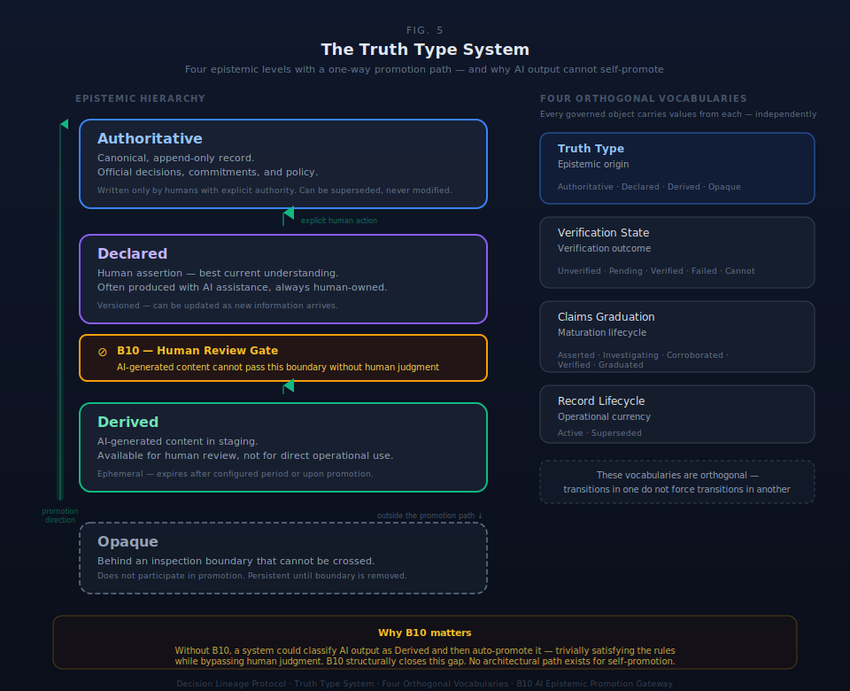
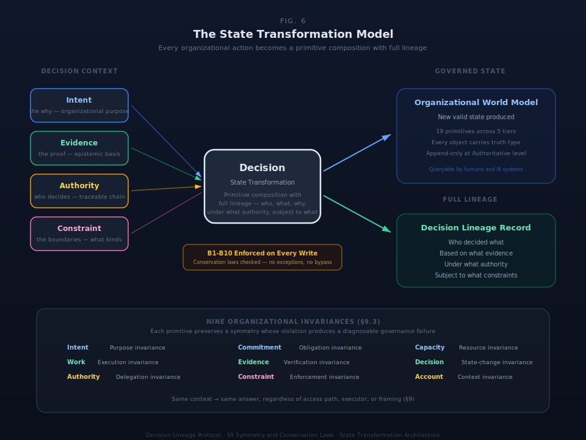

# §6 Truth Type System

The truth type system classifies the epistemic status of every governed object. It answers four orthogonal questions through four independent vocabularies: Truth Type (what is the epistemic origin?), Verification State (what is the verification outcome?), Claims Graduation Stage (where is this claim in its maturation lifecycle?), and Record Lifecycle State (is this record operationally current?). These vocabularies are orthogonal — a single governed object can simultaneously carry values from each, and transitions in one do not force transitions in another. This section defines the four vocabularies, the state machines governing their transitions, and the architectural boundaries separating them.





### §6.1 Truth Types

Four truth types classify every Evidence instance by epistemic origin. The behavioral invariant B3 (§5) enforces that every Evidence record carries exactly one.

#### Table 6.1.1: Truth Type Definitions

| Truth Type | Definition | Who Writes | Mutability | Canonical |
|---|---|---|---|---|
| **Authoritative** | Canonical, append-only record. Represents official decisions, commitments, and policy. | Humans with explicit authority only | Append-only — can be superseded, never modified | Yes |
| **Declared** | Human assertion representing best current understanding. Often produced with AI assistance, but always owned and written by a human. | Humans (AI may propose to staging) | Versioned — can be updated as new information arrives | Yes |
| **Derived** | AI-generated content in staging. Available for human review, not for direct operational use. Ephemeral — expires after a configured time period or upon promotion. | AI systems and humans | Ephemeral — expires or is promoted | No (enforced) |
| **Opaque** | Content behind an inspection boundary that cannot be crossed. The governed object's epistemic status is structurally unknowable — not because information is missing (that is Unknown/CannotVerify), but because the boundary to the information source cannot be penetrated. | System (assigned at boundary detection) | Persistent — remains Opaque until the inspection boundary is removed or penetrated | No (boundary-enforced) |

**Opaque vs. Unknown.** Opaque is not a synonym for unknown or unverified. Unknown means information might exist but has not been found — the gap could potentially be filled. Opaque means the inspection boundary cannot be crossed — the information exists behind a barrier (proprietary model internals, third-party black boxes, regulatory firewalls, encrypted stores without key access) that is structurally impenetrable. The distinction matters for governance: an Unknown gap triggers investigation (IQ Capture, §16); an Opaque boundary triggers risk assessment (the organization must decide whether to operate without visibility). Opaque evidence cannot be promoted through the standard Derived → Declared → Authoritative path because promotion requires human epistemic judgment on content that cannot be inspected.

**DESIGN SPACE: Opaque → Computed transition.** If an inspection boundary is later penetrated — a proprietary model is replaced by an inspectable one, a regulatory firewall is lifted, decryption keys become available — the truth type may transition from Opaque to the appropriate type (typically Derived, entering the standard promotion workflow). This truth type transition is a governed state transformation with lineage: a Decision recording what changed, why the boundary was penetrated, and under what authority. The conditions and mechanics of Opaque transitions are DESIGN SPACE for substrate implementations.

#### CWA/OWA Framing

The four truth types map to the architectural boundary between the substrate and the advisory layer:

**Authoritative operates under the Closed World Assumption.** What is not explicitly recorded as Authoritative does not exist in the canonical governance record. Absence is meaningful — a missing Authoritative record is a gap, not an unknown. This maps to SHACL enforcement: the substrate validates Authoritative records against constraint shapes, and violations are structural failures.

**Derived operates under the Open World Assumption.** Derived content represents what might be true — AI-generated interpretations, analyses, and proposals that have not been verified by human judgment. The substrate does not treat Derived content as definitive. This maps to OWL advisory reasoning: the advisory layer can reason over Derived content to surface patterns and recommendations, but Derived content never enters the canonical record without human promotion.

**Declared occupies the operational middle.** Declared content is canonical (used in decisions) but not immutable (can be updated). It is the working layer of governance — human assertions that have been accepted as operationally current, versioned and tracked, but subject to revision.

**Opaque operates outside both assumptions.** Opaque content is neither open-world (we don't reason about what might be true behind the boundary) nor closed-world (absence is not meaningful — the content exists but is inaccessible). Opaque is the honest epistemic classification for capabilities and data sources that governance must reference but cannot inspect. The substrate records that the boundary exists, classifies what is behind it to the extent knowable, and enables the organization to make governed decisions about operating with limited visibility.

### §6.2 Epistemic Boundary Maintenance

The four truth types form four epistemic layers with enforced separation:

| Layer | Truth Type | Enforcement | Boundary Rule |
|---|---|---|---|
| **1** | Authoritative | Append-only; supersession creates new record | Only humans with verified Authority (B5) can write |
| **2** | Declared | Versioned; update history preserved | Only humans can write; AI may propose to staging for review |
| **3** | Derived | Ephemeral; expires or promotes | AI and humans can write; content is never canonical |
| **4** | Opaque | Persistent; boundary-enforced | System assigns at boundary detection; cannot be inspected or promoted through standard path |

**Promotion direction.** Content moves upward only: Derived → Declared → Authoritative. Each promotion requires explicit human action (B10, §5). There is no demotion: an Authoritative record is never downgraded to Declared, and a Declared record is never downgraded to Derived. Supersession replaces the record; it does not change its truth type. Opaque content does not participate in the standard promotion path — it can only transition to another truth type when the inspection boundary is removed (see §6.1, Opaque → Computed transition).

**Staging requirement.** All AI-generated output lands in staging with truth type Derived. No architectural path exists for AI output to bypass staging and enter the Declared or Authoritative layer directly. The staging requirement is structural, not procedural — it is enforced by the type system, not by workflow convention.

### §6.3 AI Interpretation Handling

AI systems participate in governance through the Derived layer exclusively. The epistemic boundary constrains what AI may and may not do:

#### AI Boundaries

| AI May | AI Must Not |
|---|---|
| Surface system-detectable gaps (deviation, missing evidence, stale context) | Modify Authoritative records |
| Propose language when explicitly requested | Create canonical entries without human promotion |
| Draft artifacts to staging areas | Approve decisions autonomously |
| Calculate derived projections | Suppress uncertainty or limitations in output |
| Recommend escalation | Claim regulatory or legal authority |
| Route captured signals by authority chain | Sense tacit knowledge (humans are the only sensors for tacit signal) |

#### Derived Promotion Workflow

AI-generated content follows a structured promotion path:

1. **Generation.** AI produces proposed content (analysis, language, projections).
2. **Staging.** Output lands as Derived with AI attribution and a time-to-live (TTL).
3. **Human Review.** A human reviews the staged content and decides: accept, modify, or reject.
4. **Promotion to Declared.** If accepted, the human rewrites in their own words. The truth type changes to Declared. A new versioned record is created.
5. **Promotion to Authoritative.** A human with explicit, traceable authority (B5) promotes the Declared record. The truth type changes to Authoritative. The record becomes append-only.
6. **Archival.** If rejected or expired (TTL), the Derived content is archived. It is retained for audit trail but exits the promotion workflow.

AI can produce revised drafts during review (looping back to step 2), but cannot advance content past the Derived stage. All promotions require human action (B10, §5).

#### Derivation Depth Tracking

Evidence records carry two additional fields that track the derivation chain — how many inferential steps separate the evidence from primary observation or source material:

| Field | Type | Description |
|---|---|---|
| `derivation_depth` | Number | 0 = direct observation or primary document. 1 = derived from one piece of primary evidence. 2+ = derived from derived evidence. Each inferential step increments the depth counter. |
| `derived_from` | Reference<Evidence>[] | Links to the parent evidence record(s) from which this evidence was derived. Empty for depth-0 evidence. |

**Chain visibility during promotion review.** When a human reviewer considers promoting Derived evidence to Declared, the derivation chain is visible: the reviewer sees the derivation depth, the full chain of parent evidence, and the primary sources at depth 0. This enables informed epistemic judgment — a depth-3 derivation from AI-generated evidence carries different weight than a depth-0 human observation.

**DESIGN SPACE: Derivation depth limits.** Whether a maximum derivation depth should constrain promotion eligibility (e.g., "evidence at depth > 3 cannot be promoted") is a substrate implementation decision. The protocol requires depth tracking and chain visibility; it does not prescribe depth-based promotion restrictions. Organizations may configure depth limits appropriate to their risk tolerance and domain.

### §6.4 Evidence Verification States

Evidence artifacts transition through verification states independent of their truth type. A Declared evidence record and an Authoritative evidence record both enter as Unverified and progress through the same verification state machine.

#### Table 6.4.1: Verification States

| State | Meaning | Next Action |
|---|---|---|
| **Unverified** | Evidence exists but has not been reviewed | Assign to verifier |
| **VerificationPending** | Assigned to verifier; process active | Verification in progress |
| **Verified** | Passed verification; reliable for use in decisions | Terminal (unless record is superseded) |
| **VerificationFailed** | Failed verification; unreliable | Reject claim or find alternative evidence; may revert to Unverified on new evidence |
| **CannotVerify** | Evidence incomplete or inaccessible | Note gap; escalate if critical; may revert to Unverified if evidence is supplemented |

#### Transitions

| From | To | Trigger | Constraint |
|---|---|---|---|
| Unverified | VerificationPending | Verifier assigned | Must record assignedVerifier and timestamp |
| VerificationPending | Verified | Verification passes | Must record verificationMethod, verifiedBy, timestamp |
| VerificationPending | VerificationFailed | Verification fails | Must record failureReason |
| VerificationPending | CannotVerify | Evidence incomplete/inaccessible | Must record cannotVerifyReason |
| VerificationFailed | Unverified | New evidence submitted | Must record reversionReason; resets cycle |
| CannotVerify | Unverified | Evidence supplemented or access restored | Must record reversionReason; resets cycle |

**Terminal states.** Verified is terminal — a verified record does not revert; it is replaced by a new record if circumstances change. VerificationFailed and CannotVerify are soft-terminal — they can revert to Unverified if new evidence is submitted, but do not auto-retry.

### §6.5 Claims Graduation Protocol

Claims — explicit assertions about the state of the governed system — follow a maturation path independent of evidence verification. The graduation protocol tracks organizational confidence in an assertion.

#### Table 6.5.1: Graduation Stages

| Stage | Authority | Confidence Band | Action Required |
|---|---|---|---|
| **Asserted** | Anyone (initial asserter) | ~0.3 | Subject matter expert review |
| **Investigating** | Assigned investigator | ~0.5 | Evidence gathering, testing |
| **Corroborated** | Evidence reviewers | ~0.7 | Pattern validation, secondary confirmation |
| **Verified** | Verification authority | ~0.9 | Steward endorsement decision |
| **Graduated** | Domain steward | 0.95+ | Added to governing framework; automatically consulted in relevant decisions |

#### Forward Transitions

| From | To | Trigger | Constraint |
|---|---|---|---|
| Asserted | Investigating | SME accepts claim for review | Must assign investigator |
| Investigating | Corroborated | Supporting evidence found | Supporting Evidence records must be in VerificationState = Verified |
| Corroborated | Verified | Secondary confirmation obtained | Must record confirmation method |
| Verified | Graduated | Domain steward endorses | Must record endorsement with authority reference |

#### Reversion and Failure Paths

| From | To | Trigger | Constraint |
|---|---|---|---|
| Any stage | Asserted | Contradicting evidence discovered | Must record contradicting evidence; resets maturation cycle |
| Investigating | Asserted | Investigation inconclusive | Must record reversion reason |
| Verified | Corroborated | Steward declines endorsement | Must record decline reason |
| Any stage | Archived | Claim superseded by newer claim | Must record superseding claim reference |

**Graduated is soft-terminal.** Graduated claims become part of organizational learning and are automatically consulted in relevant decisions. They can revert to Asserted if contradicting evidence surfaces — organizational knowledge is revisable.

### §6.6 State Machine Orthogonality

The three state machines (Evidence Verification, Derived Promotion, Claims Graduation) operate independently. An object participates in whichever machines apply to its type:

| Object Type | Participates In | Example State |
|---|---|---|
| Evidence (human-created) | Verification + Lifecycle | Declared, Verified, Active |
| Evidence (AI-generated) | Verification + Promotion + Lifecycle | Derived, Unverified, Active |
| Claim (human-created) | Graduation + Lifecycle | Declared, Corroborated, Active |
| Claim (AI-generated) | Graduation + Promotion + Lifecycle | Derived, Asserted, Active |

#### Cross-Machine Interactions

The machines are orthogonal but not isolated. Three logical correlations constrain their interaction:

**Claims graduation reads verification state.** A claim cannot advance from Investigating to Corroborated unless its supporting Evidence records are in VerificationState = Verified. The graduation machine reads the verification machine's state but does not transition it.

**Derived promotion is independent of verification.** An AI-generated evidence item can be promoted from Derived to Declared regardless of its VerificationState. Promotion changes epistemic origin, not verification status. A Declared + Unverified record is valid — it is a human assertion that has not yet been verified.

**Record lifecycle is orthogonal to all machines.** Any record in any state of any machine can be superseded (RecordLifecycleState → Superseded). Supersession creates a new record that re-enters the relevant state machines at their initial states. The superseded record is retained for audit trail.

### §6.7 Verification Type Taxonomy

The verification type specifies *what question* a verification operation answers. Where verification state (§6.4) tracks the *outcome* of verification, verification type identifies the *concern*.

#### Table 6.7.1: The Seven Verification Types

| Type | Question | Scope | Applies To |
|---|---|---|---|
| **EXIST** | Does this governed object exist in the expected location and form? | Object-local | Any primitive instance |
| **COMPLETE** | Does this governed object contain all required components? | Object-local | Primitives with mandatory fields (MVR compliance) |
| **CURRENT** | Is this governed object still valid and up-to-date? | Object-local | Time-sensitive primitives (Capacity, Evidence, Constraint) |
| **APPROVED** | Has this governed object received required authorization? | Relational | Authority-gated actions (Decision, Commitment, Work) |
| **CONSISTENT** | Does this governed object align with related objects in the substrate? | Relational | Cross-primitive relationships |
| **COMPLIANT** | Does this governed object satisfy applicable constraints and external standards? | Relational | Objects within Constraint scope |
| **RATIFIED** | Has this governed object been formally confirmed by the appropriate governing body? | Relational | High-stakes objects requiring collective endorsement |

#### Generative Construction

The seven types are generated from two orthogonal scope categories and five verification sub-dimensions:

**Object-local verification** (properties of the object itself):
- Ontological → EXIST (does it exist?)
- Mereological → COMPLETE (is it structurally whole?)
- Temporal → CURRENT (is it still valid?)

**Relational verification** (properties relative to other objects or standards):
- Individual authorization → APPROVED (was it permitted?)
- Internal alignment → CONSISTENT (does it fit with related objects?)
- External conformance → COMPLIANT (does it satisfy external requirements?)
- Collective authorization → RATIFIED (has it been formally confirmed?)

#### Boundary Assumptions

The taxonomy is closed under three domain assumptions. These are design decisions, not theorems:

1. **Governance scope.** Verification concerns the epistemic status of governed objects within the substrate. Operational concerns (accessibility, performance, recoverability) are outside verification scope.

2. **Relational accuracy.** Traditional audit and governance frameworks treat accuracy as an independent verification property: "does this value match reality?" In organizational governance, this question has no substrate-independent answer. Every governed value is correct *relative to* something — a source record, a constraint, a derivation chain, or a prior state. There is no ground truth in governance that is not itself a governed object. The architecture therefore decomposes accuracy into two relational axes: CONSISTENT (does this value match the source record or related object it should match?) and COMPLIANT (does this value satisfy the constraint or external standard that governs it?). Together these two types exhaust the verification surface that a standalone ACCURATE type would cover: internal correctness against sources and external correctness against rules. An ACCURATE type would either collapse into one of these axes or require a notion of absolute ground truth that organizational governance cannot provide. This is a substantive architectural position — the absence of an ACCURATE verification type is deliberate, not an omission.

3. **Verification temporality.** Verification is retrospective or present-tense. Prospective assessment ("will this remain valid?") is prediction, not verification, and belongs to the Capacity primitive or risk frameworks.

#### Pragmatic Ordering

The types suggest a verification workflow:

```
EXIST → COMPLETE → CURRENT → APPROVED → CONSISTENT → COMPLIANT → RATIFIED
```

This ordering is pragmatic, not logically necessary. The first link (EXIST → COMPLETE: cannot check completeness of a nonexistent object) and last link (COMPLIANT → RATIFIED: ratification presumes compliance) are strong presuppositions. The middle links (COMPLETE → CURRENT → APPROVED → CONSISTENT → COMPLIANT) are procedural recommendations — consistency can be checked regardless of approval status, and compliance can be assessed on incomplete objects.

Not all objects require all seven types. The applicable types depend on the primitive, its governance context, and the Constraint set in scope.

#### Verification Records

Each verification operation produces a verification record combining:

| Field | Content |
|---|---|
| Verification type | Which question (from the seven-type vocabulary) |
| Verification method | How answered: hash_check, source_confirmation, independent_review, cross_reference, or chain_validation |
| Verification state | Outcome: Unverified, VerificationPending, Verified, VerificationFailed, or CannotVerify |
| Verified by | Actor who performed the verification |
| Timestamp | When the verification was performed |

A single governed object may undergo multiple verification operations of different types. Each produces its own verification record with its own state. The per-type state is tracked in verification records, not on the governed object itself.

#### Extension Policy

The verification type vocabulary is closed for the current architecture version. Adding an eighth type requires an Architecture Decision Record documenting: (1) why existing types cannot cover the new verification question, (2) which primitives it applies to, (3) the SHACL mechanism that enforces it, and (4) the impact on RATIFIED, which assumes all prior types are satisfied. Profiles may select subsets of the seven types but may not add types without architecture-level justification.

## Scope

This section specifies the four epistemic vocabularies and their state machines. It does NOT specify: how verification is operationally performed (that is substrate-specific), the detailed promotion workflow mechanics (substrate implementation), or the specific SHACL shapes enforcing truth type constraints (shapes graph, separate artifact).

## Locked Design Positions

**Locked.** Four orthogonal epistemic vocabularies. Truth Type with four values (Authoritative, Declared, Derived, Opaque). Verification State with five values. Claims Graduation Stage with five values. Record Lifecycle State with two values. Three independent state machines. Promotion path Derived → Declared → Authoritative. No demotion.

## Implementation Requirements

SDK implementations MUST enforce exactly one truth type per Evidence record. SDK implementations MUST support the promotion path Derived → Declared → Authoritative with no demotion. SDK implementations MUST prevent AI-generated content from bypassing the Derived stage. SDK implementations MUST track and expose derivation chains for promotion review.
