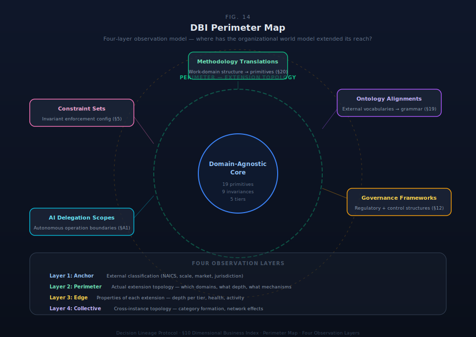

# §10 The Dimensional Business Index: Substrate Perimeter Map

§8 established that governance must be a world model with specific structural subsystems. §9 established that these structural invariances must be explicitly encoded. This section asks: once the substrate exists with its invariance-preserving primitive grammar, what can be observed about the shape of where the organizational world model has extended its observational reach?

The Dimensional Business Index is the organizational world model's diagnostic surface — a protocol-level observation of where primitive composition has extended into domains of organized human activity. It introduces no new primitives. Every element is a query pattern over existing protocol artifacts that reveals what the organizational world model can observe. The DBI maps the shape of governed space, not the decisions within it. It is topology, not content.

### Protocol Placement

The DBI is a DLP-World-Model specification. It defines the structural observation of where primitive composition has extended.

| Protocol Layer | DBI Content | Example |
|---|---|---|
| **DLP-Core** | The primitives that compose at the perimeter | Account, Authority, Decision, Work — the grammar |
| **DLP-World-Model** | The perimeter map specification (this section) | Four-layer observation model, edge properties, collective topology |
| **DLP Substrate** | Query implementation, rendering, interchange export | Cypher queries against AGE graph, MCP/JSON/RDF export |
| **Derivatives** | Visualization, benchmarks, analytics products | Industry dashboards, category formation monitors |

The four-layer model and observation principles are structural — they describe what perimeter observation means. Query patterns, interchange formats, and visualization are operational — they describe how to observe. The specification belongs to protocol; the implementation belongs to substrate and derivatives. §10.6 draws this boundary explicitly.

### Core Architectural Insight

The substrate's interior is domain-agnostic. Nineteen primitives across five tiers (§4) compose to represent any organizational state. The nine Tier 1 primitives enforce nine organizational invariances (§9.3). Conservation laws ground each invariance (§9.4). None of this is specific to any industry, methodology, or organizational form.

The perimeter is where the domain-agnostic interior meets specific domains of organized human activity. Every methodology translation (§20) extends the perimeter into a new domain. Every ontology alignment (§19) creates a surface where external structure connects to primitive composition. Every governance activation (§12) defines a governance boundary.

The DBI observes this perimeter. It reads existing primitive state and renders the extension topology. The observation is structural: where has governance extended, where are the gaps, what is the organizational shape?

Because every extension uses the same nineteen primitives across five tiers, the combinatorial surface grows faster than the extension count. The first methodology translation creates one extension surface. The second creates cross-domain pattern visibility, shared constraint discovery, and combinatorial governance surfaces at the intersection. Governance in one domain is directly legible in another — the primitives compose across domains without translation.

### §10.3 The Four-Layer Model

The DBI observes the substrate's perimeter through four structural layers, each providing a different mode of observation.

**Layer 1: Anchor.** The anchor is an external classification locating a substrate instance on the existing map of organized human activity. It is an Account — a declaration of organizational context at genesis, recorded as part of the bootstrap specification (§22). The principal actor asserts the organization's classification as part of substrate initialization.

| Component | Classification | Values |
|---|---|---|
| **Industry** | NAICS codes | Standard six-digit North American Industry Classification |
| **Scale** | OECD-style employee tiers | MICRO (1–9), SMALL (10–49), MEDIUM (50–249), LARGE (250–999), ENTERPRISE (1000+) |
| **Market type** | Business relationship orientation | B2B, B2C, B2G, B2B2C, and similar |
| **Jurisdiction** | Regulatory environment | Country, state/province, or regulatory regime identifier |

Anchor metadata varies by profile. EAS instances declare full industry, scale, market, and jurisdiction context. BAS instances declare market and scale. PAS instances inherit anchor from parent.

The anchor is not a scoring dimension, not a primary key, and not a constraint on what the substrate can extend into. Organizations reclassify, and the anchor updates with lineage — the Account records every classification change as a governance state transformation.

**Layer 2: Perimeter.** The perimeter is the substrate's actual extension topology — which domains have been reached by primitive composition, at what depth, and through what mechanisms.

| Perimeter Element | Protocol Source | v9 Section |
|---|---|---|
| Methodology translations completed | Translation-Mapping-Integration Architecture | §20 |
| Ontology alignments active | Ontology Alignment Engine | §19 |
| Governance frameworks registered | Governance Activation | §12 |
| AI delegation scopes configured | AI Orchestration Layer | §A1 |
| Constraint sets configured | Behavioral Invariants | §5 |

Each row represents a mechanism by which the substrate's perimeter extends into a specific domain. Methodology translations bring work-domain structure into primitive composition. Ontology alignments bridge external vocabularies to the protocol's grammar. Governance frameworks register regulatory and control structures. AI delegation scopes define where the substrate operates autonomously. Constraint sets configure invariant enforcement for the extension context.

Perimeter depth is not scalar. A methodology translation that activates Tier 4 primitives (Interpretation, Environment Interface) is a deeper extension than one activating only Tiers 1–2. Depth is observable per primitive tier:

| Tier | Primitives | What Activation Means |
|---|---|---|
| **Tier 1** (9: Irreducible Core) | Intent, Commitment, Capacity, Work, Evidence, Decision, Authority, Account, Constraint | Governance grammar active — invariances enforced |
| **Tier 2** (4: Unconditional Infrastructure) | Identifier, Entity, Context, Namespace | Identity, entity, context, and namespace established |
| **Tier 3** (3: Governed Operation) | Orientation, Learning, Activation | Environmental awareness and adaptive behavior active |
| **Tier 4** (2: AI-Native Extensions) | Interpretation, Environment Interface | Semantic processing and external domain sensing active |
| **Tier 5** (1: Operational Configuration) | Cycle | Temporal governance configured |

A perimeter point at Tier 3 depth — with Orientation, Learning, and Activation engaged — represents a fundamentally different governance posture than one at Tier 1–2 depth. The former has pre-decisional framing and institutional adaptation; the latter has governance capture without cognitive sophistication. Perimeter depth is a structural property, not a quality score.

**Layer 3: Edges.** Edges are the properties of each point on the perimeter — the characteristics of each extension surface.

| Property | What It Observes | v9 Section |
|---|---|---|
| **Graduation stage** | A (Capture), B (Advise), or C (Orchestrate) — per scope, not per instance | §A1 |
| **Activity level** | Whether Work is actively flowing through this edge or defined but dormant | §4 (Work primitive) |
| **Governance domain coverage** | Which of the seven governance domains (§13) are active at this edge | §13 |
| **Evidence density** | Volume and quality of lineage accumulated at this edge | §28 |
| **Composability surface** | Whether this edge's primitive composition is legible to other substrate instances | §27 |

Governance domain coverage replaces scalar "governance depth." The seven governance domains — (1) Authority & Decision Rights, (2) Commitment & Obligation, (3) Evidence, Record & Truth, (4) Work Execution & Lifecycle, (5) Access, Identity & Boundary, (6) Exception, Escalation & Override, (7) Learning, Change & Evolution — are defined in §13. An edge with five of seven domains active is a different organizational shape than one with two. The *which* matters: an edge with Authority + Evidence but no Work governance is structurally different from one with Work + Learning but no Authority.

Edges reveal organizational posture:
- Where judgment is irreducible (edges at Stage A — capture only)
- Where automation is mature (edges at Stage C — orchestrate)
- Where governance is deep but activity is low (over-governed or dormant domains)
- Where activity is high but governance is shallow (risk surfaces)
- Where governance domain coverage is uneven (conformance gaps)

**Layer 4: Collective.** The collective layer is the emergent topology across substrate instances — what becomes visible when multiple perimeters exist in the same primitive grammar.

It observes: where perimeters cluster (multiple organizations extending into the same domain), where new extensions are appearing across the network (emerging domains), where judgment patterns are consolidating (edges graduating across multiple instances), where perimeters touch (organizations in the same domain with composable edge structures), and where no perimeters have reached (unextended domains — the map of what governance has not yet addressed).

| Interchange Format | Collective Layer Role | v9 Section |
|---|---|---|
| **MCP Server** | Real-time agent queries across instances — AI agents query remote perimeters through MCP protocol | §18 |
| **JSON Export** | Simple interop — perimeter snapshots exchanged between instances | §18 |
| **RDF/OWL Export** | Full fidelity — formal cross-instance topology with semantic precision, archival compliance | §18 |

The collective layer requires both format interoperability (§18 provides transport) and semantic interoperability (§19 provides cross-ontology bridges). Format interoperability means data can move between instances. Semantic interoperability means instances know they are observing the same thing when their perimeters reference equivalent concepts. Both are required.

**Instance isolation by default.** No cross-instance visibility exists unless explicitly granted. Collective layer participation is opt-in, recorded as a governance Decision in the substrate. The organization decides what perimeter visibility to grant; the default is none. License verification (§24) provides ecosystem authenticity — collective observation requires knowing which instances are legitimate.

### §10.4 Environment Interface as Formal Primitive Hook

The DBI's perimeter observation flows through the Environment Interface primitive (Tier 4, §4). This is not incidental — Environment Interface IS the architectural hook that makes perimeter observation a first-class primitive concern. It is the sensor surface where the substrate's domain-agnostic interior meets specific external domains.

| Direction | What Flows | Example |
|---|---|---|
| **Inward** (sensing) | External domain structure enters substrate as ontology alignment proposals | External invoice fields → Ontology Alignment (§19) → primitive mappings |
| **Outward** (observation) | Substrate extension state is queried as perimeter topology | DBI perimeter query → active methodology translations, graduation stages, governance domain coverage |

Environment Interface maps to governance domains 5 (Access, Identity & Boundary) and 6 (Exception, Escalation & Override) from §13 — the domains where the substrate's boundary with external systems is governed.

The DBI reads the outward direction. It queries Environment Interface to render which domains the substrate has extended into, at what depth, through what mechanisms, and with what properties. The perimeter map is the Environment Interface observed as topology.

### §10.5 The No Translation Tax Principle

When every organizational edge constructs from the same primitives, there is no impedance mismatch between what the organization does and what the substrate captures. When two substrate instances extend into the same domain using the same primitives, their edges compose directly — through shared compositional grammar, not through API translation or data sharing agreements.

This principle is grounded in the invariance argument of §9, not merely in shared vocabulary. Shared vocabulary alone does not guarantee interoperability — the same word can mean different things in different contexts. This is precisely the symmetry-breaking problem Chlon identifies (§9.1): a log-loss-trained model learns context-dependent meanings that break the invariance that a term means the same thing everywhere. The no-translation-tax principle holds because the nine conservation laws (§9.4) are architecturally preserved:

- Intent means the same thing across domains because purpose invariance is enforced (B9)
- Authority carries the same delegation semantics everywhere because delegation invariance is enforced (B5)
- Evidence has the same epistemic classification regardless of source domain because verification invariance is enforced (B3)
- Constraint applies the same prohibition regardless of which domain edge it governs because boundary invariance is enforced (B6)

The translation tax disappears because invariances hold across domains, not because domains share a common dictionary. Without the conservation laws, even primitives named the same could drift in meaning across organizational boundaries — and the compositional surface would fragment into domain-specific dialects. The invariance-preserving architecture prevents this fragmentation structurally.

## Scope

This section specifies the four-layer DBI model (Anchor, Perimeter, Edges, Collective), Environment Interface as observation hook, and the no-translation-tax principle. It does NOT specify: query implementations (Cypher, SQL), visualization products, scoring or rating systems, dashboard implementations, analytics derivatives, or consulting services using DBI data.

## Locked Design Positions

**Locked.** Four-layer DBI model (Anchor, Perimeter, Edges, Collective). Perimeter depth by tier (1–5 activation levels). Edge properties (graduation stage, activity level, domain coverage, evidence density, composability). Environment Interface as formal observation hook. No-translation-tax principle grounded in conservation laws. Instance isolation by default; collective participation opt-in with Decision recording.

## Implementation Requirements

SDK implementations MUST support DBI queries over Environment Interface to render anchor, perimeter, edges, and collective topology. SDK implementations MUST persist anchor metadata as Account records with lineage. SDK implementations MUST track perimeter depth per Tier 1–5 activation. SDK implementations MUST enforce instance isolation by default; cross-instance visibility requires explicit Decision authorization and license verification.
