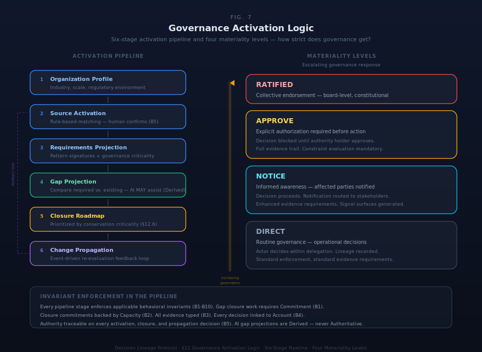

# §12 Governance Activation Logic

§11 specifies what governance content exists and how it is structured — the registry. This section specifies what happens when an organization engages with that registry: which patterns activate, what gaps exist, how gaps are assessed with verification precision, how gaps are prioritized by conservation criticality, and how closure proceeds through named stages.

§12 operationalizes what §8 derives — graduation as variety engineering — and what §9 establishes — conservation law preservation as the ordering principle for gap prioritization. The activation pipeline processes organizational events against the organizational world model, making the governance registry (§11) operational for a specific organization by detecting gaps and guiding remediation.



## §12.1 The Activation Pipeline


The governance activation pipeline transforms an organizational profile into an ordered closure roadmap through six sequential stages. Each stage has defined inputs, outputs, and architectural constraints.

### Table 12.1.1: Activation Pipeline Stages

| Stage | Input | Process | Output | Architectural Constraint |
|---|---|---|---|---|
| **1. Organization Profile** | Organizational characteristics: industry, scale, regulatory environment, graduation stage, active primitive tiers | Capture and validate profile attributes against controlled vocabularies | Validated profile record with governance-relevant characteristics | Profile is an Account (§4) — every profile change is a governance state transformation with lineage |
| **2. Source Activation** | Validated profile + registered governance sources (§11) | Evaluate each source's trigger conditions against profile attributes; select applicable sources | Set of activated governance sources with activation type (full, partial, reference) | Activation MUST NOT be automatic — the engine proposes; a human with traceable authority (B5) confirms |
| **3. Requirements Projection** | Activated sources + pattern signatures from each source | For each activated source, resolve the applicable pattern signatures and their hierarchy | Set of required pattern signatures — the organization's governance requirements | Projected patterns inherit the governance criticality (§11.7) and conservation law references of their source signatures |
| **4. Gap Projection** | Required patterns + existing governance state (verification records, evidence artifacts) | Compare each required pattern against existing evidence; classify gap status using verification types (§6.7) | Gap register — each gap qualified by which verification types are present and which are missing | Gap projection is computational — AI agents MAY perform this stage. Gap evidence carries truth type Derived until human review. |
| **5. Closure Roadmap** | Gap register + governance criticality + cross-framework dependencies (§11.4) | Prioritize gaps into ordered closure sequence using the four-level criticality scheme (§12.6) | Ordered closure roadmap with named progression stages per gap (§12.7) | Closure ordering is deterministic given the criticality scheme — conservation-critical before invariant-enforcing before standard before advisory |
| **6. Change Propagation** | Profile changes, new source registrations, conformance test results (§13.6) | When inputs change, re-execute affected pipeline stages; propagate changes through dependent stages | Updated activation set, updated gap register, updated closure roadmap | Propagation is event-driven, not continuous — triggered by profile change, source update, or conformance feedback |

The pipeline is not a one-time operation. Stage 6 creates a feedback loop: conformance test results from the policy projection layer (§13.6) flow back as gap register updates, which trigger closure roadmap re-prioritization. Profile changes trigger re-evaluation starting at Stage 2. New governance source registrations trigger re-evaluation starting at Stage 3.

**SDK Constraints:**
- **MUST:** The pipeline exposes each stage as a distinct, queryable operation with typed inputs and outputs.
- **MUST:** Every pipeline execution produces an audit trail — who triggered it, when, what changed.
- **MUST NOT:** The pipeline execute autonomously on a schedule. Activation is event-triggered: profile change, source update, or conformance feedback.
- **DESIGN SPACE:** Batch vs. incremental re-evaluation when inputs change is an implementation choice. The architecture requires that the output is equivalent regardless of evaluation strategy.

## §12.2 Rule-Based Activation Model


Activation is rule-based. Each governance source in the registry (§11) declares one or more trigger conditions. The activation engine evaluates which sources apply to a given organizational profile by matching profile attributes against trigger conditions.

### Table 12.2.1: Activation Rule Structure

| Component | Description | Example |
|---|---|---|
| **Governance source** | The registered source this rule activates | COSO ERM, ERKIA, FinOps for AI |
| **Trigger conditions** | Boolean expression over profile attributes — composed using ANY-OF (disjunction) and ALL-OF (conjunction) | ANY-OF: is_public_company, annual_revenue > threshold, employee_count > threshold |
| **Activation type** | Whether the source is fully activated, partially activated, or activated as reference only | Full (all patterns applicable), Partial (subset of patterns), Reference (informational only) |
| **Mandatory flag** | Whether activation is unconditional for matching profiles | COSO IC: mandatory for all organizations. NIST AI RMF: mandatory when deploying AI systems. |
| **Priority** | Ordering when multiple rules apply to the same source | Lower priority number = higher precedence |

### Activation Algorithm

The activation algorithm evaluates each governance source independently against the organizational profile:

```
FUNCTION evaluate_activation(profile, registered_sources):

    activated = []

    FOR EACH source IN registered_sources:
        FOR EACH rule IN source.activation_rules:
            IF evaluate_trigger(rule.conditions, profile):
                activated.add({
                    source: source,
                    activation_type: rule.activation_type,
                    mandatory: rule.mandatory
                })
                BREAK  // First matching rule wins per source

    // Apply tier-aware filtering (§12.5)
    activated = filter_by_active_tiers(activated, profile.active_tiers)

    RETURN activated


FUNCTION evaluate_trigger(conditions, profile):

    IF conditions.type == "ANY_OF":
        RETURN ANY(evaluate_single(c, profile) FOR c IN conditions.clauses)

    IF conditions.type == "ALL_OF":
        RETURN ALL(evaluate_single(c, profile) FOR c IN conditions.clauses)

    RETURN evaluate_single(conditions, profile)


FUNCTION evaluate_single(condition, profile):
    actual = profile[condition.attribute]
    RETURN apply_operator(actual, condition.operator, condition.value)
```

The algorithm produces an activation proposal — a set of governance sources with their activation types. The proposal is computational; the confirmation is a governance act.

**SDK Constraints:**
- **MUST:** Activation rules are declarative. The trigger conditions are data, not code — they are evaluated by a generic engine, not hard-coded per source.
- **MUST NOT:** The activation engine auto-activate sources without human confirmation. The engine proposes applicability; a human with traceable authority (B5) confirms. Mandatory sources are flagged as mandatory in the proposal — they are not silently activated.
- **MUST NOT:** Activation be continuous or polling-based. Activation evaluates when a profile is assessed or when a governance source is registered or updated.
- **DESIGN SPACE:** The operator vocabulary for trigger conditions (equals, not_equals, greater_than, less_than, contains, member_of) is implementation-defined. The architecture requires that conditions are expressible as composable Boolean expressions over profile attributes.

## §12.3 Invariant Enforcement in the Activation Pipeline


The activation pipeline produces governance state — activated sources, gap assessments, closure decisions, change propagation events. This state MUST satisfy all ten behavioral invariants (§5). Each invariant maps to specific pipeline stages where enforcement is required.

### Table 12.3.1: Invariant-to-Pipeline Enforcement Mapping

| Invariant | Rule | Pipeline Stage(s) | Enforcement Mechanism | Failure Mode If Absent |
|---|---|---|---|---|
| **B1** | Work requires Commitment | Stage 5 (Closure Roadmap) | Gap closure work items MUST trace to a Commitment — no closure effort without formal agreement to close | Shadow closure — effort expended on gap closure that no one has committed to; resources consumed without organizational agreement |
| **B2** | Commitment requires Capacity | Stage 5 (Closure Roadmap) | Closure commitments MUST be backed by verified Capacity — no closure promises without resource verification | Impossible closure promises — gaps committed to closing without verifying the organization has the resources to do so |
| **B3** | Evidence requires Truth Type | Stage 4 (Gap Projection) | All gap evidence MUST carry a truth type. AI-generated gap projections are Derived. Human gap assessments are Declared. Closure confirmations are Authoritative. | Epistemically unmarked gap assessments — the organization cannot distinguish AI-projected gaps from human-verified gaps from confirmed closures |
| **B4** | Decision requires Account | Stages 2, 5, 6 (Source Activation, Closure, Change Propagation) | Source activation decisions, closure decisions, and change approvals MUST link to an Account providing full state context | Context-free governance decisions — the organization knows a source was activated or a gap was closed but not against what organizational state |
| **B5** | Authority must be traceable | Stages 2, 5, 6 (Source Activation, Closure, Change Propagation) | The actor confirming source activation, closing a gap, or approving a change MUST hold traceable Authority with a delegation chain terminating at a root | Untraceable governance acts — binding governance decisions made by actors whose authority cannot be verified |
| **B6** | Constraint binds primitives | Stage 3 (Requirements Projection) | When patterns activate, their constraint-aligned signatures MUST bind to specific primitive instances or classes — no unbound governance requirements | Unbound governance — requirements exist as documentation but do not attach to governed objects; governance is aspirational, not operational |
| **B7** | All objects flaggable | Stages 4, 5 (Gap Projection, Closure Roadmap) | Every gap in the gap register and every item in the closure roadmap MUST have a signal attachment surface | Invisible gap problems — stakeholders cannot flag issues with gap assessments or closure progress; problems in the governance pipeline itself are unobservable |
| **B8** | Signals route to authority | Stages 4, 5, 6 (Gap Projection, Closure, Change Propagation) | Signals raised against gaps, closure items, or propagated changes MUST route to an authority on the governance chain for the affected scope | Unrouted governance signals — problems are flagged against gaps or closures but never reach anyone with the authority to act |
| **B9** | IQ resolution creates Decision | Stage 4 (Gap Projection), Stage 6 (Change Propagation) | When gap investigation or change analysis produces findings, those findings MUST produce a Decision or Work item — no inert governance intelligence | Inert gap intelligence — the organization discovers governance issues through gap projection or change analysis but the findings never convert to action |

**Enforcement timing.** B1–B6 enforcement follows the two-pass validation architecture (§5.3). Pass 1 shapes (B1, B2, B3, B4, B5 immediate, B6 binding) enforce synchronously on every pipeline write — a closure work item without a Commitment link is rejected immediately. Pass 2 shapes (B5 transitive, B6 universal, B8, B9) enforce on a configurable schedule — signal routing availability and IQ resolution completeness are monitored, not gated per-operation.

## §12.4 Graduated Gap Assessment


Gap assessment uses the seven verification types from §6.7, not binary pass/fail. A gap is not simply present or absent — it is characterized by which verification types the existing governance pattern satisfies and which it does not.

The seven verification types form a precision spectrum:

```
EXIST → COMPLETE → CURRENT → APPROVED → CONSISTENT → COMPLIANT → RATIFIED
```

A pattern that EXISTS but is not COMPLETE is a structurally different gap than one that is COMPLETE, CURRENT, and APPROVED but not yet CONSISTENT with related patterns. The graduated model transforms gap assessment from "is it implemented?" to "is it implemented to the required verification standard?"

### Table 12.4.1: Verification-Type-Qualified Gap Assessment

| Gap Profile | Verification Types Present | Gap Characterization | Closure Action |
|---|---|---|---|
| **Absent** | None | Pattern has no corresponding governance artifact — full gap | Create the governance artifact from scratch |
| **Exists but incomplete** | EXIST | Artifact exists but lacks required components | Complete the artifact's required fields and structure |
| **Complete but stale** | EXIST, COMPLETE | Artifact is structurally complete but not reviewed for currency | Review and update to reflect current organizational state |
| **Current but unauthorized** | EXIST, COMPLETE, CURRENT | Artifact is current but lacks required approval | Route to authority holder for approval |
| **Approved but inconsistent** | EXIST, COMPLETE, CURRENT, APPROVED | Artifact is approved but misaligns with related governance artifacts | Resolve cross-reference inconsistencies |
| **Consistent but non-compliant** | EXIST, COMPLETE, CURRENT, APPROVED, CONSISTENT | Artifact is internally consistent but does not satisfy external standards | Align with applicable external requirements |
| **Compliant but unratified** | EXIST, COMPLETE, CURRENT, APPROVED, CONSISTENT, COMPLIANT | Artifact satisfies all standards but has not received formal collective endorsement | Submit for governing body ratification |
| **Fully verified** | All seven types | No gap — pattern fully satisfies all required verification types | Maintain; re-verify on schedule |

Not all patterns require all seven verification types. The required verification depth depends on the pattern's materiality level.

### Table 12.4.2: Materiality-Based Required Verification

| Materiality Level | Required Verification Types | Rationale | Applies To |
|---|---|---|---|
| **Baseline** | EXIST, COMPLETE | The governance artifact must exist and be structurally whole | All activated patterns — the minimum verification for any governance requirement |
| **High-risk** | EXIST, COMPLETE, CURRENT, APPROVED | The artifact must additionally be current and authorized | Patterns with governance criticality of invariant_enforcing or higher; patterns in regulated domains |
| **Certification-grade** | EXIST, COMPLETE, CURRENT, APPROVED, CONSISTENT, COMPLIANT | The artifact must additionally align with related artifacts and satisfy external standards | Patterns mapped to certifiable frameworks (ISO 27001, ISO 42001, SOC 2, FedRAMP) |

RATIFIED is not included in any materiality level by default. It applies only to specific patterns where collective endorsement is explicitly required — board-level governance decisions, constitutional organizational policies. Profiles configure which patterns require RATIFIED.

A gap is closed when the governance artifact satisfies all verification types required by its materiality level. A pattern at baseline materiality is closed when it passes EXIST and COMPLETE. The same pattern at certification-grade materiality requires six verification types to close. The gap register tracks both the current verification state and the required verification state for each pattern, producing a precise closure distance.

## §12.5 Tier-Aware Activation


The activation engine filters patterns by the organization's active primitive tiers, which are gated by graduation stage. An organization that has not demonstrated governance capability at lower tiers should not be governed by pattern expectations that reference higher-tier primitives.

### Table 12.5.1: Graduation Stage Gates

| Graduation Stage | Active Tiers | Pattern Scope | Rationale |
|---|---|---|---|
| **Stage A (Capture)** | Tiers 1–2 | Patterns aligned to the nine core primitives (§4.1) and the four infrastructure primitives (§4.6.1) only | Stage A organizations capture governance state. Patterns referencing Orientation, Learning, or Activation (Tier 3) are premature — the organization has not yet demonstrated basic governance capture capability. |
| **Stage B (Advise)** | Tiers 1–3 | Stage A patterns + patterns aligned to Orientation, Learning, and Activation (§4.6.2) | Stage B organizations receive governance intelligence. Patterns referencing Interpretation or Environment Interface (Tier 4) are premature — the organization has not yet demonstrated pre-decisional framing and institutional adaptation. |
| **Stage C (Orchestrate)** | Tiers 1–5 | Full pattern scope — all registered patterns eligible for activation | Stage C organizations operate with full AI participation in governance chains. All tiers active; all patterns eligible. Tier 5 (Cycle) activates as an organizational configuration choice. |

**Filtering mechanism.** Each pattern signature carries a primitive alignment field (§11.7) listing the Tier 1 primitives it maps to. Tier 2–5 primitives are referenced through the pattern's activation context. The activation engine compares each pattern's tier requirements against the organization's active tier set. Patterns requiring primitives above the active tier set are excluded from the activation proposal.

**SDK Constraints:**
- **MUST:** The activation engine skip patterns whose primitive alignment or activation context references primitives above the organization's active tier set.
- **MUST NOT:** A Stage A organization activate Tier 3+ patterns. This is a structural constraint, not a recommendation — it prevents governance overreach.
- **DESIGN SPACE:** How tier requirements are encoded on pattern signatures (explicit tier field vs. inferred from primitive alignment) is an implementation choice. The architecture requires that tier filtering produces correct results regardless of encoding strategy.

## §12.6 Conservation-Aware Gap Prioritization


Gap prioritization uses the four-level governance criticality classification defined in §11.7 Table 11.7.2. Each pattern signature carries a criticality level. When a gap exists in a pattern, the criticality level determines the gap's position in the closure roadmap.

### Table 12.6.1: Gap Prioritization Scheme

| Priority | Criticality Level | Definition | Prioritization Rule | Example Gap |
|---|---|---|---|---|
| **1 (highest)** | Conservation-critical | Gap in a pattern that directly enforces one of the nine conservation laws (§9) | Always first in closure roadmap regardless of layer, tier, or materiality | Missing authority traceability pattern — delegation invariance cannot be verified; authority chains may contain untraceable links |
| **2** | Invariant-enforcing | Gap in a pattern that supports B1–B10 behavioral invariant enforcement (§5) | After conservation-critical; before standard | Missing evidence classification pattern — B3 enforcement weakened; some evidence may lack truth type marking |
| **3** | Standard | Gap in a recognized governance best practice pattern | After invariant-enforcing; before advisory | Missing COSO IC principle — internal control framework incomplete but not structurally dangerous |
| **4 (lowest)** | Advisory | Gap in an operational guidance or reference pattern | Last in closure roadmap | Missing FinOps maturity pattern — operational opportunity but no structural governance risk |

**Within-level ordering.** When multiple gaps share the same criticality level, secondary ordering applies:

1. **Governance layer** (§11.3): Layer 1 (External Standards) before Layer 2 (AI-Native) before Layer 3 (Operational Authorities) — foundational governance before extensions.
2. **Layer 1 tier** (§11.4): Foundational before Risk & Security before Specialized — dependencies before dependents.
3. **Materiality level** (§12.4): Certification-grade before high-risk before baseline — higher verification requirements indicate higher organizational stakes.
4. **Cross-framework dependency** (§11.4 Table 11.4.2): Dependency sources before dependent sources — COSO IC gaps before SOC 2 gaps.

This ordering is deterministic. Given the same gap register and the same criticality scheme, any implementation produces the same closure sequence.

**SDK Constraints:**
- **MUST:** The closure roadmap order conservation-critical gaps before all other gaps regardless of other ordering factors.
- **MUST:** Within-level ordering follow the four-factor sequence: layer → tier → materiality → dependency.
- **DESIGN SPACE:** Whether the closure roadmap is computed eagerly (full roadmap on every gap register change) or lazily (next-N items on demand) is an implementation choice.

## §12.7 Closure Roadmap Architecture


A gap is a governance coverage observation, not a failure state. "Governance coverage has not yet extended here" is a roadmap input — it positions the organization on a known path, not in an error condition. Closure is the progression from gap identification to governance coverage.

Four named closure stages structure this progression. Each stage has entry criteria that the preceding stage must satisfy before the gap can advance.

### Table 12.7.1: Closure Progression Stages

| Stage | Name | Entry Criteria | Governance Posture | Example |
|---|---|---|---|---|
| **1** | **Awareness** | Gap projected by the activation pipeline (Stage 4 output) | The organization knows the gap exists. No commitment to close. | Gap projection identifies a missing NIST CSF GOVERN function pattern. The gap appears in the gap register. |
| **2** | **Enablement** | Gap acknowledged by an authority holder with jurisdiction over the gap's governance scope | Resources and authority allocated to close the gap. The authority holder has accepted responsibility. | The CISO reviews the NIST CSF gap, acknowledges it, and assigns ownership to the security program lead. |
| **3** | **Management** | Work primitive (§4) created with gap-specific acceptance criteria; Commitment backed by Capacity (B1, B2 enforced) | Active work in progress on gap closure. The closure is governed work within the substrate — tracked, committed, and capacity-verified. | The security team creates a work item: "Establish GOVERN function." The work traces to a commitment backed by budgeted capacity. |
| **4** | **Governance** | Conformance test (§13.6) passes at the verification level required by the pattern's materiality (§12.4) | Gap closed — the governance artifact exists and satisfies all required verification types. The gap exits the gap register. | The GOVERN function policy document passes EXIST, COMPLETE, CURRENT, and APPROVED verification. The gap is removed from the closure roadmap. |

**Progression invariants.** The four stages enforce a strict ordering: Awareness → Enablement → Management → Governance. A gap cannot advance to Management without first being enabled (authority acknowledged). A gap cannot be closed without passing the conformance test at the required verification depth. Backward transitions are permitted: a gap in Management can return to Enablement if the authority holder withdraws commitment, or return to Awareness if the underlying profile changes.

**SDK Constraints:**
- **MUST:** Gap closure produce a Decision primitive (§4) linking to the Account that provides the gap's state context (B4 enforced). The closure decision records which verification types passed, under whose authority, and against what organizational state.
- **MUST NOT:** Gap closure be automated. Closing a gap is a governance act: it asserts that the organization has extended governance coverage to a previously uncovered area. This assertion requires human authority. AI agents MAY compute gap projections, verify conformance test inputs, and draft closure evidence — but the closure decision is a human act.
- **MUST NOT:** AI agents perform activation acts: source activation, gap closure, or change approval. These are governance acts requiring human authority consistent with the AI-Cannot-Be-Principal constraint (§22).
- **DESIGN SPACE:** Whether closure stages are tracked as explicit state on the gap record or inferred from the presence of related primitives (a Work item with gap-specific criteria implies Management stage) is an implementation choice.

## §12.8 Actor Constraints


Activation pipeline operations divide into two categories: computational acts (pattern matching, gap projection, roadmap ordering) and governance acts (source confirmation, gap closure, change approval). The distinction determines which actors may perform which operations.

### Table 12.8.1: Actor Participation in Activation Pipeline

| Pipeline Operation | Category | Allowed Actor Types | Governance Posture | Constraint |
|---|---|---|---|---|
| **Profile assessment** | Governance act | Human, Organizational Unit | Any | Profile declaration is an assertion of organizational characteristics — requires human judgment about the organization's state |
| **Trigger evaluation** | Computational act | Human, AI Agent, System | Any | Evaluating whether a profile matches trigger conditions is pattern matching — no discretion required |
| **Activation proposal** | Computational act | Human, AI Agent, System | Any | Assembling the set of sources whose triggers match is computation — produces a proposal, not a decision |
| **Activation confirmation** | Governance act | Human only | Assistive or Agentic | Confirming that proposed sources apply to this organization is a governance decision requiring traceable authority (B5) |
| **Requirements projection** | Computational act | Human, AI Agent, System | Any | Resolving applicable patterns from activated sources is deterministic given the activation set |
| **Gap projection** | Computational act | Human, AI Agent, System | Any | Comparing required patterns against existing evidence is computation — produces Derived evidence (B3) |
| **Gap assessment review** | Governance act | Human only | Assistive or Agentic | Confirming gap accuracy and materiality is a governance judgment — promotes gap evidence from Derived to Declared (§6) |
| **Closure roadmap ordering** | Computational act | Human, AI Agent, System | Any | Applying the prioritization scheme (§12.6) to the gap register is deterministic |
| **Gap closure** | Governance act | Human only | Assistive or Agentic | Asserting that governance coverage has extended to a previously uncovered area requires human authority |
| **Change approval** | Governance act | Human only | Assistive or Agentic | Approving propagated changes to the activation set, gap register, or closure roadmap requires human authority |

The table enforces a structural principle: AI agents amplify human governance capacity by performing computational acts at machine speed, but governance acts — the decisions that create, modify, or close governance state — require human authority. This is not a transitional limitation. The principle derives from the architectural position that governance legitimacy requires traceable human authority (B5), not from a temporary distrust of AI capability.

**SDK Constraints:**
- **MUST:** The pipeline enforce actor type and governance posture constraints at each operation boundary. A governance act attempted by an AI agent is rejected, not logged for later review.
- **MUST:** Every governance act in the pipeline produce an audit record identifying the human actor, their authority chain (B5), and the Account context (B4).
- **MUST NOT:** AI agents perform governance acts even when operating in Agentic posture. Agentic posture permits autonomous computational acts within delegation bounds — it does not extend to governance acts in the activation pipeline.

## §12.9 Evidence Cold Start


A new organizational world model instance has structure (primitives and relationships from TMI translation, §20) but no evidence history. The first governance activations encounter an empty evidence base. This section specifies how the activation pipeline behaves under evidence-absent conditions.

### The Environment Interface as Cold Start Mechanism

Evidence cold start is not "no evidence exists" — it is "evidence enters through the Environment Interface (§4.6.3) from external systems at genesis." The Environment Interface primitive is the protocol-level cold start mechanism.

At genesis, the first Authoritative Evidence enters the substrate through Environment Interface connectors:

| Product Context | Environment Interface Source | First Authoritative Evidence |
|---|---|---|
| **New entity** (founder context) | Day-one connectors (e.g., business registration, financial infrastructure) | Entity creation records, Authority root establishment (business registration = first governed authority) |
| **Established organization** (enterprise context) | Document extraction connectors (existing policies, org charts, compliance artifacts) | Imported governance structure — the existing policies produce the initial evidence base for gap projection |

### Activation Pipeline Behavior at Genesis

| Pipeline Stage | Behavior Under Evidence-Absent Conditions |
|---|---|
| **Stage 1 (Organization Profile)** | Profile is populated from TMI translation (§20). Evidence base is thin but sufficient for profile validation. |
| **Stage 2 (Source Activation)** | Activation proceeds normally — trigger conditions evaluate against the profile, not against evidence. |
| **Stage 3 (Requirements Projection)** | Requirements project normally — they describe what governance coverage is needed, not what evidence currently exists. |
| **Stage 4 (Gap Projection)** | The gap register is maximally populated — almost every required pattern is a gap at genesis because evidence has not yet accumulated. This is expected and correct: the gap register reflects organizational governance maturity honestly. |
| **Stage 5 (Closure Roadmap)** | The closure roadmap is large at genesis and shrinks as evidence accumulates through Environment Interface connectors and operational activity. Conservation-critical gaps are prioritized first. |
| **Stage 6 (Change Propagation)** | As Environment Interface connectors populate evidence, the gap register dynamically updates — each new piece of evidence may close gaps or advance closure stages. |

### Truth Type at Genesis

Evidence arriving through Environment Interface at genesis carries truth type according to its source: Authoritative for legally binding records (business registration, regulatory filings), Declared for organizational assertions (internal policies, org charts), Derived for AI-extracted content (document parsing output). The TMI translation output (§20) produces Declared evidence — it is a human-reviewed representation of organizational structure, not yet Authoritative until the organization ratifies it through the standard promotion workflow.

## §12.10 Governance Maturity Framework


Governance maturity describes the arc of an organization's relationship with its organizational world model over time — from initial setup through full evidenced governance.

### Maturity Stages

| Stage | Name | Description | Evidence Characteristic |
|---|---|---|---|
| **1** | **Bootstrap** | TMI translation complete; primitives populated; Environment Interface connected; minimal evidence | Gap register maximally populated; evidence coverage < 20% |
| **2** | **Documented** | Core governance policies captured as Declared evidence; authority chains established; primary constraints defined | Gap register shrinking; evidence coverage 20-50%; most evidence is Declared |
| **3** | **Evidenced** | Operational evidence accumulating; decisions producing lineage; signals and IQs in use | Evidence coverage 50-80%; mix of Declared and Authoritative; governance activation operating |
| **4** | **Verified** | Conformance tests passing; verification types exercised across critical governance patterns | Evidence coverage > 80% for conservation-critical patterns; verification records present |
| **5** | **Audited** | External validation; full verification type coverage; governance record supports independent audit | Evidence coverage > 90%; full audit trail; external certifiers can verify governance posture |

### Maturity Metric: Evidence Coverage Ratio

The primary maturity metric is the evidence coverage ratio: the proportion of conservation-critical constraints (§12.6) that have Authoritative or Declared evidence supporting their satisfaction.

`coverage_ratio = (constraints_with_evidence / total_conservation_critical_constraints)`

This metric is computable from the gap register and closure roadmap. It provides a single quantitative indicator of governance maturity.

### DESIGN SPACE

- Advancement criteria (what specific evidence thresholds trigger stage transitions) are substrate-level configuration.
- Whether maturity is self-assessed or externally certified.
- How maturity interacts with profile graduation (PAS → BAS → EAS, §21.4) — maturity may be a prerequisite for profile graduation, or profile graduation may drive maturity advancement.
- Whether maturity stage is visible externally (e.g., in federation contexts, §23.4) as a trust signal.

