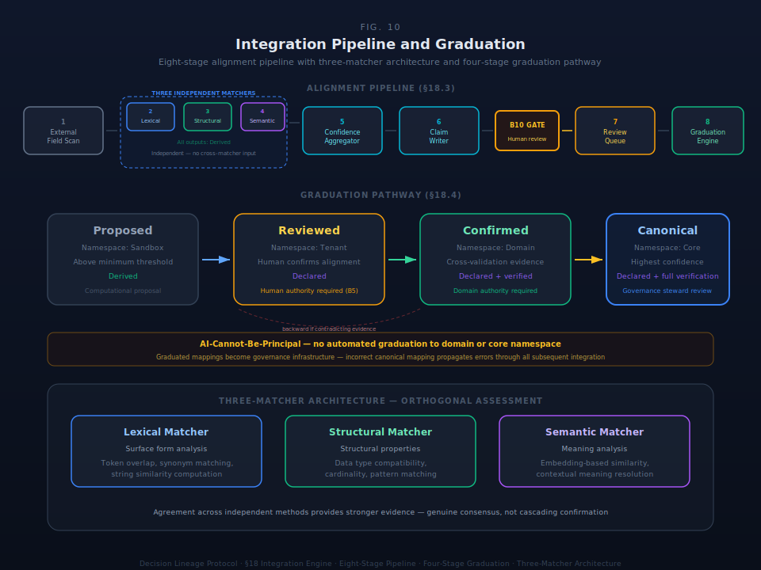

# §18 Integration Engine

The integration engine provides the architectural machinery for connecting the governance substrate to external knowledge systems, ontologies, and data sources. It specifies the engine: pipeline stages, graduation pathways, confidence models, and relationship types. It is independent of what content flows through the engine. §19 specifies the content — which ontologies, how they map, and what gets pre-loaded. §20 specifies how the substrate gets configured to receive it.

Integration connects the substrate's governance grammar — nineteen primitives across five tiers (§4) — to the external knowledge universe. External ontologies, domain vocabularies, regulatory taxonomies, and operational data structures all use different terms for governance-relevant concepts. The integration engine provides the protocol-level machinery for proposing, evaluating, reviewing, and graduating mappings between external concepts and substrate primitives.

The engine is domain-agnostic. The same pipeline processes a financial ontology mapping (FIBO concepts to Commitment and Constraint) and a legal ontology mapping (LKIF norms to Constraint and Authority). The pipeline architecture is protocol; the content that flows through it is configuration.

The integration engine operates within the substrate lifecycle (§18.2), processes external knowledge through the alignment pipeline (§18.3), graduates alignment claims through a variety engineering model (§18.4), and maintains nine integration-layer relationship types (§18.5) that extend the core composition model (§4.4). Every integration operation preserves the nine conservation laws (§9).

### §18.1 Integration Layer Purpose

Integration operates as a continuous function within the Operate stage of the substrate lifecycle. It is not a lifecycle stage. The earlier six-stage model (Genesis → Configure → Govern → Integrate → Operate → Learn) consolidated Govern and Integrate into Operate because both are continuous operational capabilities, not sequential phases passed through once. Integration runs continuously during Operate, producing alignment proposals, processing review decisions, and graduating confirmed mappings. The Plan stage monitors integration health — alignment coverage, graduation throughput, confidence trends — and allocates learning resources when integration patterns warrant structural adaptation.

### §18.2 Substrate Lifecycle Architecture

The substrate lifecycle is DLP-level architecture. Any DLP implementer requires these stages. The lifecycle consists of one entry point and one continuous cycle.

**Entry:** Genesis (one-time, irreversible).
**Cycle:** Configure → Operate → Plan → Learn → Configure → ...

Genesis is the only moment where authority is asserted rather than delegated. After genesis, all authority traces to a root, and the substrate lives in the cycle indefinitely.

#### Table 18.2.1: Lifecycle Stages

| Stage | Purpose | Entry Condition | Exit Condition | Key Activities |
|---|---|---|---|---|
| **Genesis** | Establish the substrate's initial valid state | Explicit initialization by a human with root authority | Seven genesis objects created atomically: root Authority, stewardship Entity, initial Account, genesis Context, root Namespace, foundational Constraint set, genesis Intent | Authority chain established; stewardship role created; first valid state produced. Irreversible — genesis cannot be re-executed on an existing substrate. |
| **Configure** | Populate the substrate with organizational context | Genesis complete (first time) or Learn output directs reconfiguration (recurring) | Substrate ready for governance activation: organizational model populated, profile selected, primitive tiers activated | Organizational context captured; profile assessment (EAS, BAS, or PAS) completed; primitive tier activation determined. The specific implementation of Configure is substrate-level — the protocol defines output requirements, not the configuration mechanism. |
| **Operate** | Steady-state governance execution | Governance activation (§12) complete (first time) or Configure output accepted (recurring) | Plan stage triggered by materiality threshold crossing or periodic review | Governance enforcement continuous (B1–B10 on every state transformation). Integration continuous (alignment pipeline processing). Capture continuous (Signal, IQ, Confidence mechanisms per §14–§16). |
| **Plan** | Risk-informed resource allocation | Accumulated operational signals cross materiality threshold, or periodic review triggers | Routing decision: single-loop (back to Operate), double-loop (forward to Learn), or spawn (new Configure for new operational context) | Signal classification by decision type. ERKIA materiality assessment (§11). Absorptive capacity evaluation. Integration health assessment — alignment coverage gaps, graduation backlogs, confidence degradation trends. |
| **Learn** | Double-loop adaptation — examine and change governing variables | Plan allocates learning resources for identified adaptation needs | Changed governing variables formalized; reconfiguration directives produced | Dissonance detection and root cause analysis. Collaborative reframing of governing variables. Institutional embedding — modified Constraints, updated Authority delegations, revised Intent declarations. Exploration/exploitation classification of learning outcomes. |

**First-time sequence.** A new substrate instance follows: Genesis → Configure → Governance Activation (§12) → Integration onboarding → Operational steady-state. Governance Activation occurs between Configure and Operate on first entry — the activated governance patterns (§12) establish the governance surface before steady-state operations begin. Integration onboarding initializes the alignment pipeline with the organization's external knowledge sources.

**Recurring cycle.** After the first-time sequence completes, the substrate operates in the four-stage cycle: Configure → Operate → Plan → Learn. On subsequent entries to Configure, only the specific governing variables identified by the Learn stage are reconfigured — not the full organizational onboarding.

**Spawning pattern.** When Plan identifies signals that reveal genuinely new operational possibilities — not improvements to existing operations, but new organizational capabilities — the allocation routes to Configure for a new operational context. The new context spawns on shared substrate infrastructure: it inherits the parent's authority chain and governance framework, composes from the same primitive set, and enforces the same invariants. This is the recursion principle operationalized — each new operational possibility is a new viable system instance on shared infrastructure.

#### Table 18.2.2: Function × Stage Matrix

Five functional capabilities operate at varying intensity across the lifecycle. The matrix specifies what the substrate does at each stage, independent of where it is in the temporal sequence.

| | Configure | Operate | Plan | Learn |
|---|---|---|---|---|
| **Capture** | Organizational context extraction (primary) | Signal + IQ + Confidence capture (primary) | Signal aggregation and pattern recognition | Feedback capture from learning process |
| **Compose** | Initial state composition from configuration inputs (primary) | State transformation — every organizational action becomes a primitive composition with full lineage (primary) | — | Recomposition — rebuilding governance state to reflect changed governing variables |
| **Enforce** | Constraint validation on initial state (active) | B1–B10 on every state transformation; truth type boundaries; authority checking (primary) | Invariant health audit across accumulated operational period (active) | Constraint evolution governance — changes to constraints satisfy meta-constraints (active) |
| **Project** | Initial governance landscape projections (emerging) | Policy projection across seven domains (§13); deviation measurement; integration coverage reporting (primary) | Materiality assessment; predictive composition — forward state projection from current trends (primary) | Impact projection — what changes if governing variables are modified (active) |
| **Adapt** | Dormant | Dormant | Route decision: single-loop, double-loop, or spawn (emerging) | Environmental scanning; institutional embedding; reconfiguration directives (primary) |

**Reading the matrix.** (primary) indicates peak intensity — the function is the dominant activity at that stage. (active) indicates the function operates but is not the primary concern. (emerging) indicates the function is activating but not yet fully engaged. (—) indicates the function is dormant or negligible. Every non-dormant cell represents active substrate computation.

### §18.3 TMI Alignment Pipeline Architecture

The alignment pipeline processes external knowledge into substrate-aligned claims. External field descriptors — the data structures, ontology concepts, and vocabulary terms from systems outside the substrate — enter the pipeline and emerge as alignment claims with confidence scores, truth type classification, and graduation eligibility.

The pipeline follows an eight-stage linear flow with a review gate between computational processing and graduation.

#### Table 18.3.1: Pipeline Stages

| Stage | Input | Process | Output | Truth Type |
|---|---|---|---|---|
| **1. External Field Scan** | External system schema, ontology definition, or data dictionary | Identify candidate fields, concepts, or terms for alignment. Register source metadata in the integration registry. | Set of external field descriptors with source attribution | N/A (input registration) |
| **2. Lexical Matcher** | External field descriptors + substrate concept vocabulary | Token overlap analysis, synonym matching via alternative labels, string similarity computation | Per-field lexical similarity scores against candidate primitive alignments | Derived |
| **3. Structural Matcher** | External field descriptors + substrate concept structure | Data type compatibility analysis, cardinality comparison, structural pattern matching | Per-field structural similarity scores against candidate primitive alignments | Derived |
| **4. Semantic Matcher** | External field descriptors + substrate concept embeddings | Embedding-based semantic similarity, contextual meaning resolution | Per-field semantic similarity scores against candidate primitive alignments | Derived |
| **5. Confidence Aggregator** | Scores from all three matchers | Weighted combination of matcher scores with consensus bonus for agreement across matchers | Aggregated confidence score per alignment proposal | Derived |
| **6. Claim Writer** | Aggregated proposals above minimum confidence threshold | Write alignment claim to claims registry with full provenance: source field, proposed primitive, confidence score, matcher contributions, consensus indicator | Alignment claim record in staging | Derived |
| **7. Review Queue** | Alignment claims awaiting human review | Human reviewer evaluates proposed alignment: confirm, correct, or reject. Conservation law violation check (§18.6). | Reviewed alignment claim — confirmed, corrected, or rejected | Declared (on confirmation) |
| **8. Graduation Engine** | Confirmed alignment claims meeting graduation criteria | Two-stage evaluation (§18.4): normalization gates then multi-dimensional scoring. Namespace promotion on success. | Graduated mapping in target namespace scope | Declared with verification type |

#### Three-Matcher Architecture

The three-matcher pattern is protocol-level architecture. Lexical, structural, and semantic matchers assess alignment from orthogonal perspectives — surface form, structural properties, and meaning. The three-matcher design provides robustness: a correct alignment that fails lexical matching (different terminology) can still succeed through structural and semantic matching. A misleading alignment that passes lexical matching (similar terms with different meanings) is caught by structural and semantic disagreement.

**MUST:** All three matchers execute independently. No matcher receives another matcher's scores as input. Independence ensures that matcher agreement is genuine consensus, not cascading confirmation.

**MUST:** The Confidence Aggregator combine scores from all three matchers with a consensus bonus when matchers agree. Agreement across independent assessment methods provides stronger evidence of correct alignment than any single high-confidence matcher score.

**DESIGN SPACE:** Specific matcher implementations, scoring algorithms, weight distributions across matchers, consensus bonus formula, and minimum confidence thresholds are domain-configurable. The three-matcher pattern and independent execution are protocol; the implementation details within each matcher are substrate-level choices.

#### Signal and IQ Generation

The alignment pipeline may generate Signals and Investigative Queries (§14–§16) during processing. A low-confidence alignment proposal for a Tier 1 primitive may trigger a Signal routed to the governance authority responsible for that primitive's domain. A pattern of alignment failures across a specific external ontology may generate an IQ for systematic investigation. These capture mechanisms operate within the pipeline as architectural integration points — the pipeline does not suppress organizational awareness of alignment challenges.

### §18.4 Graduation Engine Architecture

The graduation engine manages the pathway from proposed alignment to verified mapping. It operationalizes graduation as variety engineering (§8): each graduation stage transfers variety management responsibility from human reviewers to the substrate's verified mapping infrastructure, with evidence accumulation justifying each transfer.

#### Table 18.4.1: Graduation Pathway

| Stage | Namespace Scope | Confidence Requirement | Authority Requirement | Truth Type |
|---|---|---|---|---|
| **Proposed** | Sandbox | Above minimum pipeline threshold | None — computational proposal | Derived |
| **Reviewed** | Tenant | Human reviewer confirms alignment correctness | Human with authority over the integration scope — traceable via B5 | Declared |
| **Confirmed** | Domain | Tier-weighted confidence threshold met; cross-validation evidence accumulated | Domain authority with governance jurisdiction — human authority required | Declared with verification types (EXIST, APPROVED, CONSISTENT) |
| **Canonical** | Core | Highest confidence threshold; demonstrated stability across operational use | Architectural review by governance steward — human authority required | Declared with full verification (EXIST, APPROVED, CONSISTENT, COMPLIANT) |

**Progression invariants.** Graduation follows strict ordering: Proposed → Reviewed → Confirmed → Canonical. A mapping cannot advance to Confirmed without first passing human review at the Reviewed stage. A mapping cannot reach Canonical without demonstrated operational stability at the Confirmed stage. Backward transitions are permitted: a Confirmed mapping can return to Reviewed if contradicting evidence surfaces or if the external ontology changes.

**AI-Cannot-Be-Principal.** No automated process may graduate an alignment to a namespace scope that produces Authoritative truth type assertions. The Confirmed and Canonical stages require human authority because graduated mappings become part of the governance infrastructure — they determine how external data is interpreted within the substrate. An incorrect canonical mapping propagates errors through every subsequent integration operation that references it. Human authority at graduation is not a transitional limitation; it is a structural requirement derived from the position that governance legitimacy requires traceable human authority (B5, §12.8).

**MUST:** Human authority required for graduation to domain or core namespace scope.
**MUST NOT:** Automated graduation to core namespace without architectural review by a governance steward.

#### Two-Stage Evaluation Model

The graduation engine uses a two-stage evaluation for every graduation decision. The pattern is protocol-level architecture; the specific evaluation criteria within each stage are domain-configurable.

**Stage A: Normalization Gates.** Before scoring, the graduation engine verifies that the alignment claim is properly classified. Three normalization gates ensure the scored object represents what it claims to represent:

- **Category correction.** Verify that the proposed primitive alignment is categorically correct — an external concept proposed as Work is not actually a Decision or Commitment in disguise.
- **Structural collapsing.** Detect when multiple alignment proposals resolve to the same underlying concept and should be consolidated rather than independently graduated.
- **Grouped logic detection.** Identify when an external concept maps to a composition of primitives rather than a single primitive — a concept that spans both Authority and Decision requires a compositional mapping, not a simple one-to-one alignment.

Stage A gates are pass/fail. A claim that fails any normalization gate returns to the Review Queue for reclassification before scoring proceeds.

**Stage B: Multi-dimensional scoring.** Claims that pass normalization gates are scored across multiple independent dimensions. The multi-dimensional approach prevents a single strong signal from masking weakness in other evaluation aspects.

**MUST:** Scoring use multiple independent dimensions. A single-dimension score (e.g., confidence alone) is insufficient — it does not distinguish a high-confidence trivial mapping from a high-confidence structurally significant one.
**DESIGN SPACE:** Specific scoring dimensions, dimension weights, threshold values, and dimension definitions are domain-configurable per deployment context. The protocol requires multi-dimensional scoring; it does not prescribe which dimensions.

#### Tier-Weighted Confidence

Alignment claims touching higher-tier primitives require higher graduation confidence. This reflects the architectural reality that errors in higher-tier primitive mappings have greater blast radius:

- **Tier 1 (Irreducible Core):** Highest confidence required. An incorrect mapping to Intent, Commitment, Authority, or any of the nine core primitives propagates errors through conservation law enforcement. Every state transformation that references the mapping inherits the error.
- **Tier 2 (Unconditional Infrastructure):** High confidence required. Identifier, Entity, Context, and Namespace mappings affect every primitive instance — infrastructure errors are pervasive.
- **Tier 3 (Governed Operation):** Moderate confidence required. Orientation, Learning, and Activation mappings affect cognitive sophistication but are bounded by tier boundary rules (§4.7).
- **Tier 4 (AI-Native Extensions):** Lower confidence acceptable. Interpretation errors are recoverable by design — AI-generated content enters as Derived truth type and requires human promotion.
- **Tier 5 (Operational Configuration):** Lowest confidence acceptable. Cycle mapping errors affect temporal governance legibility but do not propagate through conservation law enforcement.

**MUST:** Graduation thresholds account for the target primitive's tier. A Tier 1 alignment claim at the same raw confidence score as a Tier 5 claim faces a higher graduation bar.
**DESIGN SPACE:** Specific tier-weight values, the mathematical formula relating tier to threshold adjustment, and the base confidence thresholds are domain-configurable.

### §18.5 Integration Relationship Types

Nine integration-layer relationships extend the thirteen core composition relationships defined in §4.4 Table 4.4.1. The core relationships — motivates, frames, requires, authorizes, enables, produces, evaluates, contextualizes, records, legitimizes, delegates, governs, constrains — define how primitives compose in the governance graph. The integration relationships define how the integration engine interacts with that graph during alignment and lifecycle management.

#### Table 18.5.1: Integration Relationship Types

| Relationship | From | To | Cardinality | Semantic |
|---|---|---|---|---|
| **signals** | Any primitive instance | Signal record (§14) | 1:M | A governed object raises a signal during integration processing — alignment anomalies, confidence degradation, or conservation law tension detected by the pipeline |
| **routesTo** | Signal or alignment claim | Authority instance | M:M | Integration signals and claims route to the authority responsible for the affected governance scope — implements B8 within the integration context |
| **conserves** | Integration operation | Conservation law (§9) | M:M | An integration operation preserves a specific conservation law — the explicit assertion that the operation maintains the invariance |
| **activates** | Alignment claim confirmation | Governance pattern (§11) | 1:M | A confirmed alignment claim activates downstream governance patterns — verified mappings enable governance coverage to extend to newly integrated domains |
| **interprets** | Semantic Matcher output | External field descriptor | M:M | The semantic matcher's meaning resolution for an external concept — captures what the matcher understood, at what confidence, under what assumptions (connects to Interpretation primitive, §4.6.3) |
| **orients** | Integration health metrics | Orientation instance | M:M | Integration coverage, confidence trends, and graduation throughput inform the substrate's pre-decisional framing — alignment landscape awareness feeds Orientation (§4.6.2) |
| **learns** | Alignment feedback record | Learning instance | M:M | Reviewer corrections, graduation reversions, and confidence recalibrations feed the institutional learning mechanism — integration experience becomes organizational knowledge |
| **scopes** | Namespace assignment | Alignment claim | 1:M | The namespace scope (sandbox, tenant, domain, core) assigned to an alignment claim — determines the claim's governance authority and visibility boundaries |
| **graduates** | Graduation decision | Alignment claim | 1:1 | The graduation act that promotes an alignment claim to a higher namespace scope — a Decision with Authority, producing Evidence with truth type Declared |

#### Architectural Boundary

These nine relationships are integration-context extensions. They do not modify the locked thirteen core composition relationships (§4.4). The core model specifies how primitives compose into governance state. The integration model specifies how the integration engine operates on that governance state during alignment, review, and graduation.

The distinction is enforced: integration relationships reference integration-specific objects (alignment claims, pipeline stages, graduation decisions) that exist within the integration engine's operational scope. They do not redefine how Intent motivates Commitment or how Authority legitimizes Decision — those relationships are locked in §4.4 and invariant across all operational contexts.

### §18.6 Conservation Law Preservation

Every integration operation — alignment proposal, graduation act, namespace promotion, relationship-type assignment — must preserve the nine conservation laws (§9). Integration extends the substrate's governance surface to new domains; it must not compromise the invariances that make governance structurally sound.

#### Table 18.6.1: Integration × Conservation Law

| Conservation Law | Conserved Quantity | Integration Obligation | Violation Detection |
|---|---|---|---|
| **Organizational direction** (Intent) | Purpose persists through governance actions | Alignment proposals must not create mappings that fragment organizational purpose — an external concept mapped to Intent in one integration context must carry the same directional meaning across all contexts | Review Queue (§18.3 Stage 7): reviewer verifies that proposed Intent mappings preserve purpose invariance across integration contexts |
| **Binding force** (Commitment) | Responsibility cannot vanish | Alignment proposals mapping external obligations to Commitment must preserve binding force — a contractual obligation in the external system must remain binding in the substrate representation | Graduation Engine (§18.4): normalization gate verifies that Commitment-aligned concepts carry obligation semantics, not aspirational semantics |
| **Feasibility truth** (Capacity) | Available resources are factual | Alignment proposals mapping external resource data to Capacity must preserve factual grounding — capacity representations must reflect verified availability, not projected or optimistic availability | Confidence Aggregator (§18.3 Stage 5): structural matcher detects when external capacity fields carry different verification standards than the substrate requires |
| **State transformation fidelity** (Work) | Same action produces same state change | Alignment proposals mapping external process data to Work must preserve transformation fidelity — identical external processes must map to identical substrate state changes | Review Queue: reviewer verifies that Work-aligned mappings produce consistent state transformation semantics across external system variants |
| **Epistemic status** (Evidence) | Proof quality is intrinsic to the record | Alignment proposals mapping external data artifacts to Evidence must classify truth type at the point of mapping — no external data enters the Evidence primitive without epistemic classification (B3) | Pipeline invariant: Claim Writer (§18.3 Stage 6) enforces B3 on every alignment claim. Claims without truth type classification are rejected. |
| **Option space completeness** (Decision) | Full state visible at decision time | Alignment proposals mapping external decision records to Decision must preserve the full option space — a decision record that omits rejected alternatives violates the conservation law | Normalization gate (§18.4 Stage A): category correction detects when external decision records are structurally incomplete relative to the Decision primitive's requirements |
| **Scope preservation** (Authority) | Delegation scope is recorded | Alignment proposals mapping external authorization structures to Authority must preserve delegation scope — an authorization in the external system must carry the same scope boundaries in the substrate | Review Queue: reviewer with traceable authority (B5) verifies that Authority-aligned mappings preserve delegation scope semantics |
| **State fidelity** (Account) | Actual state is verifiable | Alignment proposals mapping external state records to Account must preserve verifiability — the external record's state must be reproducible and auditable within the substrate | Structural Matcher (§18.3 Stage 3): detects when external state record structures lack the audit trail properties that Account requires |
| **Rule universality** (Constraint) | Same rule produces same prohibition | Alignment proposals mapping external rules to Constraint must preserve universality — a rule that applies to all actors in the external system must apply to all actors in the substrate | Graduation Engine: multi-dimensional scoring (§18.4 Stage B) evaluates whether Constraint-aligned mappings maintain universal application semantics |

#### Enforcement Architecture

Conservation law preservation is enforced at three pipeline stages:

1. **Structural detection (Stages 2–5).** The three matchers and confidence aggregator detect structural incompatibilities between external concepts and substrate primitives. A structural mismatch — an external concept that lacks properties required by the target primitive — is a signal of potential conservation law tension.

2. **Human review gate (Stage 7).** The Review Queue is the primary enforcement point. A human reviewer with traceable authority evaluates whether the proposed alignment preserves the conservation laws relevant to the target primitive. Conservation law violations detected at this stage cause rejection — the proposal returns to the pipeline for reclassification or is discarded.

3. **Graduation evaluation (Stage 8).** The graduation engine's normalization gates and multi-dimensional scoring evaluate conservation law preservation as a graduation criterion. A mapping that passed review but demonstrates conservation law tension during operational use — detected through Signal and IQ mechanisms (§14–§16) — can be reverted from its current namespace scope.

**MUST:** No integration operation may create a conservation law violation. An alignment proposal that would break a conservation law is rejected at the Review Queue stage.
**MUST:** Conservation law preservation be an explicit evaluation criterion in the graduation engine's multi-dimensional scoring.
**MUST NOT:** The pipeline graduate an alignment claim when a conservation law violation has been detected and not resolved.

### §18.7 SDK Constraints Summary

All SDK constraints from §18.1–§18.6 are consolidated here for implementation reference.

#### Table 18.7.1: §18 SDK Constraints

| ID | Constraint | Type | Rationale | Source |
|---|---|---|---|---|
| 18-01 | All three alignment matchers (lexical, structural, semantic) execute independently — no matcher receives another's scores as input | MUST | Independence ensures genuine consensus; cascading confirmation undermines the multi-matcher design | §18.3 |
| 18-02 | Confidence Aggregator combines scores from all three matchers with a consensus bonus for cross-matcher agreement | MUST | Multi-matcher agreement provides stronger alignment evidence than any single high score | §18.3 |
| 18-03 | Specific matcher implementations, scoring algorithms, weight distributions, consensus bonus formula, and minimum thresholds are domain-configurable | DESIGN SPACE | Different deployment contexts require different matching strategies — the protocol defines the pattern, not the parameters | §18.3 |
| 18-04 | Human authority required for graduation to domain or core namespace scope | MUST | Graduated mappings become governance infrastructure; governance legitimacy requires traceable human authority (B5) | §18.4 |
| 18-05 | No automated graduation to core namespace without architectural review by a governance steward | MUST NOT | Core namespace mappings affect all substrate instances; errors propagate through conservation law enforcement across the entire deployment | §18.4 |
| 18-06 | Graduation scoring uses multiple independent dimensions | MUST | Single-dimension scoring cannot distinguish trivial from structurally significant mappings; multi-dimensional evaluation prevents masking | §18.4 |
| 18-07 | Specific scoring dimensions, dimension weights, threshold values, and dimension definitions are domain-configurable | DESIGN SPACE | Different domains require different evaluation criteria — the protocol requires multi-dimensional scoring, not specific dimensions | §18.4 |
| 18-08 | Graduation thresholds account for the target primitive's tier — higher-tier primitives require higher confidence | MUST | Tier 1 mapping errors propagate through conservation law enforcement; Tier 5 errors affect configuration only | §18.4 |
| 18-09 | Specific tier-weight values, threshold adjustment formula, and base confidence thresholds are domain-configurable | DESIGN SPACE | Different deployment contexts have different risk tolerances — the protocol requires tier-weighting, not specific values | §18.4 |
| 18-10 | No integration operation may create a conservation law violation | MUST | Conservation laws (§9) are the organizational invariances that governance must preserve; integration cannot compromise them | §18.6 |
| 18-11 | Alignment proposals that would break a conservation law are rejected at the Review Queue stage | MUST | The review gate is the primary enforcement point for conservation law preservation | §18.6 |
| 18-12 | Conservation law preservation is an explicit evaluation criterion in graduation multi-dimensional scoring | MUST | Graduation promotes mappings into higher-authority namespace scopes; conservation law tension must be evaluated before promotion | §18.6 |
| 18-13 | Pipeline does not graduate alignment claims when a detected conservation law violation remains unresolved | MUST NOT | Unresolved violations indicate the mapping is structurally unsound for the target namespace scope | §18.6 |
| 18-14 | The lifecycle exposes each stage (Genesis, Configure, Operate, Plan, Learn) as a distinct, queryable state with typed entry and exit conditions | MUST | SDK teams need stage-aware logic for resource management, monitoring, and operational routing | §18.2 |
| 18-15 | Every alignment claim carries truth type classification from creation through graduation | MUST | B3 enforcement — no governed object exists without epistemic classification; alignment claims are governed objects | §18.3, §18.6 |
| 18-16 | Integration relationships (§18.5) do not modify the thirteen core composition relationships (§4.4) | MUST NOT | The core composition model is locked; integration relationships extend it for integration operations without redefining primitive composition semantics | §18.5 |
| 18-17 | The spawning pattern for new operational contexts inherits the parent's authority chain and governance framework | MUST | the recursion principle requires that spawned instances operate within the same governance infrastructure — independent instances without authority inheritance are ungoverned | §18.2 |
| 18-18 | The Function × Stage matrix intensities (primary, active, dormant, emerging) are queryable per substrate instance | MUST | Operational monitoring requires knowing which capabilities are active at which intensity for the current lifecycle stage | §18.2 |
