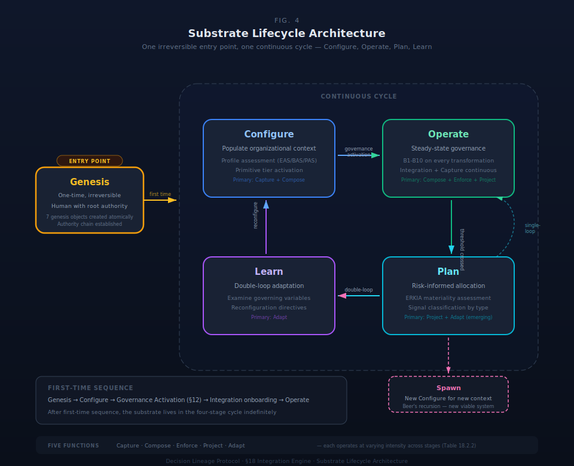

# §21 Substrate Profiles

A substrate profile is a pre-configured instance type optimized for a governance context — each provides a different observation perspective on the organizational world model. Three profiles exist: Enterprise Accountability Substrate (EAS), Business Accountability Substrate (BAS), and Project Accountability Substrate (PAS). The three profiles share the same nineteen primitives across five tiers (§4), the same ten behavioral invariants (§5), the same truth type system (§6), and the same state transformation model (§9). Profiles differ in authority model, temporality, governance subject, default activation levels, accountability model, and bootstrap pattern, allowing different stakeholders to query the same underlying organizational world model through tailored lenses.

Profiles are substrate-level concepts — not protocol-level. Any DLP implementer uses the same primitives and invariants. Profiles configure how those primitives activate and interact within a specific organizational context.

One structural relationship governs the three profiles: EAS = BAS + Governance. EAS is a superset of BAS, not a sibling. Every EAS instance contains all BAS content plus a governance layer. BAS is the operational base. PAS is bounded scope with delegated authority. BAS→EAS graduation is additive — the governance layer instantiates on top of existing BAS content.

Profiles partition the governance problem space by organizational complexity and temporality. EAS governs complex organizations with subordinate units and portfolio structure. BAS governs operating businesses with ongoing rhythm. PAS governs time-bounded projects with completion criteria. The same primitives, invariants, and mechanics operate across all profiles; activation intensity varies per profile.

### §21.1 Profile Architecture

#### Table 21.1.1: Profile Comparison Matrix

| Dimension | EAS (Enterprise) | BAS (Business) | PAS (Project) |
|---|---|---|---|
| **Governance subject** | Organization with complex hierarchy — regulated, multi-department, board-governed | Business with simpler structure — SMB, startup, partnership, solo practice | Bounded project — discrete effort with completion criteria |
| **Authority source** | Inherent — CEO / Board via organizational charter | Inherent — business owner / partner via ownership | Delegated from parent instance |
| **Temporality** | Ongoing | Ongoing | Bounded |
| **Relationship to BAS** | Superset (BAS + Governance) | Base operational substrate | Independent bounded scope; may be child of BAS or EAS |
| **Organizational complexity** | Subordinate units, own methodology, own governance framework, manages portfolio | Ongoing rhythm without subordinate governance | Single scope, clear completion criteria |
| **Accountability model** | Full RACIVG (six roles) | RACI (four roles) | Simplified (OWNER + COLLABORATOR) |
| **Governance frameworks** | Full activation | Profile-driven subset | Parent-inherited |
| **AI graduation ceiling** | Board-authorized | Owner-authorized | Parent-constrained (tighten-only) |
| **Bootstrap pattern** | Full governance stack + regulatory constraints at Genesis | Core invariants + business-specific constraints at Genesis | Genesis authority traces to parent; project sponsor receives delegated authority; parent constraints cascade with tighten-only rule |

#### Structural Containment

The EAS = BAS + Governance relationship is not a classification convenience — it is a structural containment. Every EAS instance contains the full BAS operational layer: all seventeen BAS intent domains, all BAS evidence types, all BAS account templates, all BAS commitment and authority templates, and the five-phase BAS activation sequence. The EAS governance layer adds eight governance domain intents, governance-specific evidence types, governance accounts, governance commitments, oversight and advisory authority types, board and executive role templates, and a governance lifecycle overlay.

This containment means BAS→EAS graduation is additive. When a business adds enterprise governance, the existing BAS content continues operating at the operational (COMMAND) level while the governance layer adds OVERSIGHT authority above and ADVISORY authority alongside.

#### Profile Selection at Genesis

Profile selection occurs at Genesis — the irreversible initialization that establishes the substrate's initial valid state (§18.2). Profile configures functional capability activation across the four-stage lifecycle (Configure → Operate → Plan → Learn). The lifecycle stages are universal across profiles; the activation intensity is profile-specific.

Profile selection is determined by organizational complexity, not hierarchy position. A node is EAS when it has subordinate units requiring their own governance, maintains its own methodology, operates its own governance framework, and manages a portfolio. A node is BAS when it has ongoing business rhythm without subordinate governance needs. A node is PAS when it has bounded scope and clear completion criteria.

### §21.2 Content Package Architecture

Each profile ships with pre-built content that instantiates at Genesis. Content packages provide the initial governance structure from which the organization operates. The three packages reflect the containment relationship: EAS inherits all BAS content and adds a governance layer; PAS provides bounded project structure.

#### Table 21.2.1: EAS Content Package Structure

| Category | Inherited from BAS | Added by EAS Governance Layer |
|---|---|---|
| **Intent domains** | 17 operational domains (INTENT-BAS-00 through INTENT-BAS-17) | 8 governance domain intents (INTENT-EAS-*) |
| **Evidence types** | operational evidence types | governance-specific evidence types |
| **Account templates** | Time, money, customers, operations, team, risk, growth | Governance accounts: decisions pending, policy currency, active delegations, budget vs. actual, objective progress, open risks |
| **Commitment templates** | Founder, customer, contractor, employee, advisor, investor, partner, vendor | Charter, bylaw, fiduciary duty, delegation, role, policy |
| **Authority templates** | Root (founder), financial, hiring, product, customer, operations, strategic, legal | Oversight (board-level), advisory (non-binding), enhanced command (executive) |
| **Lifecycle phases** | 5 operational phases (Phase 0–4) | 4 governance phases (Formation, Establishment, Operations, Maturity) — runs in parallel with BAS operational phases |

#### EAS Governance Domain Intents

The eight EAS governance domain intents represent the categories of enterprise governance that distinguish EAS from BAS:

1. **Mission & Strategy** — Define organizational purpose and direction
2. **Governance & Oversight** — Establish and maintain governance structures
3. **Financial Stewardship** — Manage resources with board-level accountability
4. **People & Capability** — Build organizational capacity with succession and structure governance
5. **Stakeholder Relations** — Manage external relationships and reporting obligations
6. **Risk & Assurance** — Identify, evaluate, and manage enterprise risk
7. **Learning & Improvement** — Improve organizational effectiveness through institutional adaptation
8. **Operations & Delivery** — Execute work with performance reporting to governance bodies

Three of these enhance existing BAS domains rather than replacing them: Financial Stewardship adds board-level budget approval and audit requirements to BAS Money; People & Capability adds succession planning and organizational structure governance to BAS Hiring; Operations & Delivery adds board-level performance reporting to BAS Managing. The BAS intent continues operating at COMMAND level while the EAS intent adds OVERSIGHT requirements.

#### BAS Content Scope

BAS provides the operational base for business governance. Seventeen intent domains span the full business lifecycle:

- **Strategic layer** (INTENT-BAS-00 through INTENT-BAS-05): Founder readiness, problem and market validation, business model and strategy, financial planning, product and operations design, brand and market presence
- **Structural layer** (INTENT-BAS-06 through INTENT-BAS-17): Entity and legal structure, tax elections, ownership and governance, compliance, financial infrastructure, insurance, licenses, location, employment, intellectual property, contracts, fundraising

BAS ships with evidence types across all seventeen domains, seven account template categories, eight commitment templates, eight authority templates, and a five-phase activation sequence (Phase 0: Pre-Commitment through Phase 4: Scale Prep) with evidence-gated transitions between phases.

#### PAS Content Scope

PAS provides bounded project governance for seven project types:

| Project Type | Purpose | Default Duration |
|---|---|---|
| **Building** | Create something tangible | 1–6 months |
| **Research** | Investigate, explore, analyze | 2–8 weeks |
| **Transition** | Move from state A to state B | 1–6 months |
| **Sprint** | Time-boxed focused effort | 1–4 weeks |
| **Venture Evaluation** | BAS Phase 0 — formal gateway to business creation | 2–8 weeks |
| **Creative** | Writing, art, portfolio development | 3–12 months |
| **Learning** | Course, certification, skill acquisition | 1–6 months |

PAS ships with evidence types (universal project evidence plus type-specific evidence per project type), four required account templates (time budget, time spent, progress, scope), self-commitment and external commitment templates, and owner plus collaborator authority templates. PAS lifecycle consists of five phases: Definition, Planning, Execution, Completion, and Closure.

#### Table 21.2.2: Profile Content Summary

| Content Category | EAS | BAS | PAS |
|---|---|---|---|
| **Intent domains** | 25 (17 BAS + 8 governance) | 17 | Per project type (1 root + sub-intents) |
| **Evidence types** | BAS operational + governance-specific | Operational evidence types across all domains | Universal + type-specific per project type |
| **Account templates** | BAS operational + governance | 7 categories | Required + optional per type |
| **Commitment templates** | BAS templates + 6 governance commitments | 8 | 3 self + 4 external |
| **Authority templates** | BAS templates + oversight + advisory | 8 (founder-delegated) | Owner + collaborator + advisor |
| **Lifecycle phases** | 5 operational + 4 governance (parallel) | 5 (Phase 0–4) | 5 (Definition through Closure) |
| **Governance domains** | 8 EAS governance domain intents | — | — |

### §21.3 Profile Governance Model

#### RACIVG as Profile Differentiator

The RACIVG accountability model (§22) provides the structural differentiator between enterprise and business governance. Six roles exist in the model:

- **R (Responsible)** — executes the work
- **A (Accountable)** — owns the outcome and accepts closure
- **C (Consulted)** — must concur before decision or closure
- **I (Informed)** — notified after decision or closure
- **V (Verifies)** — verifies required evidence and quality; holds blocking power
- **G (Governs)** — owns binding constraints and policy surfaces; authorizes enforcement and exceptions

EAS activates the full six-role RACIVG model. BAS activates RACI only — four roles. PAS uses a simplified model with OWNER and COLLABORATOR roles. The V (Verifies) and G (Governs) roles are what distinguish enterprise governance from business operations. V provides independent evidence verification with hold power — it can block closure when evidence is missing. G provides policy and constraint authority — it owns the governance surfaces that bind all actors. Without V and G, outcome ownership (A) implicitly absorbs assurance and governance, which is adequate for founder-driven businesses but structurally insufficient when multiple stakeholders, boards, regulators, or external accountability requirements exist.

#### Table 21.3.1: Profile Governance Activation

| Role | Definition | EAS | BAS | PAS |
|---|---|---|---|---|
| **R** (Responsible) | Executes the work — human, AI agent, or hybrid | Active | Active | Active |
| **A** (Accountable) | Owns outcome and accepts closure — always human | Active | Active | Active (owner) |
| **C** (Consulted) | Required concurrence before decision — from coupled domains | Active | Active | Limited |
| **I** (Informed) | Notification after decision — does not block | Active | Active | Active |
| **V** (Verifies) | Evidence and quality verification — has hold power | Active | Not activated | Not activated |
| **G** (Governs) | Policy and constraint authority — approves enforcement and exceptions | Active | Not activated | Not activated |

Full RACIVG definition, Role Envelopes, dynamic context modifiers, and AI participation rules are specified in §22.

#### Table 21.3.2: Profile Defaults Matrix

| Component | EAS | BAS | PAS |
|---|---|---|---|
| **Primitives active** | All 19 (5 tiers) | Core 9 + selected infrastructure | Core 9 |
| **EDIM layers** | L1–L6 | L1–L4 | L1, L3 |
| **Authority model** | Full RACIVG (6 roles) | RACI (4 roles) | Simplified (OWNER + COLLABORATOR) |
| **Governance frameworks** | Full activation | Profile-driven subset | Parent-inherited |
| **AI graduation ceiling** | Board-authorized | Owner-authorized | Parent-constrained (tighten-only) |
| **Bootstrap authority** | Inherent (charter) | Inherent (ownership) | Delegated (parent) |
| **Temporality** | Ongoing | Ongoing | Bounded |
| **TMI scope** | Full 47q + 55q | Core subset | Minimum viable (5q) |

#### Knowledge Governance per Profile

Knowledge governance activation (§18.3, §19) varies by profile, reinforcing the governance model differentiation.

**EAS** activates the full knowledge governance protocol: knowledge intake triage with all four intake categories (Mapped, Partial, Unmapped, Conflicting), the complete term promotion lifecycle (PROPOSED → UNDER_REVIEW → VERIFIED → ACTIVE), and all three knowledge governance roles (Domain Steward, Knowledge Verifier, Ontology Governor). Confidence thresholds operate at protocol defaults. The Ontology Governor role maps to the enterprise governance authority structure — typically the board or senior leadership holds this role.

**BAS** activates knowledge intake triage and term promotion with a simplified role structure. The business owner typically holds both Domain Steward and Ontology Governor functions. A separate Knowledge Verifier is required by protocol invariant. Confidence thresholds are adjustable within protocol bounds, allowing business-appropriate sensitivity without compromising structural integrity.

**PAS** inherits knowledge governance configuration from its parent instance. PAS does not independently configure knowledge governance roles or thresholds. Knowledge intake within a PAS instance routes to the parent's governance structure for triage and promotion decisions.

### §21.4 Profile Selection & Graduation

#### Table 21.4.1: Profile Selection Decision Matrix

| Engagement Type | Profile | Rationale |
|---|---|---|
| Single project, clear completion criteria | PAS | Bounded scope, archives on completion |
| Retainer or ongoing advisory | BAS | Business rhythm, ongoing commitment tracking |
| Assessment leading to relationship | PAS → BAS | Graduates if relationship continues post-assessment |
| Large project with phases | BAS with PAS children | Umbrella relationship with bounded phase deliverables |
| One-time deliverable | PAS | Completes and closes |
| Client with multiple service lines | EAS | Complex enough to need own governance framework |
| Regional practice office | EAS | Jurisdictional governance requirements |
| Service line within a firm | EAS | Methodology specialization plus portfolio management |

#### Profile Graduation Mechanics

Graduation is a topology change in the instance portfolio, not a mutation of an existing instance. Graduation creates a new instance with the target profile. Evidence carries forward with full lineage preserved. The source instance completes or archives with a graduation reference linking to the new instance. Every graduation transition produces a Decision primitive with lineage — the graduation decision itself is a governed state transformation.

#### PAS → BAS Graduation

PAS → BAS graduation occurs when a bounded project becomes an ongoing business. The authority model shifts from delegated to inherent. The governance scope shifts from project completion criteria to business sustainability.

**Venture Evaluation as BAS Phase 0.** Venture Evaluation is a PAS project type that serves as the formal gateway to business creation. It is bounded (2–8 weeks), produces a GO/NO-GO decision with documented rationale, and requires structured validation evidence: problem statement, customer discovery (10+ conversations), ideal customer profile, competitive landscape, value proposition, financial model, and personal readiness assessment.

On GO: evidence, decisions, and lineage transfer directly to the new BAS instance at Phase 1 (Foundation). The venture evaluation evidence maps to BAS Phase 0 evidence requirements, preserving full provenance.

On NO-GO: the project completes normally. Evidence is preserved with full lineage for potential future reactivation. No business instance is created.

**Universal graduation triggers.** All PAS project types include graduation triggers — signals that a project may be becoming a business:

- Revenue generated
- Recurring customers or demand
- Outside investment interest
- Employment created
- Indefinite commitment emerging (bounded → unbounded drift)

**Type-specific triggers** supplement universal triggers: Building projects trigger on licensing interest or manufacturing requests. Research projects trigger on commercialization interest or methodology requests. Creative projects trigger on distribution deals or audience monetization.

**Configurable sensitivity.** Graduation trigger sensitivity is configurable per instance:

| Setting | Behavior |
|---|---|
| **Aggressive** | Trigger on first signal; prompt frequently |
| **Balanced** (default) | Trigger after 2+ signals or strong single signal |
| **Conservative** | Trigger only on explicit revenue or demand |
| **Off** | No automatic graduation prompts; manual initiation only |

Triggers are advisory signals, not automatic transitions. The substrate prompts; the human decides. The graduation decision is a full Decision primitive with lineage.

#### BAS → EAS Graduation

BAS → EAS graduation occurs when a business adds enterprise governance. The accountability model expands from RACI to full RACIVG. The governance framework activation expands to the full governance stack. The content package gains the governance layer — eight governance domain intents, governance-specific evidence types, governance accounts, governance commitments, and oversight and advisory authority types.

**Graduation triggers:**

- Board addition or formal advisory body establishment
- Outside capital with governance requirements (investors requiring board seats, reporting obligations, or audit rights)
- Regulatory mandate requiring formal governance structures
- Founder control exceeded — organizational complexity surpasses what a single decision-maker can govern
- Multiple concurrent sub-projects requiring coordination beyond parent methodology
- Specialized methodology needs beyond parent standard approach
- Resource allocation complexity requiring portfolio management

BAS → EAS graduation creates a new EAS instance. All BAS primitives carry forward. Existing BAS authorities reclassify as COMMAND type. New OVERSIGHT authority (board-level) instantiates above. New ADVISORY authority instantiates alongside. The governance lifecycle overlay (Formation → Establishment → Operations → Maturity) begins at Formation, operating in parallel with the existing BAS operational phases.

### §21.5 SDK Constraints Summary

#### Table 21.5.1: §21 SDK Constraints

| Constraint | Type | Rationale |
|---|---|---|
| Profile selection MUST occur at Genesis | MUST | Profile configures functional capability activation across the lifecycle; post-Genesis profile changes are graduation events, not reconfiguration |
| EAS content package MUST contain all BAS content | MUST | EAS = BAS + Governance is a structural containment, not a classification; every EAS instance operates the full BAS operational layer |
| Profile graduation MUST create a new instance, not mutate the existing instance | MUST | Graduation is a topology change; the source instance completes or archives with full history preserved; the target instance inherits carried evidence with lineage |
| Graduation MUST produce a Decision primitive with full lineage | MUST | Graduation is a governed state transformation; the decision records the graduation rationale, authority, evidence basis, and source-to-target instance linkage |
| PAS authority MUST be delegated from a parent instance | MUST | PAS does not assert inherent authority; project authority traces to the parent's authority chain; the project sponsor receives delegated authority scoped to project boundaries |
| EAS MUST activate V (Verifies) and G (Governs) roles | MUST | V and G are the structural differentiator between enterprise and business governance; without them, EAS reduces to BAS with additional content |
| BAS MUST NOT activate V (Verifies) and G (Governs) roles | MUST NOT | BAS operates under RACI; outcome ownership (A) absorbs assurance and governance functions in business-scale operations |
| PAS graduation triggers MUST be advisory only — human decides | MUST | Triggers are signals, not automatic transitions; the graduation decision requires human judgment about whether a bounded project has become an ongoing business |
| AI graduation ceiling in PAS MUST NOT exceed the parent's ceiling | MUST NOT | Tighten-only rule: a child instance cannot grant AI actors more autonomy than the parent permits; constraints cascade downward and can only tighten |
| PAS knowledge governance MUST inherit from parent instance | MUST | PAS does not independently configure knowledge governance; intake and promotion route to the parent's governance structure |
| BAS→EAS graduation MUST reclassify existing BAS authorities as COMMAND type and add OVERSIGHT above | MUST | The containment model requires that operational authority continues while governance authority layers on top; reclassification preserves existing authority chains |
| All profiles MUST share the same DLP-Core primitives, behavioral invariants, truth type system, and state transformation model | MUST | Profiles configure activation, not architecture; the protocol layer is invariant across profiles |
| Specific template text within content packages | DESIGN SPACE | The architecture specifies content categories and counts; specific template wording is implementation choice |
| Specific evidence type definitions within content packages | DESIGN SPACE | The architecture specifies evidence type categories and approximate counts; individual evidence type specifications are implementation choice |
| Graduation trigger sensitivity thresholds and specific trigger definitions | DESIGN SPACE | The architecture specifies four sensitivity levels and trigger categories; specific threshold values and trigger signal definitions are implementation choice |
| Knowledge governance confidence threshold values per profile | DESIGN SPACE | The architecture specifies that thresholds are adjustable within protocol bounds per substrate; specific values are implementation choice |
| EDIM domain taxonomy detail beyond domain names | DESIGN SPACE | The architecture specifies the eight EAS governance domain names and seventeen BAS intent domain scope; internal domain structure and cross-mapping detail are implementation choice |

---

## Scope

Scope limited to logical model specification. Transport protocol, serialization format, and implementation languages are DESIGN SPACE.

## Implementation Requirements

All SDK constraints listed in §21.5 are binding implementation requirements for DLP substrate builders.
