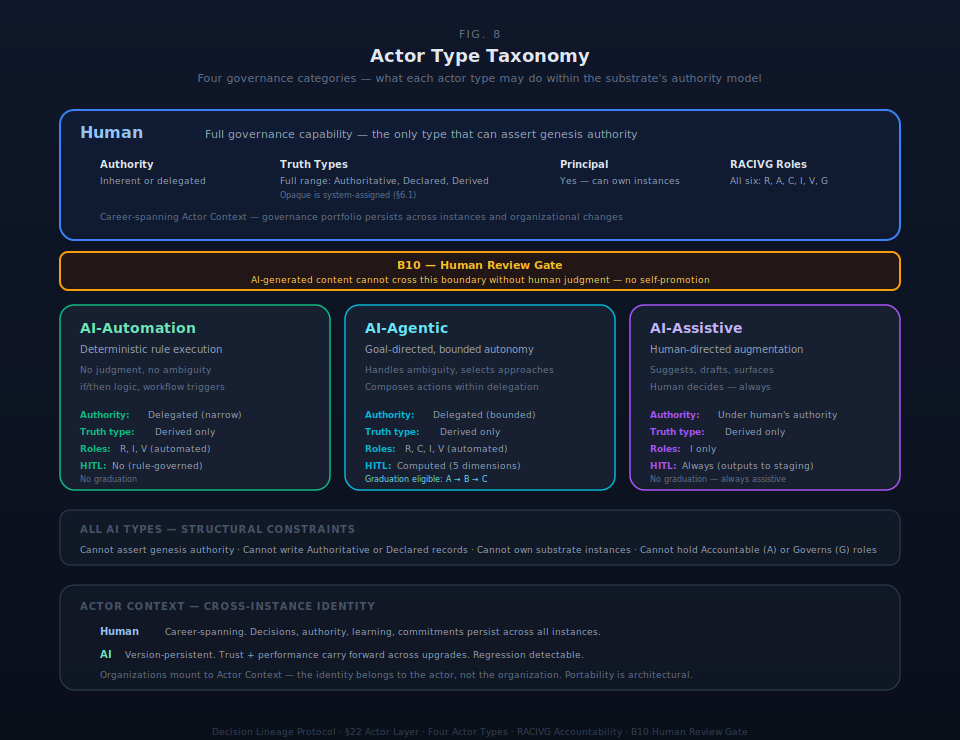

# §22 Actor Layer

The Actor Layer specifies the entities who interact with and modify the organizational world model. It defines who participates in the substrate and how their governance identity persists across instances. §21 types instances through profiles. This section types *participants* — human and AI — and defines the structural contracts that govern their cross-instance participation as agents of organizational world model evolution.

The Actor Layer has two dimensions. **Actor topology** provides every participant with a persistent governance identity called an Actor Context. **Instance topology** relates actors to the instances they participate in through ownership, sponsorship, and delegation relationships. These dimensions are orthogonal: an actor's governance identity persists regardless of which instances they participate in or leave.

Five concerns are specified: the Actor Context model (§22.1), the four-type actor taxonomy (§22.2), the RACIVG accountability model (§22.3), owner-to-instance relationships (§22.4), multi-context management (§22.5), and the Role Envelope architecture (§22.6). SDK constraints are consolidated in §22.7.

The Actor Layer provides the persistent governance identity model for all participants in the substrate ecosystem. It answers: "What has this actor decided, been authorized to do, learned, committed to, and contributed across all instances they participate in?"

### §22.1 Actor Context Model

An Actor Context is the persistent cross-instance governance identity of any actor in the substrate — human or AI. Every actor in the system has an Actor Context. It is not a substrate instance — it is the personal dimension of the Actor Layer that spans instances. An Actor Context is per-actor-per-instance: each actor carries one Actor Context per instance they participate in, bound to a common actor identity. The per-instance binding captures the actor's roles, authority scope, and constraints within that specific instance. The cross-instance identity provides the unified governance portfolio.

#### Table 22.1.1: Actor Context Structural Schema

| Field | Type | Description |
|---|---|---|
| **actor_id** | UUID | Unique actor identifier — persists across all instances and across version upgrades for AI actors |
| **actor_type** | Enum{Human, AI-Automation, AI-Agentic, AI-Assistive} | One of the four base types (§22.2) |
| **instance_id** | UUID | Per-actor-per-instance binding — the instance this context is scoped to |
| **active_roles[]** | RACIVG[] | Role assignments in this context (§22.3) |
| **authority_scope** | AuthoritySpec | What this actor may do within this instance — delegated authority boundaries |
| **active_constraints[]** | Constraint[] | What binds this actor — inherited from instance, profile, and delegation chain |
| **governance_posture** | Enum{Standard, Enhanced, Critical} | EDIM-level calibration governing review intensity and evidence requirements (§12) |
| **role_envelope_ref** | UUID | Link to the governing Role Envelope (§22.6) |

#### Human Actor Context

Human Actor Context carries the full governance portfolio:

| Property | Description |
|---|---|
| **Authority** | Inherent (own instances) or delegated (participate in others') |
| **Truth types** | Full range — Authoritative, Declared, Derived (§6). Opaque is system-assigned at boundary detection, not actor-written (§6.1). |
| **Accumulation** | Decisions made, authority delegated and received, learning captured, commitments held, capacity allocated, role envelope evolution |
| **Learning record** | Cross-instance record of capabilities developed, expertise demonstrated, governance contributions — the actor's governance portfolio |
| **Persistence** | Career-spanning — survives individual instance completion or termination |
| **Principal eligibility** | Yes — human actors can own instances (§22.4) |
| **Cross-instance view** | Unified query surface across all instances this person participates in |

The Human Actor Context is the actor's governance portfolio — their persistent record of contribution, growth, and capability across the substrate. The same data that enables cross-instance governance visibility provides the actor with a portable record of professional governance contributions. Governance is empowerment, not oversight.

#### AI Actor Context

AI Actor Context carries performance and delegation history:

| Property | Description |
|---|---|
| **Authority** | Always delegated, never inherent — AI cannot assert genesis authority |
| **Truth types** | Derived only — AI cannot write Authoritative or Declared records (§6) |
| **Accumulation** | Performance history, accuracy tracking, graduation stage per scope, delegation record, version lineage |
| **Persistence** | Persists across versions — agent upgrades are the same actor with a new capability set; trust and performance history carry forward; regression detection possible across version boundaries |
| **Principal eligibility** | No — AI cannot own a substrate instance |
| **Cross-instance view** | Unified query surface across all instances this agent operates in |
| **Graduation stage** | A→B→C per scope, computed as a function of the five routing dimensions (§A1) |

#### Persistence Model

Human Actor Context is career-spanning. It persists through instance completion, organizational changes, and role transitions. The actor accumulates a governance portfolio across all engagements — what a VP has decided across governance boards, what an employee has contributed across projects, how a consultant's expertise has evolved across client engagements.

AI Actor Context is version-persistent. When an AI agent is upgraded (new model version, new capability set), the Actor Context persists with version lineage tracking. The trust and performance evidence accumulated at version N carries forward to version N+1. Capability regression at the new version is detectable by comparing performance evidence across version boundaries.

Organizations mount to Actor Context rather than owning actor records. The Actor Context belongs to the actor, not the organization. This architectural position enables portability: an actor's governance identity travels with them across organizational boundaries.

### §22.2 Actor Type Taxonomy

Four actor types constitute a closed base set. These are governance categories — they determine what an actor may do within the substrate's authority and accountability model. They are not product categories or deployment patterns.

#### Table 22.2.1: Actor Type Taxonomy

| Type | Description | Authority | Truth Types | Principal Eligible |
|---|---|---|---|---|
| **Human** | Natural person with full governance capability | Inherent or delegated | Full range (Authoritative, Declared, Derived). Opaque is system-assigned (§6.1), not actor-written. | Yes |
| **AI-Automation** | Deterministic rule execution — no judgment, no ambiguity handling; if/then logic, workflow triggers, scheduled operations | Delegated (narrow) | Derived only | No |
| **AI-Agentic** | Goal-directed behavior with bounded autonomy — can handle ambiguity, select approaches, compose actions within delegation boundaries | Delegated (bounded) | Derived only | No |
| **AI-Assistive** | Human-directed augmentation — suggests, drafts, surfaces, recommends; human decides | Operates under human's authority | Derived only | No |

#### Table 22.2.2: Actor Type Capability Matrix

| Capability | Human | AI-Automation | AI-Agentic | AI-Assistive |
|---|---|---|---|---|
| Assert genesis authority | Yes | No | No | No |
| Write Authoritative records | Yes | No | No | No |
| Write Declared records | Yes | No | No | No |
| Write Derived records | Yes | Yes | Yes | Yes |
| Hold inherent authority | Yes | No | No | No |
| Hold delegated authority | Yes | Yes (narrow scope) | Yes (bounded scope) | No (operates under human's authority) |
| Own substrate instances | Yes | No | No | No |
| Make binding decisions | Yes | By rule only | Within delegation | No (proposes only) |
| Hold Accountable (A) role | Yes | No | No | No |
| Hold Governs (G) role | Yes | No | No | No |
| Hold Responsible (R) role | Yes | Yes (within envelope) | Yes (within delegation) | No |
| Hold Verifies (V) role | Yes | Yes (automated checks) | Yes (automated checks) | No |
| Hold Consulted (C) role | Yes | No | Yes (cross-domain) | No |
| Hold Informed (I) role | Yes | Yes | Yes | Yes |
| Graduation eligible (A→B→C) | N/A | N/A (no graduation) | Yes | N/A (always assistive) |
| Require HITL review | N/A | No (rule-governed) | Computed (five dimensions, §A1) | Always (outputs to staging) |

#### Governance Categories, Not Product Categories

The three AI operational patterns are governance distinctions, not identity labels. An AI actor can operate in different patterns at different times in different scopes. The pattern is determined by the delegation specification and the work being performed:

- **Automation** needs authority checking and lineage, but not human-in-the-loop review — the rules are predetermined.
- **Agentic** needs the full routing space because the agent exercises judgment within delegation boundaries.
- **Assistive** needs truth type enforcement (Derived only, staging required) but minimal routing overhead.

#### Extension Principle

The four types are a closed base set with an explicit extension mechanism. Derivatives may specialize the base types — for example, a domain-specific AI type that inherits AI-Agentic governance properties with additional domain constraints. Derivatives cannot modify the base taxonomy: they cannot add principal eligibility, expand truth type access, or weaken authority constraints. The extension mechanism mirrors the cognitive work type extension model defined in §A1.

### §22.3 RACIVG Accountability Model

RACIVG is an AI-native extension of RACI. Six roles govern accountability for every context that changes state. The core premise: RACIVG is attached to contexts that change state — events, decisions, transitions — not to ontology objects. Objects attach to domains, owners, and authority chains. Events attach to RACIVG assignments.

#### Table 22.3.1: RACIVG Role Definitions with AI Participation Rules

| Role | Definition | Human | AI-Automation | AI-Agentic | AI-Assistive |
|---|---|---|---|---|---|
| **R** (Responsible) | Executes the work | Yes | Yes (within envelope) | Yes (within delegation) | No (proposes only) |
| **A** (Accountable) | Owns the outcome and accepts closure | Yes | No | No | No |
| **C** (Consulted) | Required concurrence before decision or closure | Yes | No | Yes (cross-domain) | No |
| **I** (Informed) | Notification after decision or closure — does not block | Yes | Yes | Yes | Yes |
| **V** (Verifies) | Evidence and quality verification — has hold power | Yes | Yes (automated checks) | Yes (automated checks) | No |
| **G** (Governs) | Policy and constraint authority — approves enforcement and exceptions | Yes | No | No | No |

#### Hard Constraints

Four structural constraints govern RACIVG assignment:

1. **Exactly one A per context.** No context may have zero or multiple Accountable parties. Split accountability is no accountability.
2. **A is always human.** No AI actor — regardless of type or delegation scope — may hold the Accountable role.
3. **At least one R per context.** Every context must have someone executing the work.
4. **G required when policies are implicated.** When a context involves policy changes, constraint modifications, or enforcement decisions, a Governs role must be assigned.
5. **V required when evidence is mandatory for closure.** When a context requires verified evidence for closure, a Verifies role must be assigned.

#### Closure Semantics

A context is closed only when all three conditions are satisfied:

- **A** accepts the outcome
- **V** verifies that all required evidence meets the specified verification types (§6.7)
- **G** confirms compliance posture (when policies are implicated)

Closure without V verification or G compliance confirmation is structurally invalid. The closure conditions enforce the behavioral invariants: B3 (evidence requires truth type) through V verification, B5 (authority traceable) through A and G authority chains, and B6 (constraint binds primitives) through G compliance confirmation.

#### Three-Tier AI Permission Model

AI actor participation is governed by a three-tier permission model that applies across all AI actor types:

| Tier | Permissions | Examples |
|---|---|---|
| **ALWAYS_ALLOWED** | Read organizational state, calculate deviations, propose decisions, surface patterns, draft content, execute approved actions, create events | Reading context, computing gap projections, drafting closure evidence |
| **REQUIRES_HUMAN_APPROVAL** | Record decisions as resolved, modify constraint thresholds, change constraint status, create escalation branches, update trajectory | Marking a decision as selected, adjusting a threshold based on new data |
| **NEVER_ALLOWED** | Decide autonomously, override human choices, delete decisions or history, modify recorded outcomes, bypass constraint violations | Making binding governance decisions, suppressing evidence, circumventing authority chains |

Two rules govern the boundary:

- **AI interprets declared reality — it does not invent it.** AI actors process, analyze, and surface what exists in the governance record. They do not create binding organizational reality.
- **AI assists orientation — it does not silently operate.** AI actors augment human decision-making by providing context, analysis, and recommendations. They do not take autonomous governance action.

#### AI-Cannot-Be-Principal

AI actors cannot hold the authority that defines a substrate instance. This constraint is architectural, not transitional — it derives from the convergence of five structural properties:

1. **Authority traceability (B5).** Every authority must trace to a human root. An AI actor holding instance-defining authority would create an authority chain with no human origin, violating B5.
2. **Truth type system (§6).** AI actors cannot write Authoritative records. Genesis authority — the act that creates and defines a substrate instance — is the paradigmatic Authoritative act. An actor that cannot write Authoritative cannot assert genesis authority.
3. **RACIVG accountability.** AI actors cannot hold the Accountable (A) role. Instance ownership is the ultimate accountability — the owner accepts the outcome of the instance's existence. An actor that cannot be Accountable cannot own.
4. **Three-tier permissions.** "Decide autonomously" and "override human choices" are NEVER_ALLOWED. Instance ownership is the most autonomous decision in the substrate. An actor prohibited from autonomous decision cannot hold the authority from which all instance decisions derive.
5. **Moral crumple zone prevention.** Assigning instance ownership to an AI actor would create accountability without meaningful control for the human nominally responsible, or control without accountability for the AI actually operating. Either configuration produces governance failure.

This constraint does not limit AI capability. AI actors hold significant delegated authority at autonomy levels 0–3 (§A1). AI-Agentic actors exercise bounded judgment within delegation. AI-Automation actors execute deterministic operations at machine speed. The constraint applies specifically to the authority that defines the instance itself — the irreducible human governance act.

#### Profile Differentiation

RACIVG activation varies by substrate profile (§21). EAS activates the full six-role model. BAS activates RACI (four roles) — outcome ownership (A) absorbs assurance and governance functions at business scale. PAS uses a simplified model with OWNER and COLLABORATOR roles. The V (Verifies) and G (Governs) roles are the structural differentiator between enterprise and business governance.

AI actor behavioral detail — delegation model, AICAR cognitive work taxonomy, five-dimensional routing, and operating postures — is specified in §A1. This section defines the four-type taxonomy and its governance constraints. §A1 defines how AI actors behave within those constraints.

### §22.4 Owner-to-Instance Relationships

Every substrate instance is owned by a human actor. Ownership is the relationship between an actor who holds instance-defining authority and the instance that authority defines. Four relationship types capture the governance patterns through which humans relate to instances.

#### Table 22.4.1: Owner-to-Instance Relationship Types

| Relationship | Description | Authority Pattern | Example |
|---|---|---|---|
| **Owner** | Direct inherent authority over the instance — the actor who exercised genesis authority or holds transferred ownership | Inherent authority; full decision rights within instance scope; can delegate, can close | Founder owns their BAS |
| **Sponsor** | Delegated authority from a parent instance — the actor who authorizes and governs a child instance on behalf of the parent | Delegated with parent constraints; authority scope bounded by the delegation specification; tighten-only from parent | Founder sponsors a PAS from their BAS |
| **Portfolio** | Unified governance surface across multiple instances — emerges automatically when an actor participates in more than one instance | Cross-instance visibility and resource coordination; does not create new authority; aggregates existing authority relationships | Firm manages multiple client instances; Substrate Portfolio Management (§23) surfaces automatically |
| **Delegated Management** | Bounded authority over another actor's instance — the actor manages the instance under explicit delegation with lineage | Bounded delegated authority; delegation chain fully traced; constraint propagation from delegating actor; scope and duration specified in delegation contract | Professional manages client's BAS under FPSF engagement (§23) |

#### Principal as Role

Principal is a role, not an actor type. A principal is a human actor who owns one or more substrate instances. Any human actor who exercises genesis authority or receives instance ownership becomes a principal. The role is determined by the relationship, not by an inherent actor property. A human actor who participates in instances only as a collaborator is not a principal — they have an Actor Context but no instance ownership.

#### Cross-Instance Authority

Authority relationships between instances are explicit and traced:

- **Parent-child.** When a parent instance sponsors a child instance (EAS sponsors PAS, BAS sponsors PAS), the parent's authority chain governs the child. The child's authority scope is bounded by the parent's delegation.
- **Constraint propagation.** Parent constraints cascade to child instances under a tighten-only rule. A child instance may impose additional constraints beyond the parent's requirements but may never relax a parent constraint. This applies to all inheritable constraints including AI graduation ceiling, governance framework activation, and authority delegation boundaries.
- **Cross-instance visibility.** The portfolio relationship provides a unified query surface across instances. An actor with the portfolio relationship can query governance state across all instances in the portfolio. Visibility does not imply authority — querying across instances does not grant decision rights within them.
- **Delegation lineage.** Delegated management relationships carry full delegation lineage. The delegation contract specifies scope, duration, authority boundaries, and escalation conditions. The delegating actor retains ultimate authority; the managing actor operates within explicit bounds.

Graduation (PAS→BAS, BAS→EAS) is a topology change in the instance portfolio (§23). Graduation creates a new instance — it does not mutate the existing instance. Evidence carries forward with full lineage preserved. The source instance completes or archives with a graduation reference linking to the new instance.

### §22.5 Multi-Context Management

Actors participate in multiple contexts simultaneously. A human actor may hold roles in an EAS governance board, a BAS operational team, and several PAS project teams. An AI-Agentic actor may operate across multiple instances with different delegation scopes. Multi-context management governs how actors move between contexts while maintaining governance integrity.

#### Envelope-Bounded Fluidity

Four rules govern multi-context participation:

**Rule 1: Free movement within envelope bounds.** Actors move freely across contexts within the bounds of their Role Envelopes (§22.6). No explicit context-switching protocol exists. If the actor's envelope permits participation in context X and context Y, the actor transitions between them without a governance ceremony. The envelope is the permission boundary.

**Rule 2: No duplicate sessions within the same Actor Context.** An actor may hold one active session per instance binding. The per-actor-per-instance binding in the Actor Context structural schema (Table 22.1.1) enforces this — an actor's roles, authority scope, and constraints within an instance are defined by a single Actor Context record, not by multiple concurrent sessions.

**Rule 3: Cross-context norm consistency.** The combined obligation set across all envelopes an actor holds must be satisfiable. If an actor holds envelopes in context X and context Y, the obligations from both envelopes must be simultaneously fulfillable — no actor may be placed in a position where satisfying one context's obligations requires violating another's. This is a MOISE+ deontic verification property: norm consistency ensures no contradictory norms exist for the actor across their held envelopes.

**Rule 4: Cross-context visibility follows depth-gating.** What an actor can see across contexts is governed by the depth-gating rules defined in portfolio patterns (§23). Visibility does not propagate freely — it follows the authority and delegation relationships between instances.

#### Cross-Context Norm Verification

The norm consistency requirement (Rule 3) is verifiable through three properties drawn from the MOISE+ deontic specification model:

| Property | Definition | Verification Question |
|---|---|---|
| **Norm consistency** | No contradictory norms exist for the same actor across held envelopes | Can the actor's obligations be stated without logical contradiction? |
| **Norm satisfiability** | The actor can actually satisfy all norms given their capabilities and the constraints of their context | Given the actor's capacity and the time available, can they fulfill all obligations? |
| **Interaction safety** | The combined execution of the actor's obligations across contexts does not violate any context's constraints | Does fulfilling obligations in context X cause constraint violations in context Y? |

These properties are invariants on the multi-context state. When an actor accepts a new role (gaining a new envelope), the system verifies that the combined obligation set remains satisfiable. When a context modifies its obligations (changing an envelope's constraints), the system verifies that actors holding that envelope are not placed in unsatisfiable positions.

### §22.6 Role Envelope Architecture

A Role Envelope is a machine-readable authority contract. It specifies what an actor in a given role may do, must do, must not do, must produce as evidence, and must escalate under defined conditions. The Role Envelope is the variety attenuation and amplification mechanism for managing actor participation across contexts — it constrains what would otherwise be unbounded participation while amplifying the actor's effective capability within the permitted scope.

#### Table 22.6.1: Role Envelope Structural Schema

| Field | Type | Description |
|---|---|---|
| **role_id** | UUID | Unique envelope identifier |
| **scope** | Namespace[] | Governance namespaces this envelope applies to — using the four-scope model (Core, Domain, Tenant, Sandbox) from §4 |
| **permitted_actions** | Action[] | What the role may do within scope |
| **decision_rights** | DecisionSpec[] | What decisions the role may make — each with type, scope, and escalation threshold |
| **constraints** | Constraint[] | What binds the role — policy bindings, authority limits, temporal boundaries |
| **escalation_thresholds** | Threshold[] | Conditions under which the role must escalate — severity, risk, confidence, or scope triggers |
| **required_evidence** | EvidenceSpec[] | What evidence the role must produce — type, verification level, and production trigger |
| **execution_modality** | Enum{Human-Only, AI-Assisted, AI-Executed-With-Review} | How work within this envelope is performed |
| **confidence_rules** | ConfidenceSpec[] | Minimum confidence thresholds for AI-generated outputs within this envelope |
| **event_emission_obligations** | EventSpec[] | What governance events the role must emit — enabling observability of role execution |

#### Context Modifiers

Role Envelopes are not static. Five context modifiers adjust envelope behavior at runtime:

| Modifier | Effect | Example |
|---|---|---|
| **Phase** | Adjusts envelope scope based on organizational lifecycle stage | Startup phase broadens permitted actions; regulated phase tightens constraints |
| **Severity** | Tightens review requirements as severity increases | High severity requires V + mandatory C from impacted domains |
| **Risk posture** | Shifts execution modality based on organizational risk assessment | Elevated risk shifts AI-Executed to AI-Assisted |
| **Confidence** | Triggers escalation when data quality or model confidence is low | Below-threshold confidence auto-escalates to human A |
| **Automation coverage** | Adjusts human review intensity based on demonstrated automation capability | High automation coverage with established track record reduces review frequency |

Context modifiers produce deterministic envelope adjustments: the same modifier values applied to the same base envelope produce the same effective envelope. Modifier application order does not affect the result — modifiers compose commutatively.

#### Table 22.6.2: MOISE+ Verification Properties for Role Envelopes

| Property | Definition | Enforcement | Failure Mode |
|---|---|---|---|
| **Norm consistency** | No envelope contains contradictory obligations — the role is not simultaneously required to perform and prohibited from performing the same action | Verified when envelope is created or modified; blocking if violated | An actor in the role faces a logical impossibility — compliance with one obligation requires violating another |
| **Norm satisfiability** | The role can actually satisfy all envelope obligations given realistic capacity constraints and time boundaries | Verified when envelope is assigned to an actor; warning if violated | An actor is assigned obligations that exceed their capacity — impossible promises at the envelope level |
| **Interaction safety** | When an actor holds multiple envelopes, the combined obligation set across all held envelopes is satisfiable — no cross-envelope conflicts | Verified when a new envelope is added to an actor's set; blocking if violated | An actor satisfying envelope X's obligations necessarily violates envelope Y's constraints — structural cross-context failure |

#### Actor-Type Envelope Constraints

Actor types constrain which envelope configurations are valid:

| Actor Type | Envelope Constraint |
|---|---|
| **Human** | May hold any envelope. No execution modality restriction. Full decision rights available. |
| **AI-Automation** | May hold R (within envelope) + automated V. Execution modality must be AI-Executed-With-Review or Human-Only (for rule outputs). Decision rights limited to rule-determined selections. Escalation thresholds narrowly scoped. |
| **AI-Agentic** | May hold R + V + Interpretations (C for cross-domain consultation). Execution modality may be AI-Executed-With-Review for graduated scopes. Decision rights bounded by delegation specification. Escalation thresholds calibrated to Stakes×Novelty routing (§A1). |
| **AI-Assistive** | Operates under the human's envelope — does not hold an independent envelope. Outputs land in staging (Derived truth type). No independent decision rights. No escalation authority — escalation routes through the supervising human. |

### §22.7 SDK Constraints Summary

#### Table 22.7.1: §22 SDK Constraints

| Constraint | Type | Rationale |
|---|---|---|
| Every actor MUST have an Actor Context per instance they participate in | MUST | Actor Context is the governance identity binding — without it, the actor's roles, authority, and constraints in the instance are undefined |
| Actor Context MUST persist across instance completion for human actors | MUST | Career-spanning governance portfolio; an actor's governance history is not deleted when an instance completes |
| Actor Context MUST persist across version upgrades for AI actors | MUST | Trust and performance evidence accumulated at version N carries forward; version lineage is tracked |
| Actor type MUST be one of the four base types (Human, AI-Automation, AI-Agentic, AI-Assistive) | MUST | Closed base set; the four types partition governance capabilities exhaustively |
| Derivative actor types MUST NOT modify base type governance properties (principal eligibility, truth type access, authority constraints) | MUST NOT | Extension by specialization only; derivatives add domain constraints, not governance privileges |
| AI actors MUST NOT hold the Accountable (A) role | MUST NOT | AI-Cannot-Be-Principal; accountability requires human authority |
| AI actors MUST NOT hold the Governs (G) role | MUST NOT | Policy and constraint authority requires human judgment and Authoritative truth type access |
| AI actors MUST NOT write Authoritative or Declared records | MUST NOT | Truth type system enforcement (§6); all AI output is Derived until human promotion |
| AI actors MUST NOT own substrate instances | MUST NOT | AI-Cannot-Be-Principal; instance ownership is the irreducible human governance act |
| Exactly one Accountable (A) role MUST be assigned per RACIVG context | MUST | Split accountability is no accountability; one human owns each outcome |
| The Accountable (A) role MUST be assigned to a human actor | MUST | Structural constraint, not transitional limitation; derives from five convergent architectural properties |
| Governs (G) MUST be assigned when policies are implicated in a context | MUST | Policy changes require explicit governance authority; implicit policy governance creates untraced constraint modifications |
| Verifies (V) MUST be assigned when evidence is mandatory for closure | MUST | Evidence-dependent closures require independent verification; A cannot self-verify |
| Closure MUST require A acceptance AND V verification AND G compliance confirmation (when applicable) | MUST | Three-party closure prevents premature closure, unverified closure, and non-compliant closure |
| Parent constraints MUST cascade to child instances with tighten-only propagation | MUST | Authority attenuation; a child instance cannot relax a parent's constraints |
| Cross-context obligation sets MUST be verified for norm consistency and satisfiability when envelopes are assigned | MUST | Prevents actors from being placed in structurally unsatisfiable positions across contexts |
| Role Envelopes MUST be verified for norm consistency, norm satisfiability, and interaction safety | MUST | MOISE+ deontic verification prevents logically impossible, practically impossible, and cross-envelope conflicting obligations |
| AI actors MUST NOT perform governance acts (source activation, gap closure, change approval) in the activation pipeline (§12) | MUST NOT | Governance acts require human authority; AI amplifies computational capacity, not governance authority |
| NEVER_ALLOWED permissions (decide autonomously, override human, delete history) MUST be enforced structurally, not procedurally | MUST NOT | Structural enforcement prevents bypass; procedural enforcement relies on compliance |
| Specific Actor Context field implementations beyond the minimum schema | DESIGN SPACE | The architecture specifies minimum fields and semantic constraints; field encoding, storage format, and additional fields are implementation choices |
| Specific Role Envelope field implementations beyond the minimum schema | DESIGN SPACE | The architecture specifies minimum fields; additional envelope fields, modifier composition strategies, and runtime evaluation mechanisms are implementation choices |
| Specific MOISE+ verification algorithms | DESIGN SPACE | The architecture specifies three verification properties as invariants; the algorithms that verify them (constraint satisfaction, model checking, static analysis) are implementation choices |
| Context modifier composition order and evaluation strategy | DESIGN SPACE | The architecture requires commutative composition; the evaluation mechanism (eager, lazy, cached) is an implementation choice |
| Governance posture thresholds (Standard/Enhanced/Critical boundary values) | DESIGN SPACE | The architecture specifies three postures with defined semantic differences; the threshold values that trigger transitions between postures are implementation and profile choices |

---

## Scope

Scope limited to logical model specification. Transport protocol, serialization format, and implementation languages are DESIGN SPACE.

## Implementation Requirements

All SDK constraints listed in §22.7 are binding implementation requirements for DLP substrate builders.
