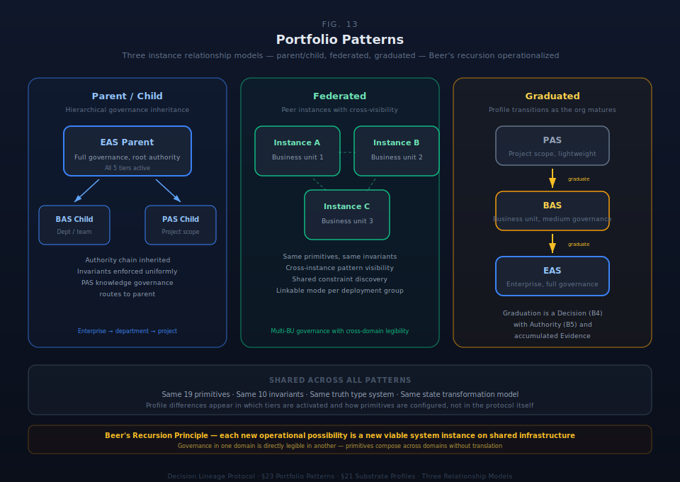

# §23 Portfolio Patterns

Multi-instance topology produces portfolio-level patterns that cannot be specified within a single substrate instance. When an organization operates multiple instances — or when multiple organizations share governance infrastructure through federation — five architectural patterns emerge: recursive viable system structure, constraint cascade with authority attenuation, portfolio management as emergent capability, federation as recursive pattern across legal entity boundaries, and depth-gated visibility.

These patterns are not additions to the primitive model. They are compositions of the nineteen primitives (§4) operating across instance boundaries, governed by the same ten behavioral invariants (§5), and grounded in the same control-theoretic foundation (§8). What changes at portfolio scale is the topology — how instances relate, how constraints propagate, and how authority attenuates through recursion.

This section specifies the portfolio-level patterns. §21 specifies what kinds of instances exist (EAS, BAS, PAS profiles). §22 specifies who participates and how actor identity persists across instances. §23 specifies what emerges when multiple instances form a governed topology.

Portfolio patterns describe the emergent governance behaviors when instances compose across organizational boundaries. They operationalize the viable system model at computational scale, enforce constraint cascade and authority attenuation across recursion levels, enable federation of independent governance domains, and provide depth-gated visibility that respects both organizational transparency needs and operational privacy boundaries.

### §23.1 Recursive Viable System Architecture

Professional services firms — and any organization with sufficient structural complexity — are recursive viable systems. The same governance pattern repeats at every level of organizational complexity, following the recursion principle (§8.2): each viable system contains viable systems, each operating the same five subsystems (S1–S5) at its own scale.

The recursive pattern is not an analogy. It is a structural property of the substrate architecture. Every EAS node is a viable system with its own operations (S1), coordination (S2), control (S3), intelligence (S4), and policy (S5). The nineteen primitives compose the same way at every recursion level. The behavioral invariants enforce the same constraints at every recursion level. The state transformation model operates the same way at every recursion level.

#### The Recursive Pattern

Profile assignment — whether a node operates as EAS, BAS, or PAS — is determined by organizational complexity at each recursion level, not by position in the hierarchy.

A node operates as **EAS** when it has its own methodology or methodology specialization, contains subordinate operational units, requires its own governance framework, and manages a portfolio of engagements or relationships.

A node operates as **BAS** when it operates within a parent EAS's governance framework, has ongoing business rhythm but not subordinate units requiring their own governance, and manages relationships rather than portfolios.

A node operates as **PAS** when it is bounded in scope and time, has clear completion criteria, and archives on completion.

Illustrative recursion for a professional services firm:

Firm (EAS) → Service Line (EAS) → Region (EAS) → Client Engagement (BAS) → Project (PAS)

The depth is not predetermined — it emerges from organizational complexity. Recursion can branch by service line, geography, practice area, engagement complexity, or jurisdictional requirements. Any BAS node may graduate to EAS if it becomes complex enough to require its own governance substrate.

#### Table 23.1.1: Recursive Pattern Properties

| Property | Specification | Invariant |
|---|---|---|
| **Primitive identity** | The same nineteen primitives (§4) compose at every recursion level | Tier structure (§4.5) preserved |
| **Invariant enforcement** | B1–B10 (§5) enforce at every recursion level | No recursion level exempt |
| **State transformation** | `State(t) → [Trigger + Action] → State(t+1)` operates identically at each level | Full lineage at every level |
| **Profile assignment** | Determined by organizational complexity, not hierarchy position | Complexity-driven, not role-driven |
| **Graduation** | BAS → EAS when subordinate governance emerges; creates new instance with carried evidence (§22) | Graduation is a Decision with Account |
| **Depth** | No protocol-level maximum; emerges from organizational viability | Recursion terminates at viable autonomy |
| **Branching** | Multi-dimensional — service, geography, practice, complexity, jurisdiction | Not limited to single hierarchy |

#### Table 23.1.2: Illustrative Multi-Level Recursion

| Recursion Level | Instance | Profile | Governance Subject |
|---|---|---|---|
| 0 | Firm | EAS | Firm-wide methodology, quality standards, professional ethics |
| 1 | Service Line (e.g., Tax) | EAS | Service-specific methodology, professional standards |
| 2 | Region (e.g., North America) | EAS | Regional governance, regulatory specialization |
| 3 | Domain (e.g., US Federal) | EAS | Domain-specific methodology, jurisdictional compliance |
| 4 | Client Engagement (ongoing advisory) | BAS | Client relationship, ongoing commitment |
| 5 | Annual Filing Project | PAS | Bounded deliverable, defined completion criteria |

At every level, the same governance grammar operates. What differentiates levels is the threshold calibration, constraint envelope, and authority scope — not the architectural machinery.

### §23.2 Constraint Cascade & Authority Attenuation

#### The Tighten-Only Rule

Each level in the recursion inherits its parent's constraints and may tighten but never loosen them. The constraint set at any node equals the intersection of all ancestor constraints plus the node's own constraints.

Constraint(node) = Constraint(root) ∩ Constraint(level-1) ∩ ... ∩ Constraint(parent) ∩ Constraint(own)

This applies to governance constraints, threshold values, AI graduation ceilings, and authority scopes. A child node cannot set any threshold looser than any ancestor. If the firm specifies Level 2 maximum AI autonomy for reasoning, no descendant can operate AI at Level 3 for reasoning — regardless of local context.

B6 — Constraint binds primitives (§5) — operates across instance boundaries. Constraints defined at a parent EAS bind primitive instances in all descendant nodes. The enforcement mode (Blocking, Warning, Logging, Advisory) cascades with the constraint.

#### Table 23.2.1: Threshold Cascade Example

| Threshold Type | Firm EAS | Service Line EAS | Regional EAS | Engagement BAS |
|---|---|---|---|---|
| Cost materiality | $100K | $50K (tighter) | $25K (tighter) | $10K (tighter) |
| AI max autonomy (reasoning) | Level 2 | Level 2 (inherits) | Level 1 (regulatory) | Level 1 (inherits) |
| AI max autonomy (citation) | Level 3 | Level 3 (inherits) | Level 3 (inherits) | Level 2 (client preference) |
| Evidence requirements | Declared minimum | Authoritative (regulatory) | Authoritative (inherits) | Per engagement letter |
| Emergency bypass authority | Managing Partner | Service Line Partner | Regional Partner | Engagement Partner |

Each row demonstrates the tighten-only rule. Values either inherit from the parent (no change) or tighten (more restrictive). No value loosens. The cascade is computable: given any node's position in the recursion, the effective threshold set is deterministically derived from the ancestor chain.

#### Authority Attenuation

Authority attenuates through recursion the same way it attenuates through delegation hops within a single instance. Each delegation between instances is a composition of primitives:

Delegation(parent → child) =
    Intent     (purpose delegated to this level)
  + Authority  (scoped — parent delegates to child within bounds)
  + Constraint (parent constraints inherited + child-specific added)
  + Commitment (organizational commitment to operate this sub-unit)
  + Work       (scope of what this level handles)
  + Account    (why this level exists, under what terms)

Each level can narrow the authority scope but never widen it. A regional partner can delegate to engagement teams only within the scope the service line partner delegated to the region. Authority attenuation is monotonic through the recursion.

#### Constraint Relaxation Governance

The tighten-only rule governs delegation direction, not permanence. Loosening is possible through an evidence-driven process via the authority chain — but the constrained instance cannot self-loosen.

The relaxation process follows five steps:

1. **Evidence accumulates** at the constrained instance. Operational data surfaces an overly tight constraint — for example, a materiality threshold that forces unnecessary escalation volume.
2. **Evidence surfaces as Signal** to the constraining authority. The Signal routes per B8 (§5) — to an authority on the governance chain for the constrained object.
3. **Constraining authority makes a Decision with Account** based on the accumulated evidence. The Decision evaluates whether relaxation is warranted and records the rationale.
4. **Modified delegation flows down.** The adjusted constraint propagates to the constrained instance and its descendants. The modified constraint still cannot exceed the constraining authority's own position — a service line partner cannot relax a constraint beyond the firm-level ceiling.
5. **Chain is recursive upward.** If the constraining authority is itself constrained by its parent, relaxation at that level requires the same evidence-driven process one level up.

This ensures every loosening is a governed decision with evidence, authority, and lineage. The governance value is in ensuring that constraint evolution is accountable, not in permanent tightening regardless of operational evidence.

### §23.3 Substrate Portfolio Manager (SPM)

#### Emergence

Substrate Portfolio Management is not a separate product or a distinct architectural component. It is the Actor Layer's (§22) portfolio view — the capability that surfaces automatically when a principal has multiple instances or when an EAS node has children.

#### Table 23.3.1: SPM Emergence Triggers

| Trigger Condition | Capability Enabled |
|---|---|
| Second instance created by a principal | Portfolio dashboard, cross-instance resource view |
| Capacity conflict detected across instances | Resource conflict alert, rebalancing recommendations |
| Hierarchical relationship established (PARENT_CHILD) | Constraint cascade enforcement, depth-gated visibility |
| Cross-instance reference needed (evidence or lineage) | Cross-instance lineage tracking |
| Aggregate child patterns reveal drift | Portfolio-level deviation measurement |

SPM capabilities emerge at any EAS node when it has children. A service line partner sees their regional portfolio. A regional leader sees their engagement portfolio. The firm sees the global portfolio. The same emergence logic applies at every recursion level.

#### Instance Relationship Types (Portfolio-Level)

Instance relationships at the portfolio level describe how instances relate across the recursive topology. Structural relationships between actors and instances (owner, sponsor, participant) are specified in §22. Portfolio relationships describe how instances relate to each other.

#### Table 23.3.2: Portfolio-Level Instance Relationship Types

| Type | Meaning | Example | Governance Implication |
|---|---|---|---|
| **PARENT_CHILD** | EAS contains child EAS/BAS/PAS | Firm → Service Line | Constraint cascade, authority delegation, depth-gated visibility |
| **SPAWNS** | Any node spawns a bounded project | Client BAS → Filing Project PAS | Spawning is a delegation event; child inherits parent constraint envelope |
| **GRADUATES_TO** | Node evolves to higher profile | Client BAS → Client EAS | New instance created; evidence carries forward; Decision with Account |
| **FEEDS** | Work in one instance informs another | Research PAS → Multiple client BAS | Cross-instance evidence linkage; lineage preserved |
| **LICENSES_FROM** | Federation: licensee uses licensor methodology | Practitioner EAS → Parent Firm EAS | Federation constraint mechanics; licensing agreement as Constraint primitive |

#### Spawning as Delegation Event

Spawning a new instance is a delegation event — a composition of primitives that crosses instance boundaries:

Spawn(parent → child) =
    Intent     (why this child instance exists)
  + Authority  (who authorized creation, with what scope)
  + Constraint (parent constraint envelope inherited)
  + Commitment (resources allocated, obligations established)
  + Work       (what this instance handles)
  + Account    (creation decision with full lineage)

The spawned instance inherits its parent's constraint envelope from the moment of creation. This inheritance is architectural — B6 (Constraint binds primitives) operates across instance boundaries. The spawning graduation stage is governed by the tighten-only rule: the parent chooses the child's starting graduation stage, up to and including the parent's own stage. The parent's stage is the upper bound. A parent at Stage B can start a child at Stage A or Stage B, but never at Stage C.

#### Cross-Instance Resource Flow

Each EAS tracks resource pools for its scope. Child instances receive allocations from the parent. Resources flow downward through the recursion and are tracked at each level.

Conflicts are detected when `sum(allocations) > available` at any level. SPM surfaces rebalancing recommendations at the level where the conflict occurs. If the conflict is unresolvable at the current level — all allocations are FIXED and the sum exceeds capacity — it escalates to the parent EAS.

SPM provides four portfolio capabilities:

- **Unified resource view** — aggregate resource allocation and utilization across all instances in the portfolio
- **Cross-instance lineage** — trace decisions, evidence, and authority relationships across instance boundaries
- **Portfolio-level deviation measurement** — detect drift patterns across multiple instances that are invisible within any single instance
- **Capacity allocation** — allocate and rebalance resources across instances with conflict detection and resolution

### §23.4 Federated Professional Services Framework (FPSF)

#### Federation as Recursive Pattern

Federation is not a separate model from the internal recursive structure. It is the same recursive pattern with the instance boundary crossing legal entity lines rather than internal organizational lines.

Internal structure:
Firm (EAS) → Service Line (EAS) → Region (EAS) → Client Engagement (BAS)

Federation structure:
Parent Firm (EAS) → Practitioner (EAS) → Client (BAS)

The constraint cascade, authority attenuation, threshold inheritance, and spawning mechanics are identical. The architectural difference is the nature of the boundary: internal nodes share a legal entity; federation nodes are separate legal entities connected by licensing agreements. The licensing agreement is the Constraint primitive instantiated at the organizational boundary.

#### Table 23.4.1: Federation Licensing Tiers

| Tier | What Is Licensed | What Practitioner Receives |
|---|---|---|
| **Methodology Only** | Work programs, templates, training materials | Methodology framework; own infrastructure, own corpus |
| **Methodology + Corpus** | Above + knowledge base access | Methodology framework + accumulated knowledge; own infrastructure |
| **Full Federation** | Above + deal flow, shared infrastructure, shared AI orchestration | Complete operational platform; deepest constraint integration |

Each tier represents a deeper constraint integration between licensor and licensee. At the Methodology Only tier, the licensing constraint specifies methodology adherence. At Full Federation, the licensing constraint extends to infrastructure standards, AI orchestration parameters, and shared quality frameworks. The constraint mechanics are identical to internal cascade — only the legal vehicle differs.

#### Table 23.4.2: Federation Party Roles

| Party | Provides | Receives |
|---|---|---|
| **Parent Firm** | Methodology, corpus, deal flow, brand | Licensing revenue, aggregate intelligence |
| **Practitioner** | Expertise, execution, client relationships | Methodology, support, infrastructure (per tier) |
| **Client** | Fees, domain context | Service delivery, accountability trail |

#### Federation Constraint Mechanics

The federation licensing agreement specifies constraints that cascade to the practitioner's child instances:

- **Methodology constraints** — practitioner must follow licensed methodology
- **Quality constraints** — practitioner must meet parent firm quality standards
- **Reporting obligations** — aggregate metrics flow upward, not client details
- **Depth-gating rules** — parent sees aggregate performance, not individual engagement data

These constraints cascade to the practitioner's child instances identically to how firm constraints cascade to internal child instances. The practitioner's client engagement (BAS) inherits constraints from both the practitioner's own EAS and, transitively, from the parent firm's EAS.

#### Depth-Gating

Recursive visibility follows a depth-gating rule at every level of the recursion, including across federation boundaries.

Each node sees:
- Its own instance data (full detail)
- Its direct children (full detail, subject to depth-gating for grandchildren)
- Aggregate patterns from deeper descendants

Each node does not see:
- Sibling instances at the same level
- Cousin instances in other branches
- Parent operational data (unless explicitly shared)

Sibling isolation is by design. Two service lines within the same firm cannot see each other's engagement detail. Two practitioners within the same federation cannot see each other's client data. Visibility follows the parent-child axis, never the sibling axis.

#### Table 23.4.3: Depth-Gated Visibility by Role

| Viewer | Sees | Does Not See |
|---|---|---|
| Client | Own instance only | Other clients, firm operations, sibling instances |
| Engagement Team | Own engagement + parent EAS context | Sibling engagements |
| Practice / Regional EAS | All child instances in scope | Sibling practice/regional data |
| Service Line EAS | All regional/practice children | Other service lines |
| Firm EAS | All instances (full portfolio) | — |
| Federation Parent | Aggregate metrics across practitioners | Individual practitioner client details |

The federation parent's visibility is explicitly limited. At the Methodology Only licensing tier, the parent receives compliance attestation. At Full Federation, the parent receives aggregate performance metrics. At no tier does the parent receive individual client engagement detail — depth-gating enforces this boundary architecturally.

#### Connection to AI Orchestration

The five-dimensional routing space (§A1) operates at every recursion level. An AI actor in a leaf-node BAS routes against all five dimensions — AICAR cognitive type, decision type, consequence level, operating posture, and graduation stage — with thresholds set by the intersection of every ancestor EAS's calibration.

Federated AI actor delegation follows the same delegation-as-composition pattern. An AI actor registered at a parent EAS can be delegated to operate within a child instance. Parent EAS constraints travel with the delegation. The child instance can add constraints but not remove parent constraints. Authority attenuation applies: the AI actor's scope in the child instance is bounded by its scope in the parent.

Cross-instance posture shifts propagate through the recursive structure. When an EAS node declares an operating posture shift (e.g., emergency mode), the shift propagates to all child instances within that branch. A firm-wide emergency affects all service lines. A regional emergency affects only that region's engagements. Posture shifts at child level surface to the parent as Signals — the parent EAS's monitoring detects when child nodes operate under non-standard posture.

When threshold breach cascades work from one decision type scope to another, per-scope graduation governs routing authority at the destination scope. Cascade context — origin decision, cascade chain, accumulated evidence — travels with the work as lineage.

### §23.5 SDK Constraints Summary

#### Table 23.5.1: §23 SDK Constraints

| ID | Category | Constraint |
|---|---|---|
| §23-C1 | **MUST** | Implement tighten-only constraint cascade: a child node's effective constraint set is the intersection of all ancestor constraints plus its own constraints. No child constraint may be looser than any ancestor constraint on the same dimension. |
| §23-C2 | **MUST** | Enforce spawning constraint inheritance: a spawned instance inherits its parent's full constraint envelope at the moment of creation. B6 (§5) operates across instance boundaries. |
| §23-C3 | **MUST** | Enforce spawning graduation stage ceiling: the parent chooses the child's starting graduation stage, up to and including the parent's own stage. The parent's stage is the upper bound. |
| §23-C4 | **MUST** | Implement depth-gated visibility: each node sees its own data, its direct children's data, and aggregate patterns from deeper descendants. Sibling nodes cannot see each other's detail. |
| §23-C5 | **MUST** | Record every constraint relaxation as a Decision (§4) with Account, made by the constraining authority based on accumulated Evidence. The constrained instance cannot self-loosen. Modified constraints cannot exceed the constraining authority's own position. |
| §23-C6 | **MUST** | Enforce authority attenuation through recursion: each delegation narrows authority scope. No delegation at any recursion level may widen the authority scope received from its parent. |
| §23-C7 | **MUST** | Preserve full lineage across instance boundaries: spawning, graduation, cross-instance evidence reference, and constraint cascade events produce complete primitive composition records traceable through the recursion. |
| §23-C8 | **MUST** | Detect resource conflicts when `sum(allocations) > available` at any level in the recursion and surface rebalancing recommendations at the level where the conflict occurs. |
| §23-C9 | **MUST NOT** | Allow any recursion level to operate outside its ancestor chain's constraint envelope. A descendant instance that violates an ancestor's constraint is in violation of B6 regardless of its local constraint configuration. |
| §23-C10 | **MUST NOT** | Grant federation parent access to individual client engagement detail. Federation visibility is limited by licensing tier and enforced by depth-gating. |
| §23-C11 | **MUST NOT** | Permit sibling visibility — instances at the same recursion level with the same parent cannot access each other's governance data except through the parent's aggregate view. |
| §23-C12 | **DESIGN SPACE** | Maximum recursion depth. The protocol defines the recursive pattern; specific depth limits are substrate-level decisions informed by organizational viability. |
| §23-C13 | **DESIGN SPACE** | Specific threshold values at each recursion level. The protocol defines the cascade mechanics; actual threshold values are populated during Configure (§18) and refined operationally. |
| §23-C14 | **DESIGN SPACE** | Federation trust boundary mechanics. The protocol defines federation as the same recursive pattern across legal entity boundaries; specific trust verification, licensing enforcement, and compliance attestation mechanisms are substrate-level. |
| §23-C15 | **DESIGN SPACE** | Resource conflict resolution algorithms. The protocol requires conflict detection and escalation; specific rebalancing strategies (priority-based, proportional, negotiated) are substrate-level. |
| §23-C16 | **DESIGN SPACE** | Resource allocation strategies across recursion levels. The protocol requires resource tracking and conflict detection; specific allocation models are substrate-level. |
| §23-C17 | **DESIGN SPACE** | Profile designation triggers. The protocol specifies that profile assignment (EAS vs. BAS vs. PAS) is determined by organizational complexity; specific complexity indicators and graduation thresholds are substrate-level. |

### §23.6 Cross-References

| Section | Relationship |
|---|---|
| §4 — Irreducible Primitives | §23 composes the same nineteen primitives across instance boundaries; the primitive model is invariant across recursion levels |
| §5 — Behavioral Invariants | B6 (Constraint binds primitives) operates across instance boundaries; B7/B8 (signal routing) follows the recursive authority chain |
| §8 — Control-Theoretic Foundation | the recursion principle (§8.2) grounds the recursive viable system pattern; variety engineering (§8.3) governs graduation cascade |
| §12 — Governance Activation | Graduation stages cascade through recursion following the tighten-only rule |
| §18 — Integration Architecture | Substrate lifecycle (§18.2) operates at each recursion level; spawning pattern (§18.2) creates new viable system instances |
| §21 — Substrate Profiles | EAS, BAS, PAS profile definitions determine node classification at each recursion level |
| §22 — Actor Layer | Actor Context (§22.1) spans instances; owner-to-instance relationships (§22.3) create the structural topology that §23 patterns operate over |
| §A1 — Agent Runtime | Five-dimensional routing operates at every recursion level with cascaded thresholds |
| §A2 — Work Orchestration | Work distribution respects constraint cascade and depth-gating across the recursive topology |

---

## Scope

Scope limited to logical model specification. Transport protocol, serialization format, and implementation languages are DESIGN SPACE.

## Implementation Requirements

All SDK constraints listed in §23.5 are binding implementation requirements for DLP substrate builders.
