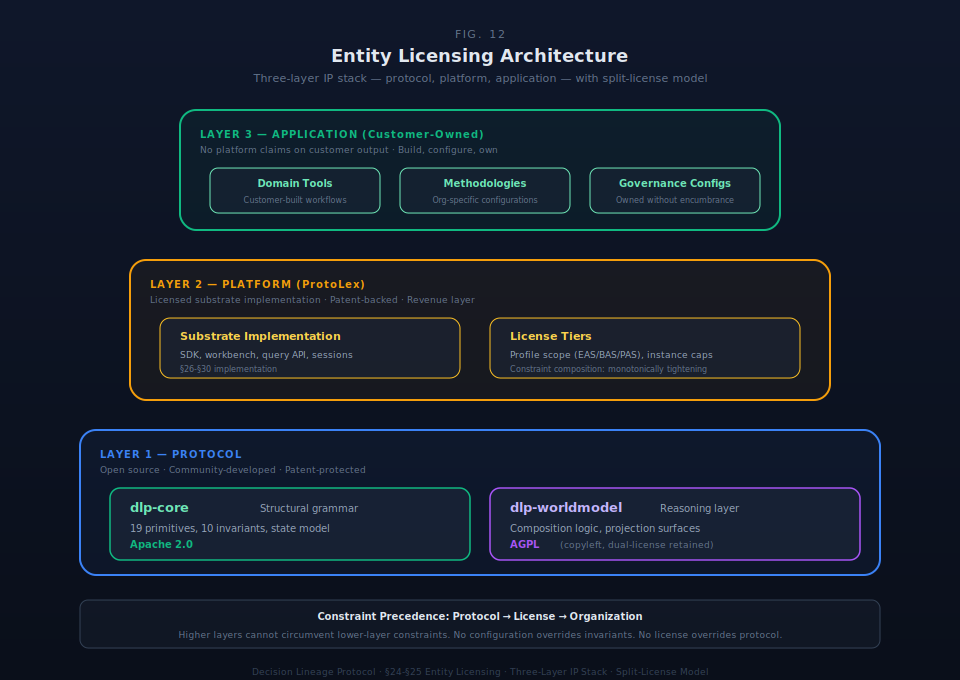

# §24 Entity & Licensing Structure


The Decision Lineage Protocol operates across four architectural layers — protocol, implementation, tooling, and applications — each with distinct ownership and licensing characteristics. A dual-dimension verification system ensures both licensing compliance and architectural conformance. This section specifies the four-layer licensing model, the license types, the verification architecture, the dual-dimension verification designation, federation licensing across legal entity boundaries, and profile graduation licensing.


The licensing architecture bridges the separation of protocol specification from implementation from application ownership. It establishes:

1. **Four layers of distinct access and ownership.** The protocol layer (open specification) separates from the implementation layer (licensed runtime), which separates from the tooling layer (licensed development infrastructure), which separates from the application layer (customer-owned). Each layer has independent licensing requirements.

2. **Verification as a dual-dimension property.** License validity and architectural conformance are verified independently. Both dimensions are required for full ecosystem standing.

3. **Federation licensing for multi-entity ecosystems.** Organizations at different scales can integrate through federation agreements that operate as Constraint primitives (§4), enabling recursive viable system patterns across legal entity boundaries.

4. **Profile graduation licensing.** As governance instances evolve (project to business to enterprise), new licensing allocations account for the expanded operational scope.


The licensing architecture rests on three foundations:

**1. Protocol-implementation separation.** The protocol layer — the specification of the nineteen primitives, ten behavioral invariants, truth type system, and state transformation model — is open. The implementation layer — the engineered substrate runtime — is licensed. This separation enables protocol adoption to drive ecosystem growth while implementations fund continued development.

The DLP protocol is independently implementable. Any organization can read the specification, build a conformant substrate, and operate governance without licensing any product from any vendor. The reference implementation, tooling, and verification infrastructure exist to accelerate adoption and enable independent inspection of conformance — not to gate access to the protocol's governance architecture. The licensing model funds continued development of these acceleration and inspection capabilities while the protocol itself remains permanently open.

**2. Architectural conformance verification.** The Constraint primitive (§4) operates across legal entity and instance boundaries. License terms are not legal text attached to engineering; they are Constraint primitive instances in the governance graph, enforceable through the same invariant system that governs all substrate operations.

**3. Recursive viable system pattern.** Federation licensing mirrors the recursive viable system pattern (§23.1). Just as internal recursion enables organizations to structure themselves at multiple scales, federation licensing enables organizations to partner and operate at multiple levels while preserving the same governance guarantees at every scale.


The entity that maintains the specification and reference implementation serves as the licensing authority for the ecosystem. This authority:

- Owns the DLP specification (open)
- Maintains a reference implementation (substrate runtime, licensed)
- Operates the verification infrastructure
- Administers the licensing verification program
- Maintains the root certificate authority for the license certificate chain

The licensing authority's governance is constrained by the open protocol commitment: the DLP specification cannot be retroactively closed, and the four-layer model cannot be collapsed. The protocol layer remains open indefinitely.



### §24.1 Four-Layer Licensing Model

The DLP ecosystem is organized into four layers. Each layer has distinct ownership, access rights, and enforcement characteristics.

#### Table 24.1.1: Four-Layer Model

| Layer | What It Contains | Access Model |
|---|---|---|
| **Protocol** | Decision Lineage Protocol specification — the nineteen primitives (§4), ten behavioral invariants (§5), truth type system (§6), state transformation model (§9), and control-theoretic foundation (§8) | Open |
| **Implementation** | Reference runtime (substrate) — the engineered system that instantiates profiles (§21), enforces invariants, manages state, and operates the governance machinery | Licensed |
| **Tooling** | Development and operational infrastructure — studio, SDK, CLI tools, verification utilities, and supporting services | Licensed / Subscription |
| **Applications** | What organizations build using the protocol, implementation, and tooling — their governance substrates, domain tools, integrations, and workflows | Organization-owned IP |

#### Layer Independence

The four layers are architecturally independent. Each layer can exist without the layers above it, and each layer's licensing is self-contained.

**Protocol layer** is open specification. Anyone can read the DLP specification, study the primitive model, research the behavioral invariants, and build their own implementation from the open specification. No license is required to read, study, or implement the protocol.

**Implementation layer** requires a commercial license. The reference implementation embodies engineering decisions, optimizations, and operational machinery that go beyond the specification. The protocol defines what invariants must hold; the implementation is how to make them hold efficiently and reliably.

**Tooling layer** operates on a subscription model. Development infrastructure, configuration interfaces, and supporting utilities are licensed separately from the reference implementation.

**Application layer** is organization-owned. The licensing relationship is with the platform, not with what organizations build on it. An organization that builds a governance workflow, configures domain-specific tools, or creates methodology implementations owns that work without encumbrance.

#### Enforcement Model

Enforcement is straightforward: "Are you using the implementation code without a license?" There is no cascading IP tracking, no derivative-work chain analysis, and no multi-degree ownership claims.

| Scenario | License Required? | Rationale |
|---|---|---|
| Read the DLP specification | No | Protocol layer is open |
| Build your own DLP implementation from the open spec | No | Growing the ecosystem; reference implementation code not used |
| Use the reference implementation | Yes — implementation license | Implementation layer is licensed |
| Use development tooling | Yes — tooling subscription | Tooling layer is licensed |
| Build an application on the platform | No additional license beyond implementation + tooling | Application IP belongs to the organization |
| Sell an application built on the platform | No license claim from the platform | Organization owns their application IP |

#### Protocol/Implementation Boundary

The boundary between protocol (open) and implementation (licensed) is the boundary between specification and code. The specification defines the governance grammar — the primitives, composition rules, invariants, and state transformation model. The implementation is the engineered system that makes the grammar operational. This boundary is testable: could someone implement the protocol knowing only the specification? If yes, the knowledge is protocol-level and open. If the knowledge requires access to implementation source code, it is implementation-level and licensed.

| Knowledge | Layer | Rationale |
|---|---|---|
| "Every commitment must be backed by at least one capacity allocation (B2)" | Protocol | Invariant specification — anyone reading §5 knows this |
| The specific state machine that enforces B2 at runtime | Implementation | Operational machinery — engineering decisions beyond the invariant statement |
| "The truth type system has three types: Authoritative, Declared, Derived (§6)" | Protocol | Type system specification — part of the open governance grammar |
| The promotion lifecycle with conflict resolution and rollback | Implementation | Operational machinery — engineering decisions not specified in §6 |
| "Constraint enforcement modes: Blocking, Warning, Logging, Advisory (§4)" | Protocol | Enforcement mode taxonomy — part of the Constraint primitive definition |
| The constraint evaluation engine that resolves conflicts in real-time | Implementation | Performance-critical engineering — resolution strategy and optimization are implementation choices |

This boundary serves both the ecosystem and the sustainability model. Openness at the protocol layer encourages adoption, enables academic study, and invites alternative implementations that grow the DLP ecosystem. Licensing at the implementation layer funds continued development and ensures quality for production deployments.


### §24.2 License Types

Four license types correspond to the four layers. Each license type has distinct terms, scope, and obligations.

#### Table 24.2.1: License Type Summary

| License Type | Layer | Access Granted | Scope Dimensions | Duration |
|---|---|---|---|---|
| **Protocol License** | Protocol | DLP specification, primitive definitions, invariant specifications | Attribution | Perpetual, irrevocable |
| **Implementation License** | Implementation | Reference runtime, profile packages, invariant enforcement | Instance count, profile type, user count, verification participation | Annual or multi-year |
| **Tooling License** | Tooling | Development studio, SDK, CLI tools, verification utilities | Feature tier (developer/professional/enterprise) | Subscription term |
| **Application License** | Application | N/A — organization owns their application IP | N/A | N/A |

#### Protocol License

The DLP specification is open. The protocol license grants unrestricted access to read, study, teach, and implement the protocol specification. Attribution to GrytLabs Research Institute, Inc. is required when publishing implementations.

The protocol license covers:
- The nineteen primitive definitions and five-tier hierarchy (§4)
- The ten behavioral invariants (§5)
- The truth type system and claims graduation model (§6)
- The minimum viable record specification (§7)
- The control-theoretic foundation (§8)
- The state transformation model and conservation laws (§9)
- The governance activation model (§12)
- The orchestration grammar specification (§A1, §A2)

The open protocol license enables:
1. **Academic study.** Researchers can analyze the DLP governance grammar and propose extensions without commercial relationships.
2. **Independent implementation.** Engineers can build DLP-conformant systems from the open specification. Independent implementations that pass conformance tests strengthen the ecosystem.
3. **Interoperability research.** The open specification enables interchange format development and cross-implementation compatibility work.

#### Implementation License

The implementation license grants access to the reference runtime. It is a commercial license with annual or multi-year terms.

The implementation license includes:
- Reference substrate runtime (deployment binary or container)
- Profile content packages (EAS, BAS, PAS) with pre-built governance structures (§21)
- Behavioral invariant enforcement engine
- State transformation and lineage tracking machinery
- Verification program participation
- License certificate credentials

Implementation license scope operates across four dimensions:

| Dimension | What It Governs | Licensing Implication |
|---|---|---|
| **Instance scope** | Number of substrate instances permitted | Instance count determines tier; each active instance consumes one allocation |
| **Profile scope** | Which profile types (EAS, BAS, PAS) permitted | Different profiles may have different licensing terms based on governance feature depth |
| **User scope** | Number of Actor Contexts (§22) active within instances | Actor Context count determines user-based licensing |
| **Verification obligation** | Participation in verification program | Licensee agrees to verification participation as a license condition |

#### Tooling License

The tooling license operates on a subscription model. Tooling access is additive to the implementation license. Active access requires an active subscription.

| Tier | Includes | Use Case |
|---|---|---|
| **Developer** | SDK, CLI tools, local development | Building applications against the substrate |
| **Professional** | Above + configuration studio, verification utilities | Operating production instances with full governance interface |
| **Enterprise** | Above + education platform, multi-instance management | Operating multiple instances with federation capabilities |

#### Application License

There is no application license from the platform. Organizations own their applications. A customer who builds a tool, configures a workflow, or creates a methodology on the platform owns that work without encumbrance.

Organizations may license their own applications to others. Tool builders can sell or license applications under their own terms. The only requirement is that end users running the application on the reference implementation must have their own implementation license.


### §24.3 License Verification Architecture

License verification operates through a two-layer model: a cryptographic certificate chain for formal attestation and a behavioral verification system for ecosystem monitoring. The two layers are complementary.

#### Table 24.3.1: Two-Layer Verification Model

| Layer | Purpose | Mode | Limitation Addressed |
|---|---|---|---|
| **Certificate Chain** | Formal attestation, legal enforceability | Active — licensee presents credentials | Cannot detect unlicensed implementations that don't cooperate |
| **Behavioral Verification** | Ecosystem scanning, compliance monitoring | Passive — detectable without licensee action | Enables forensic verification without active participation |

Neither layer alone is sufficient. Certificate-only verification requires active cooperation and misses unlicensed implementations. Behavioral-only verification is novel and harder to explain for formal auditing. The combined model provides legal foundation through the certificate chain and cost-effective monitoring through behavioral verification.

#### §24.3.1 Certificate Chain Architecture

The certificate chain provides formal attestation. It follows standard PKI patterns adapted for the licensing model.

**Chain of trust:**

```
Licensing Authority Root Certificate
    ↓ signs
Implementation License Certificate (per licensee)
    ↓ signs
Instance Attestation Certificate (per deployment)
    ↓ signs
Governance Record Signatures (individual records carry chain)
```

**Issuance flow:**

1. License agreement is executed between the licensing authority and the licensee.
2. An Implementation License Certificate is issued, signed by the root certificate.
3. On instance deployment, the licensee generates an Instance Attestation Certificate, signed by the license certificate.
4. Governance records produced by the instance carry signatures traceable through the chain.

**Attestation surfaces:**
- **Decision records.** Every primitive carries a signature field tracing to the instance attestation certificate.
- **Substrate exports.** Interchange layer exports (§19) include attestation metadata.
- **Health endpoints.** Instances expose a verification-queryable status endpoint presenting the certificate chain.

**Revocation capability.** If a licensee violates license terms, the licensing authority revokes the Implementation License Certificate. All attestations from that certificate stop validating, providing enforcement without litigation.

#### §24.3.2 Behavioral Verification

Licensed implementations use a verification mechanism that produces detectable patterns across primitive identifiers. The verification mechanism is embedded in the identification layer (§7) such that:

1. Every primitive instance created carries identification that encodes the implementation's license status.
2. The pattern is statistically valid but detectable only by the licensing authority's verification infrastructure.
3. The verification mechanism adds negligible computational overhead.

The verification pattern across a corpus of primitives enables:
- **Forensic verification.** Publicly available governance exports can be scanned to detect the implementation source.
- **Attribution without cooperation.** Verification works on published data without requiring the licensee to transmit information.
- **Ecosystem monitoring.** Unlicensed implementations can be detected through public governance exchanges.

**Corpus requirements for detection:**
- Single primitive: Indistinguishable from random — no attribution
- Small corpus (< 50 primitives): Insufficient statistical basis
- Standard corpus (50+ primitives): High-confidence detection
- Large corpus (500+ primitives): Near-certain forensic attribution

#### §24.3.3 Instance Correlation

Instance correlation controls whether multiple instances from the same licensee are linkable to each other through verification patterns.

| Mode | Seed Derivation | Use Case |
|---|---|---|
| **Isolated** (default) | Instance-specific inputs | Independent deployments; instances not linkable to each other |
| **Linkable** (opt-in) | Group-level inputs | Enterprise multi-instance or federated substrates; instances within a group are linkable |

**Isolated mode** is the default. Each instance is verified independently. The licensing authority can verify that each instance is licensed but cannot correlate instances to each other.

**Linkable mode** is opt-in. The licensee enables linkable mode for multi-instance deployments that require cross-instance provenance (§23). Instances within a deployment group become linkable for operational purposes.

#### §24.3.4 Self-Service Verification

Verification is self-service by design. Licensees verify their own compliance locally without transmitting governance data to the licensing authority.

**Verification flow:**

1. Licensee runs the verification tool locally.
2. The tool extracts identification patterns from the local instance.
3. The tool validates the certificate chain.
4. The tool generates a compliance certificate — a signed attestation of the verification result.

**Data sovereignty.** The licensing authority receives nothing automatically. The verification tool runs locally. Governance data remains in the licensee's environment. The licensee may optionally publish the compliance certificate for public verification, but this is not required.

**Auditor access.** Licensees provide compliance certificates to auditors. Auditors verify the certificate signature against the licensing authority's public key. The auditor does not need access to governance data, the identification corpus, or tool internals — the signed certificate is the attestation artifact.

#### §24.3.5 Verification Access Tiers

| Tier | Who | Capability | Data Access |
|---|---|---|---|
| **Self-Service** | Any licensee | Verify own implementation; generate compliance certificate | Own instance data only |
| **Auditor** | Delegated by licensee | Verify compliance certificates; validate signatures | Compliance certificate only |
| **Ecosystem Scan** | Licensing authority only | Detect implementations via public exports | Public exports only |

**Ecosystem scanning.** The licensing authority may scan publicly available exports — published decision records, public endpoints, interchange artifacts — for verification pattern detection. This is passive monitoring on data the implementation holder made public. The scanning does not constitute surveillance; it is equivalent to checking a published work's attribution.


### §24.4 Dual-Dimension Verification Designation

The ecosystem uses a dual-dimension verification designation that certifies both licensing status and architectural conformance. This is the signal for ecosystem authenticity and standing.

#### §24.4.1 The Two Dimensions

| Dimension | What It Verifies | How |
|---|---|---|
| **Licensed** | The implementation holder has a valid, non-revoked license | Certificate chain validation |
| **Conformant** | The implementation correctly realizes DLP architecture | Conformance testing |

Both dimensions are required for full designation. Neither alone is sufficient.

**Licensed but not Conformant.** An implementation with a valid license but failing conformance tests is licensed but unverified. This can occur during development, after version upgrades, or with customizations that break invariants. The implementation cannot represent itself as verified until conformance is restored.

**Conformant but not Licensed.** An implementation built from the open protocol specification that passes all conformance tests is technically sound but not licensed. It demonstrates competence but has not entered a licensing relationship. It cannot represent itself as verified because it lacks the license dimension.

#### §24.4.2 Conformance Testing

Conformance testing verifies that an implementation correctly realizes the DLP architecture across three levels:

| Level | What Is Tested | Method |
|---|---|---|
| **Structural** | Primitive completeness — all nineteen primitives present with correct types and relationships | Shape validation against the specification |
| **Behavioral** | Invariant compliance — all ten behavioral invariants enforced on state transformations | Test suite exercising each invariant through state transitions |
| **Compositional** | Cross-primitive composition — relationships compose correctly; state transformations produce valid lineage | Integration tests tracing governance scenarios end-to-end |

All three levels must pass. Structural conformance alone is insufficient if invariants are not enforced. Behavioral conformance alone is insufficient if composite operations break lineage. All three dimensions together establish architectural soundness.

#### §24.4.3 Verification Workflow

The verification workflow combines certificate chain validation with conformance testing.

**Initial verification:**

1. Licensee deploys an instance with valid license credentials.
2. Certificate chain validates.
3. Licensee runs the conformance test suite against the deployed instance.
4. All three conformance levels pass (structural, behavioral, compositional).
5. Licensee generates a verification attestation — a compliance certificate including both dimensions.
6. Attestation is optionally published for public verification.

**Ongoing verification:**

Verification status is maintained through continuous monitoring:

- **License validity** is checked at initialization, at configurable intervals, and before generating exports. Certificate revocation invalidates the Licensed dimension immediately.
- **Conformance status** is re-verified at defined intervals and after significant configuration changes. Re-verification triggers include scheduled interval, version upgrade, profile configuration change, and constraint modification. Any conformance failure suspends the full designation.

#### §24.4.4 Designation Lifecycle

| From | To | Trigger | Consequence |
|---|---|---|---|
| Unverified | Verified | Both dimensions pass | Instance may represent itself as verified |
| Verified | Licensed Only | Conformance failure | Verified status suspended; license remains valid |
| Verified | Conformant Only | License revocation | Verified status revoked; conformance remains valid |
| Licensed Only | Verified | Conformance restored | Full designation restored |
| Conformant Only | Verified | License obtained | Full designation restored |

Verified status is earned through verification, maintained through compliance, and lost through violation. Restoration follows the same verification workflow — there is no expedited path.

#### §24.4.5 Operational Implications

**Verified (Licensed + Conformant).** Full ecosystem participation. The instance may:
- Represent itself as verified in exports
- Participate in federated deployments with other verified implementations
- Generate compliance certificates attesting both dimensions
- Operate at full trust level

**Licensed but not Conformant.** Valid business relationship but technical deficiencies. The instance may:
- Continue operating under license
- Generate records with valid certificate signatures
- Participate in interchange (exports carry license attestation only)
- Not represent itself as verified

This state typically indicates development or a configuration drift. The remediation path is technical: run conformance tests, fix failures, re-verify.

**Conformant but not Licensed.** Technically sound but no licensing relationship. The instance may:
- Operate the DLP governance grammar correctly
- Not participate in the certificate chain
- Not represent itself as verified

This applies to independent DLP implementations. The remediation path is commercial: acquire a license.


### §24.5 Federation Licensing

Federation is a recursive pattern — a federated entity operates its own substrate instance with the same internal structure as any other instance (§23.4). Federation licensing specifies how the licensing model extends across legal entity boundaries.

#### §24.5.1 Federation Licensing Tiers

Three tiers provide progressively deeper integration between licensor and licensee:

| Tier | What Is Licensed | Constraint Integration |
|---|---|---|
| **Methodology Only** | Work programs, templates, training materials | Shallow — methodology adherence constraints only |
| **Methodology + Corpus** | Above + knowledge base access, reference implementations | Moderate — methodology + content quality constraints |
| **Full Federation** | Above + shared infrastructure, shared governance standards | Deep — methodology + content + infrastructure + quality constraints |

Each tier represents deeper constraint integration. At Methodology Only, the licensing constraint specifies adherence to licensed work programs. At Full Federation, constraints extend to infrastructure standards and shared quality frameworks. The constraint mechanics are identical to the internal tighten-only cascade (§23.2) — only the legal vehicle differs.

#### §24.5.2 The Licensing Agreement as Constraint

The federation licensing agreement is the Constraint primitive (§4) instantiated at the organizational boundary. The agreement specifies:

- **Methodology constraints.** The practitioner follows the licensed methodology. Constraints cascade to the practitioner's child instances.
- **Quality constraints.** The practitioner meets the parent firm's quality standards, verifiable through conformance testing.
- **Reporting obligations.** Aggregate metrics flow upward. Depth-gating (§23.4) ensures individual engagement detail does not reach the parent firm.
- **Verification requirements.** Each federation party maintains independent, verifiable license and conformance status.

#### §24.5.3 Recursive Federation

Federation licensing mirrors the recursive viable system pattern (§23.1). Each federation tier operates the same licensing mechanics with different constraint depth. The recursive property produces cascading constraints: a federated practitioner who operates an EAS instance with child instances is itself a recursive structure. The practitioner's child BAS inherits constraints from both the practitioner's own EAS and, transitively, from the parent firm's EAS. This is B6 (Constraint binds primitives, §5) operating across both legal and instance boundaries simultaneously.

**Federation depth is unbounded.** The protocol does not impose a hard limit on federation depth. A parent firm can federate with a practitioner who federates with a sub-practitioner. Each boundary is a licensing agreement operating as a Constraint. Each boundary follows the tighten-only rule.

#### §24.5.4 Federation Verification Independence

**Verification is independent at each level:**

| Verification Event | Parent Firm Impact | Practitioner Impact |
|---|---|---|
| Parent loses verified status | No direct impact on practitioner | Federation constraint source degrades |
| Practitioner loses verified status | Practitioner must remediate independently | Practitioner loses substrate access |
| Parent license revoked | Federation agreement constraints lose authority | Practitioner retains independent license; federation terminates |

The independence model prevents cascading failures. A parent's license issue does not invalidate practitioner licenses. A practitioner's conformance failure does not degrade the parent's status.


### §24.6 Profile Graduation Licensing

Profile graduation (PAS→BAS, BAS→EAS) is a topology change in the instance portfolio (§23). Graduation creates a new instance with the target profile. The licensing implication is direct: a new instance requires its own license allocation.

#### §24.6.1 Graduation and License Requirements

Graduation does not transfer the source instance's license to the new instance. It requires a new license allocation.

| Graduation Path | Source Instance | New Instance | License Requirement |
|---|---|---|---|
| **PAS → BAS** | Bounded project | Ongoing business | New instance allocation; PAS archives with graduation reference |
| **BAS → EAS** | Business operations | Enterprise governance | New instance allocation at EAS tier; additional terms may apply |

#### §24.6.2 Evidence Carry-Forward

Graduation carries evidence forward with four governing rules:

1. **Evidence integrity.** All evidence artifacts carry forward with original truth types, timestamps, and provenance intact. No evidence is modified. Authoritative evidence remains Authoritative.

2. **Lineage continuity.** The graduation decision links the source instance to the new instance. Carried evidence retains its lineage chain. Graduation extends lineage; it does not break it.

3. **Verification pattern continuity.** The new instance generates its own pattern from its own instance seed. Evidence carried from the source instance retains the source pattern. Both pattern sets are valid graduation artifacts in the new instance.

4. **Authority chain preservation.** Authority delegations from the source do not automatically transfer. The new instance establishes its own authority structure at genesis. Carried evidence references source authority chains for lineage but does not constitute active authority.

#### §24.6.3 BAS → EAS Graduation Detail

BAS → EAS graduation has specific licensing implications:

1. **Profile scope change.** The new instance operates at EAS tier. If the licensee's license does not include EAS scope, graduation requires a license upgrade before deployment.

2. **Verification re-certification.** The new instance must independently achieve verified status. Source verification does not transfer.

#### §24.6.4 Graduation in Federated Contexts

When a federated entity's instance graduates:

- The graduated instance requires a new license allocation under the federated entity's license.
- Federation constraints cascade to the new instance through the tighten-only rule.
- The parent firm's visibility follows federation depth-gating — the parent sees the graduation event in aggregate metrics but not the new instance's governance data.
- The federated entity's verification status is unaffected by the graduation.

#### §24.6.5 Source Instance Disposition

**Archival.** When graduation replaces the source (project becomes business), the source instance completes its lifecycle and archives. The archived instance remains queryable for lineage. Its license allocation is released.

**Continuation.** When graduation creates a parallel structure (business adds enterprise governance while operations continue), both instances may operate. Both consume license allocations.


## Scope

The licensing architecture constrains:

- **Protocol openness.** The protocol layer cannot be closed. The DLP specification remains perpetually open.
- **Layer independence.** Each layer has independent licensing. Requirements at one layer do not cascade to others except where explicitly stated.
- **Verification obligation.** Every implementation instance must participate in the verification program.
- **Application IP protection.** The licensing authority cannot claim intellectual property on applications built by organizations. The platform-application boundary is absolute.


## Locked Design Positions

The following positions are locked decisions:

1. **Four-layer model is permanent.** The separation of protocol (open), implementation (licensed), tooling (licensed), and application (organization-owned) is structural and cannot be collapsed.

2. **Verification is dual-dimension.** Verification combines formal certificate attestation with behavioral verification. Both dimensions are required for full ecosystem standing.

3. **Self-service verification is architectural.** Organizations verify compliance locally. The licensing authority does not receive governance data automatically.

4. **Federation licensing follows recursive viable system pattern.** Federation constraints operate as Constraint primitives with tighten-only cascade at every level. No federation depth limit is imposed.

5. **Verified status requires both dimensions.** Licensed-only and Conformant-only are distinct states. Full verification requires both.


## Implementation Requirements

**Core SDK commitments for §24:**

- MUST implement certificate chain validation at instance initialization and at defined intervals.
- MUST implement identification verification for all primitive instantiation.
- MUST support self-service verification without external data transmission.
- MUST embed attestation metadata in all interchange layer exports.
- MUST enforce instance isolation by default; linkable mode requires explicit opt-in.
- MUST implement all three conformance test levels (structural, behavioral, compositional).
- MUST record graduation licensing events as Decision primitives.
- MUST maintain verification pattern integrity through graduation.
- MUST enforce federation depth-gating constraints architecturally.
- MUST NOT grant verified designation to implementations satisfying only one dimension.
- MUST NOT allow production deployments without valid license credentials.
- MUST NOT transmit licensee governance data during verification.
- MUST NOT enable cross-instance correlation in Isolated mode.

