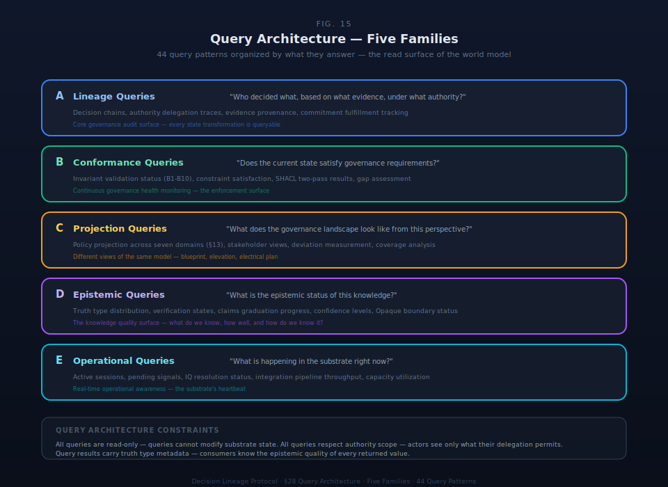

# §28 Query Architecture

This specification section defines implementation contracts for the Decision Lineage Protocol substrate.

The Decision Lineage Protocol substrate is AI-native infrastructure. Humans express intent in natural language; AI translates to substrate queries. No user — human or AI agent — writes Cypher or SQL directly. The query architecture defines a pattern-based query model with forty-four named patterns across eleven domain families, a dual-language execution strategy (Cypher for graph traversal, SQL for relational operations), canonical return structures with mandatory truth type metadata, an AI query generation layer that maps natural language to parameterized templates, and a three-format interchange layer exposing query results to external consumers.

This section specifies the query contracts — inputs, outputs, traversal semantics, governance constraints, and interchange mappings — that the SDK must implement. The forty-four patterns read the state produced by the two hundred and forty-four operations defined in §27. Transport protocol, wire format, and client-library ergonomics are DESIGN SPACE.

---

## §28.1 Query Architecture Overview

### §28.1.1 Design Principles

The query architecture rests on five principles:

**Pattern-based query model.** Every query the substrate supports maps to a named pattern with typed inputs, a defined traversal strategy, a canonical return structure, and explicit governance constraints. Ad-hoc queries do not exist. AI agents and SDK consumers select patterns, supply parameters, and receive structured results. The pattern library is the complete query surface.

**AI-native interface.** The primary query interface is natural language. Humans describe what they want; the AI query generation layer identifies the matching pattern, extracts parameters, validates constraints, and executes the query. The AI layer never constructs raw query strings — it fills parameters into pre-validated templates.

**Dual-language execution.** The substrate uses two query languages with an architectural boundary. Cypher (Apache AGE) handles graph traversals — variable-depth paths along the thirteen cross-primitive relationships defined in §4.4. SQL (PostgreSQL) handles relational operations — lookups, filters, aggregations, and joins on fixed-schema tables. Hybrid patterns compose results from both engines at the SDK layer. The boundary is stable: if a pattern traverses variable-depth paths, it requires Cypher; everything else is SQL.

**Truth type transparency.** Every query result carries truth type metadata — `truth_type`, `verification_state`, and `record_lifecycle_state` — on every returned record. Consumers always know the epistemic status of the data they receive. Derived content is never presented as canonical without explicit marking.

**Three interchange formats.** Query results are exposed through three formats: MCP Server for AI agent interaction, JSON Export for integration pipelines, and RDF/OWL Export for formal compliance and archival. Not all patterns require all formats — internal governance patterns (scope validation, principal enforcement) are SDK-only.

### §28.1.2 Query Stack

The query stack comprises four layers:

### Table 28.1.1: Query Stack Layers

| Layer | Role | Input | Output |
|---|---|---|---|
| **Natural Language** | Human intent expression | Free-text question or command | Pattern identification + parameter candidates |
| **AI Generation** | Pattern selection, parameter extraction, validation | NL input + substrate context | Validated, parameterized query template |
| **Query Engine** | Dual-language execution | Template + parameters | Raw result set |
| **Return Formatting** | Canonical structure assembly, truth type annotation, pagination | Raw result set | Typed return structure with QueryMetadata |

The AI Generation layer sits between the human and the query engine. It translates intent to parameterized templates, validates parameters against the substrate schema, enforces depth limits and access control, and handles disambiguation when multiple patterns match a natural language query.

### §28.1.3 Pattern-to-Operation Correspondence

The forty-four query patterns read state produced by the two hundred and forty-four operations defined in §27 and the seventy-two cross-cutting operations spanning multiple primitives. Every operation postcondition creates or modifies queryable state:

- **Create operations** produce records queryable by truth type filter (QP-TRU-01) and domain-specific patterns.
- **Transition operations** advance lifecycle state queryable by status-filtered patterns (QP-ORC-01, QP-SIG-01, QP-SIG-02, QP-TMP-01).
- **Composite operations** produce multi-primitive state queryable by graph traversal patterns (QP-AUTH-01 through QP-LIN-04) and governance state patterns (QP-GOV-01 through QP-GOV-05).
- **Invariant enforcement** produces validation reports queryable by QP-INV-01 and QP-INV-02.
- **KPI operations** produce measurement records queryable by QP-KPI-01 through QP-KPI-03.

No operation produces state that falls outside the forty-four pattern query surface.

---

## §28.2 Dual-Language Strategy

### §28.2.1 Language Selection

The substrate query engine uses two languages, each selected for a distinct structural reason.

**Cypher (Apache AGE)** handles graph traversals — queries that follow variable-depth paths along the thirteen cross-primitive relationships (§4.4). Authority delegation chains, decision lineage traces, impact radius computations, escalation path resolutions, and recursive instance hierarchies are graph-native operations. Cypher expresses these as declarative path patterns with per-hop filtering and depth control. Apache AGE runs as a PostgreSQL extension, keeping both languages within a single database system.

**SQL (PostgreSQL)** handles relational operations — lookups on fixed-schema tables, filtered queries with known join paths, aggregations, and temporal reconstructions. Governance state queries, truth type filtering, actor context loading, work specification retrieval, KPI metrics, and cycle management are relational by nature. SQL's mature optimization, window functions, and aggregation capabilities serve these patterns directly.

### §28.2.2 Classification Rule

The classification rule is deterministic: if a pattern traverses variable-depth paths along cross-primitive relationships, it is Cypher-required. If it performs lookups, filters, or aggregations on fixed-schema tables with known joins, it is SQL-eligible. If it combines both, it is Hybrid-required.

### Table 28.2.1: Language Classification Summary

| Classification | Count | Percentage | Discriminator |
|---|---|---|---|
| **Cypher-required** | 10 | 23% | Variable-depth traversal along §4.4 relationships |
| **SQL-eligible** | 24 | 55% | Fixed-schema lookups, filters, aggregations |
| **Hybrid-required** | 10 | 23% | Graph traversal composed with relational filtering |

### §28.2.3 Language Distribution by Domain

Graph traversal concentrates in two domain families. Authority & Delegation and Decision Lineage account for seven of ten Cypher-required patterns. This reflects the substrate's core structural insight: authority chains and decision lineage are inherently graph problems — they involve variable-depth paths, multi-edge traversals, and per-hop validation.

### Table 28.2.2: Language Classification by Domain Family

| Domain Family | Cypher | SQL | Hybrid | Total |
|---|---|---|---|---|
| A — Authority & Delegation | 4 | — | 1 | 5 |
| B — Decision Lineage | 3 | — | 1 | 4 |
| C — Governance State | — | 3 | 2 | 5 |
| D — Truth & Verification | — | 4 | — | 4 |
| E — Actor & Instance | — | 3 | 1 | 4 |
| F — Orchestration & Work | — | 4 | 1 | 5 |
| G — Signal & IQ | 1 | 2 | 1 | 4 |
| H — Profile & Portfolio | 2 | 1 | 1 | 4 |
| I — Conservation & Invariant | — | 1 | 2 | 3 |
| J — KPI & Measurement | — | 3 | — | 3 |
| K — Temporal & Cycle | — | 3 | — | 3 |

### §28.2.4 Hybrid Composition Model

All ten Hybrid patterns follow a consistent composition strategy: SQL identifies entities and filters records; Cypher validates structural relationships through graph traversal; the SDK composes results into the canonical return structure. The SDK query layer orchestrates this composition — it is not visible to query consumers.

Representative hybrid composition:

- **QP-AUTH-05** (AI-Cannot-Be-Principal Enforcement): SQL identifies AI actors by type. Cypher traverses each actor's authority chains to verify human-held root termination.
- **QP-GOV-04** (Conformance Test): SQL executes Pass 1 invariant checks (B1–B4, B5-immediate, B6-binding). Cypher executes Pass 2 checks (B5-T transitive chain, B8 signal routing). SDK aggregates into a unified conformance report.
- **QP-INV-01** (Conservation Law Compliance): SQL runs all single-node property checks. Cypher runs transitive closure and cross-instance validation. SDK merges into a compliance result.

### §28.2.5 CTE Fallback Strategy

Recursive Common Table Expressions (CTEs) provide a fallback for deployments without Apache AGE. Simple single-edge-type chains — authority delegation (QP-AUTH-01, QP-AUTH-02), instance hierarchy (QP-PRO-02) — have clean CTE substitutions with acceptable performance up to depth twenty. Multi-edge patterns (QP-LIN-01 decision lineage) require multiple CTEs joined at the application layer. Impact radius (QP-LIN-03) with its thirteen-edge-type multi-directional traversal has no viable CTE fallback — Apache AGE is required for this pattern.

### Table 28.2.3: CTE Fallback Viability

| Viability | Patterns | Notes |
|---|---|---|
| **Full** | QP-AUTH-01, QP-AUTH-02, QP-PRO-02 | Single FK chain; clean recursive CTE |
| **Partial** | QP-AUTH-03, QP-AUTH-04, QP-LIN-01, QP-LIN-02, QP-LIN-04, QP-SIG-03, QP-PRO-03 | Multiple CTEs required; verbose and performance-sensitive |
| **None** | QP-LIN-03 | Thirteen edge types; multi-directional traversal; graph-native only |

---

## §28.3 Query Pattern Library

### §28.3.1 Pattern Taxonomy

The query pattern library comprises forty-four named patterns organized into eleven domain families. Each pattern specifies typed input parameters, a canonical return structure, traversal semantics, depth limits, governance constraints, and use cases. The families are not arbitrary groupings — they correspond to the structural domains of the governance substrate.

### Table 28.3.1: Query Pattern Library

| ID | Pattern Name | Family | Language | Return Type | MCP Tool |
|---|---|---|---|---|---|
| QP-AUTH-01 | Authority Chain Traversal | A | Cypher | PathResult | `authority_chain` |
| QP-AUTH-02 | Delegation Tree | A | Cypher | TreeResult | `delegation_tree` |
| QP-AUTH-03 | Multi-Path Authority Check | A | Cypher | PathResult | `check_authority` |
| QP-AUTH-04 | Delegation Scope Validation | A | Cypher | ConformanceResult | SDK-only |
| QP-AUTH-05 | AI-Cannot-Be-Principal Enforcement | A | Hybrid | ConformanceResult | SDK-only |
| QP-LIN-01 | Decision Lineage Trace | B | Cypher | PathResult | `decision_lineage` |
| QP-LIN-02 | Decision Descendants | B | Cypher | TreeResult | `decision_descendants` |
| QP-LIN-03 | Impact Radius | B | Cypher | SubgraphResult | `impact_radius` |
| QP-LIN-04 | Decision Reconstruction | B | Hybrid | Composite | `reconstruct_decision` |
| QP-GOV-01 | Governance Source Registry | C | SQL | PaginatedList | `governance_registry` |
| QP-GOV-02 | Activation Pipeline State | C | SQL | PaginatedList | `activation_pipeline` |
| QP-GOV-03 | Gap Register Query | C | SQL | PaginatedList | `gap_register` |
| QP-GOV-04 | Conformance Test | C | Hybrid | ConformanceResult[] | `conformance_check` |
| QP-GOV-05 | Policy Surface Query | C | Hybrid | Composite | `policy_surface` |
| QP-TRU-01 | Truth Type Filter | D | SQL | PaginatedList | `filter_by_truth_type` |
| QP-TRU-02 | Verification State Query | D | SQL | PaginatedList | `verification_status` |
| QP-TRU-03 | Claims Graduation Status | D | SQL | PaginatedList | `claims_graduation` |
| QP-TRU-04 | Promotion Pathway Status | D | SQL | PaginatedList | `promotion_queue` |
| QP-ACT-01 | Actor Context Query | E | SQL | ActorContextRecord | `actor_context` |
| QP-ACT-02 | Actor Governance Portfolio | E | Hybrid | PortfolioRecord | `actor_portfolio` |
| QP-ACT-03 | RACIVG Role Query | E | SQL | PaginatedList | `role_assignments` |
| QP-ACT-04 | Role Envelope Query | E | SQL | RoleEnvelopeRecord | SDK-only |
| QP-ORC-01 | Work Specification Query | F | SQL | PaginatedList | `work_specifications` |
| QP-ORC-02 | Routing Resolution Query | F | SQL | PaginatedList | `routing_decisions` |
| QP-ORC-03 | AICAR Classification Query | F | SQL | CountSummary[] | SDK-only |
| QP-ORC-04 | Constraint Evaluation Query | F | SQL | PaginatedList | SDK-only |
| QP-ORC-05 | Delegation Scope Resolution | F | Hybrid | DelegationScopeRecord | `delegation_scope` |
| QP-SIG-01 | Signal Routing Query | G | Hybrid | PaginatedList | `signals` |
| QP-SIG-02 | IQ Lifecycle Query | G | SQL | PaginatedList | `investigative_queries` |
| QP-SIG-03 | Escalation Chain Query | G | Cypher | PathResult | `escalation_chain` |
| QP-SIG-04 | Pattern Detection Query | G | SQL | PaginatedList | SDK-only |
| QP-PRO-01 | Profile Graduation State | H | SQL | GraduationAssessment | `profile_status` |
| QP-PRO-02 | Recursive Instance Tree | H | Cypher | TreeResult | `instance_tree` |
| QP-PRO-03 | Constraint Cascade Query | H | Cypher | CascadeResult | SDK-only |
| QP-PRO-04 | Depth-Gated Visibility Query | H | Hybrid | Filtered result | SDK-only |
| QP-INV-01 | Conservation Law Compliance | I | Hybrid | ConformanceResult[] | `invariant_compliance` |
| QP-INV-02 | Violation History Query | I | SQL | PaginatedList | `violation_history` |
| QP-INV-03 | Override Audit Query | I | Hybrid | PaginatedList | `override_audit` |
| QP-KPI-01 | KPI Lifecycle Query | J | SQL | PaginatedList | `kpi_lifecycle` |
| QP-KPI-02 | Invariant Signal Query | J | SQL | InvariantSignalReading[] | `invariant_signals` |
| QP-KPI-03 | Control KPI Status | J | SQL | PaginatedList | `control_kpis` |
| QP-TMP-01 | Cycle-Scoped Query | K | SQL | PaginatedList | `cycles` |
| QP-TMP-02 | Temporal Aggregation | K | SQL | TimelineResult | SDK-only |
| QP-TMP-03 | Account Time-Window Query | K | SQL | AccountStateRecord | `account_history` |

**MCP exposure.** Thirty-five of forty-four patterns are exposed as MCP Server tools. Nine patterns are SDK-only: internal validation patterns (QP-AUTH-04, QP-AUTH-05), access control patterns (QP-ACT-04, QP-PRO-04), internal analytics (QP-ORC-03, QP-ORC-04, QP-SIG-04, QP-TMP-02), and structural validation (QP-PRO-03).

### §28.3.2 Domain Family Descriptions

### Table 28.3.2: Domain Families

| Family | Domain | Core Concern | Language Tendency |
|---|---|---|---|
| **A** | Authority & Delegation | Chain traversals, scope validation, AI-Cannot-Be-Principal | Cypher-dominant |
| **B** | Decision Lineage | Causal chains, impact radius, decision reconstruction | Cypher-dominant |
| **C** | Governance State | Activation pipeline, gap register, conformance, policy surfaces | SQL with Hybrid for graph-backed tests |
| **D** | Truth & Verification | Truth type filtering, verification state, claims graduation | Pure SQL |
| **E** | Actor & Instance | Actor context, portfolio, RACIVG roles, role envelopes | SQL with Hybrid for cross-instance |
| **F** | Orchestration & Work | Work specifications, routing decisions, delegation scope | SQL with Hybrid for chain validation |
| **G** | Signal & IQ | Signal routing (B8), IQ lifecycle (B9), escalation chains | Mixed |
| **H** | Profile & Portfolio | Graduation state, recursive instances, constraint cascade | Cypher for hierarchy; SQL for state |
| **I** | Conservation & Invariant | Conservation law compliance, violation history, override audit | Hybrid for validation; SQL for history |
| **J** | KPI & Measurement | KPI lifecycle, invariant signals, control KPI status | Pure SQL |
| **K** | Temporal & Cycle | Cycle-scoped queries, temporal aggregation, state reconstruction | Pure SQL |

---

## §28.4 Authority & Decision Patterns

Families A and B are the most graph-intensive domains. They traverse the cross-primitive relationships defined in §4.4 to answer the substrate's core structural questions: who has authority, how was it delegated, why was a decision made, and what does it affect.

### §28.4.1 Authority Chain Traversal (QP-AUTH-01)

Authority chain traversal follows the `delegates` relationship (§4.4, relationship #11) upward from any authority to the root. This is the foundational graph pattern — every authorization check, audit trail, and scope validation relies on it.

### Table 28.4.1: QP-AUTH-01 Specification

| Attribute | Specification |
|---|---|
| **Input** | `authority_id: UUID`, `instance_id: UUID` |
| **Output** | PathResult — ordered Authority nodes linked by `delegates` edges, terminating at root |
| **Traversal** | Upward: child → parent via `parent_authority_id`. Terminates at `is_root_authority = true`. |
| **Depth limits** | EAS: 100, BAS: 25, PAS: inherited from parent instance |
| **Invariants enforced** | B5 (every non-root node has a parent), B5-T (chain terminates at root — cycles are violations) |
| **Governance** | Truth type returned on every node. Scope metadata included per hop. |

### §28.4.2 Multi-Path Authority Check (QP-AUTH-03)

Multi-path authority check answers the question "can this actor do this?" by traversing from actor through `holds` and `delegates` edges to find any authority matching the required scope. The pattern uses eager termination — it returns the shortest valid path, not all paths.

### Table 28.4.2: QP-AUTH-03 Specification

| Attribute | Specification |
|---|---|
| **Input** | `actor_id: UUID`, `required_scope: JSONB`, `instance_id: UUID` |
| **Output** | PathResult — shortest valid path from actor to matching Authority, or empty |
| **Traversal** | Outward: actor → (holds) → authority → (delegates) → authority. Scope filter: `authority.scope @> required_scope` at each node. Eager termination on first match. |
| **Depth limits** | Default: 15. Configurable up to profile maximum. |
| **Invariants enforced** | B5 (chain validity). AI-Cannot-Be-Principal (§22): AI actors hold only delegated authority. |

### §28.4.3 Decision Lineage Trace (QP-LIN-01)

Decision lineage trace follows the causal chain from a decision backward through its antecedents — the intents that framed it, the evidence that informed it, the authority that legitimized it, and the account that contextualized it. This pattern traverses four of the thirteen cross-primitive relationships (§4.4): `frames`, `evaluates`, `legitimizes`, and `contextualizes`.

### Table 28.4.3: QP-LIN-01 Specification

| Attribute | Specification |
|---|---|
| **Input** | `decision_id: UUID`, `instance_id: UUID` |
| **Output** | PathResult — ordered Decision nodes with causal edges toward root causes |
| **Traversal** | Upward: effect → cause. Edge types: `frames` (Intent → Decision), `evaluates` (Decision → Evidence), `legitimizes` (Authority → Decision), `contextualizes` (Account → Decision). Terminates at nodes with no further causal antecedents. |
| **Depth limits** | Default: unlimited (decision lineage is append-only; historical depth is valid). Configurable for performance. |
| **Invariants enforced** | B4 (every decision links to account). Truth type per node. |

### §28.4.4 Impact Radius (QP-LIN-03)

Impact radius is the most graph-intensive pattern. It traverses all thirteen cross-primitive relationships outward from a decision to compute the connected subgraph of affected entities within a configurable depth. This is not a tree — it is an arbitrary subgraph with multiple edge types, branching, and reconvergence.

### Table 28.4.4: QP-LIN-03 Specification

| Attribute | Specification |
|---|---|
| **Input** | `decision_id: UUID`, `instance_id: UUID`, `max_depth: INTEGER` (default: profile-dependent — EAS: 10, BAS: 5, PAS: 3) |
| **Output** | SubgraphResult — connected component with all thirteen edge types, per-node depth from center |
| **Traversal** | Multi-directional from decision. All thirteen §4.4 edge types. Collects distinct nodes within depth limit. |
| **Depth limits** | Default: 5. Maximum: EAS: 20, BAS: 10, PAS: 5. |
| **Invariants enforced** | Depth-gated visibility (§23): respects instance boundary and actor visibility scope. Truth type per node. |
| **CTE fallback** | None. Thirteen-edge-type multi-directional traversal is graph-native only. |

### §28.4.5 Decision Reconstruction (QP-LIN-04)

Decision reconstruction assembles the complete context of a decision for audit: the decision record, its authority chain, the account state at decision time, the evidence set evaluated, the intent framing, and the constraint set in scope. This is a hybrid pattern — graph traversal resolves structural relationships; SQL retrieves field-level details and the temporal constraint snapshot.

### Table 28.4.5: QP-LIN-04 Specification

| Attribute | Specification |
|---|---|
| **Input** | `decision_id: UUID`, `instance_id: UUID` |
| **Output** | Composite: DecisionRecord + PathResult (authority chain) + AccountRecord (state snapshot) + EvidenceRecord[] + IntentRecord[] + ConstraintRecord[] |
| **Traversal** | Graph: `legitimizes` (Authority), `contextualizes` (Account), `evaluates` (Evidence), `frames` (Intent). SQL: decision fields, constraint set active at `decision.made_at`. |
| **Invariants enforced** | B4 (account link), B5 (authority chain). Derived evidence clearly distinguished from Authoritative/Declared. |

### §28.4.6 Remaining Authority & Decision Patterns

Four additional patterns complete these families:

### Table 28.4.6: Additional Authority & Decision Patterns

| Pattern | Purpose | Key Feature |
|---|---|---|
| **QP-AUTH-02** (Delegation Tree) | Enumerate all authorities delegated from a source, downward | TreeResult with fanout per level |
| **QP-AUTH-04** (Delegation Scope Validation) | Verify scope containment at every hop in a delegation chain | Per-hop `child.scope ⊆ parent.scope` check |
| **QP-AUTH-05** (AI-Cannot-Be-Principal) | Verify every AI actor's authority traces to a human root | Hybrid: SQL identifies AI actors, Cypher validates chains |
| **QP-LIN-02** (Decision Descendants) | Find all downstream decisions and work from a root decision | TreeResult via `authorizes` path (Decision → Commitment → Work) |

---

## §28.5 Governance & Compliance Patterns

Families C and I address governance infrastructure: what governance frameworks are active, where compliance gaps exist, whether behavioral invariants hold, and how violations are tracked and overridden.

### §28.5.1 Conformance Test (QP-GOV-04)

The conformance test pattern executes the ten conformance tests defined in §13, each backed by one or more of the ten behavioral invariants. This is a hybrid pattern: Pass 1 tests (B1 through B4, B5-immediate, B6-binding) are relational single-node checks; Pass 2 tests (B5-T transitive chain, B8 signal routing) require graph traversal.

### Table 28.5.1: QP-GOV-04 Specification

| Attribute | Specification |
|---|---|
| **Input** | `instance_id: UUID`, `governance_domain: ENUM` (optional, 1–7 per §13), `conformance_level: ENUM` (optional: structural, operational, governed, auditable, sovereign) |
| **Output** | ConformanceResult[] — per-test: test_id, invariant_ref (B1–B10), result (pass/fail), validation_pass (pass_1_core, pass_2_sparql, schema), enforcement_action, sample_violations |
| **Traversal** | Pass 1: SQL single-node property checks. Pass 2: Cypher transitive closure (B5-T via QP-AUTH-01) and routing validation (B8 via QP-SIG-03). |
| **Conformance levels** | Structural: B1–B4. Operational: + B5, B6. Governed: + B7, B8. Auditable: + B9. Sovereign: all B1–B10 plus RATIFIED verification (§6.7). |
| **Result truth type** | Conformance results are always Authoritative — the validation engine is a trusted system component. |

### §28.5.2 Gap Register (QP-GOV-03)

The gap register query retrieves governance gaps characterized by the seven verification types (§6.7): EXIST, COMPLETE, CURRENT, APPROVED, CONSISTENT, COMPLIANT, RATIFIED. Each gap records which verification types are present and which are missing, enabling graduated assessment of governance completeness.

### Table 28.5.2: QP-GOV-03 Specification

| Attribute | Specification |
|---|---|
| **Input** | `instance_id: UUID`, `verification_types_missing: ENUM[]` (optional), `closure_stage: ENUM` (optional), `governance_criticality: ENUM` (optional) |
| **Output** | PaginatedList\<GapRegisterEntry\> — gap_id, pattern_ref, verification_types_present/missing, criticality_level, closure_stage, materiality_level |
| **Ordering** | Default: criticality DESC (conservation_critical → invariant_enforcing → standard → advisory), closure_stage ASC |
| **Closure stages** | Awareness → Enablement → Management → Governance (§12 four-stage closure progression) |

### §28.5.3 Conservation Law Compliance (QP-INV-01)

Conservation law compliance runs the full invariant test suite — Pass 1 relational checks and Pass 2 graph checks — mapped to the nine conservation laws (§9). Each conservation law maps to one or more behavioral invariants: organizational direction is enforced by B9; binding force by B1 and B2; feasibility truth by B2; epistemic status by B3; scope preservation by B5; rule universality by B6; emergency signaling by B7 and B8.

### Table 28.5.3: QP-INV-01 Specification

| Attribute | Specification |
|---|---|
| **Input** | `instance_id: UUID`, `conservation_law: TEXT` (optional), `invariant_id: ENUM` (optional, B1–B10) |
| **Output** | ConformanceResult[] — per conservation law: enforcing invariant(s), enforcement pass, result, violation count, sample violations |
| **Pass 1** | B1 (`commitment_id IS NOT NULL`), B2 (`EXISTS capacity_allocations`), B3 (`truth_type IS NOT NULL`), B4 (`account_id IS NOT NULL`), B5-immediate, B6-binding |
| **Pass 2** | B5-T (transitive chain via QP-AUTH-01), B6-U (cross-instance universality), B8 (routing via QP-SIG-03), B9 (resolved IQ → Decision/Work) |

### §28.5.4 Remaining Governance & Compliance Patterns

### Table 28.5.4: Additional Governance Patterns

| Pattern | Purpose | Language |
|---|---|---|
| **QP-GOV-01** (Governance Source Registry) | List registered governance patterns by layer and criticality | SQL |
| **QP-GOV-02** (Activation Pipeline State) | Show activation state across governance sources through the six-stage pipeline (§12) | SQL |
| **QP-GOV-05** (Policy Surface) | Generate a scoped governance projection — "what rules apply to me?" | Hybrid |
| **QP-INV-02** (Violation History) | Query violation records with override tracking and enforcement action filtering | SQL |
| **QP-INV-03** (Override Audit) | Audit invariant overrides: authority, rationale, scope of exception | Hybrid |

---

## §28.6 Truth & Verification Patterns

Family D enforces the epistemic boundary (§6) through queries. Every primitive record in the substrate carries a truth type (Authoritative, Declared, Derived, Opaque — §6.1), a verification state, and a record lifecycle state. These four patterns make the epistemic layer queryable.

### §28.6.1 Truth Type Filter (QP-TRU-01)

The foundational epistemic query. It filters any of the nineteen primitive tables by truth type and lifecycle state. This pattern is invoked — directly or as a sub-query — by virtually every other pattern that returns primitive records.

### Table 28.6.1: QP-TRU-01 Specification

| Attribute | Specification |
|---|---|
| **Input** | `instance_id: UUID`, `primitive_type: ENUM` (any of 19), `truth_type: ENUM` (authoritative, declared, derived, opaque), `record_lifecycle_state: ENUM` (optional, default: active) |
| **Output** | PaginatedList\<PrimitiveRecord\> — with truth_type, verification_state, and record_lifecycle_state on every record |
| **Default behavior** | Excludes superseded records unless explicitly requested. Derived content is clearly marked as non-canonical. |
| **B3 enforcement** | Every returned Evidence record carries exactly one truth type from the controlled vocabulary. |

### §28.6.2 Promotion Pathway Status (QP-TRU-04)

The promotion pathway query tracks AI-generated content through its lifecycle from staging to promotion or expiration. All AI output lands in staging with truth type Derived (§6.2). Promotion to Declared requires human review; promotion to Authoritative requires a Decision with traceable Authority (B5). No demotion path exists — the promotion direction is monotonic.

### Table 28.6.2: QP-TRU-04 Specification

| Attribute | Specification |
|---|---|
| **Input** | `instance_id: UUID`, `promotion_workflow_state: ENUM` (optional: staging, human_review, promoted, archived), `content_type: ENUM` (optional) |
| **Output** | PaginatedList\<PromotionRecord\> — record_id, current_truth_type, promotion_state, ttl_expiry, reviewer, promotion_decision_ref |
| **Epistemic boundary** | Derived → Declared → Authoritative only. Staging requirement is structural, enforced by the type system. |

### §28.6.3 Remaining Truth & Verification Patterns

### Table 28.6.3: Additional Truth Patterns

| Pattern | Purpose | Key Feature |
|---|---|---|
| **QP-TRU-02** (Verification State) | Query verification state (§6.4) by state and verification type (§6.7) | Seven verification types: EXIST through RATIFIED |
| **QP-TRU-03** (Claims Graduation) | Query claims by graduation stage (§6.5) | Five stages: Asserted → Investigating → Corroborated → Verified → Graduated |

---

## §28.7 Actor, Work & Orchestration Patterns

Families E and F provide the query surface for actor context, RACIVG role assignments, work specifications, routing decisions, and delegation scope. These patterns read the state produced by the orchestration operations (§27.7) and actor lifecycle operations (§27.2).

### §28.7.1 Actor Context (QP-ACT-01)

Every actor action requires context loading — the actor's type, active roles, authority scope, constraints, governance posture, and delegation references. This is the most frequently invoked pattern. It is pure SQL: a lookup on the actors table joined with delegations and role envelopes.

### Table 28.7.1: QP-ACT-01 Specification

| Attribute | Specification |
|---|---|
| **Input** | `actor_id: UUID`, `instance_id: UUID` |
| **Output** | ActorContextRecord — actor_type (Human, AI-Automation, AI-Agentic, AI-Assistive), active_roles (RACIVG[]), authority_scope, active_constraints[], governance_posture (Standard/Enhanced/Critical), delegation_refs[] |
| **RACIVG constraint** | AI actors cannot hold A (Accountable) — the AI-Cannot-Be-Principal constraint (§22) |
| **Frequency** | Very high — every actor action triggers context loading |

### §28.7.2 Routing Resolution (QP-ORC-02)

Routing resolution queries audit the seven-step resolution engine (§A2): CLASSIFY → ACTIVATE → ROUTE → SELECT → COMPOSE → CONFIRM → EMIT. Each routing decision record captures the five-dimensional context (AICAR type, decision type, consequence level, operating posture, graduation stage), the alternatives considered, the selection rationale, and the computed human-in-the-loop level.

### Table 28.7.2: QP-ORC-02 Specification

| Attribute | Specification |
|---|---|
| **Input** | `routing_decision_id: UUID` (optional), `instance_id: UUID`, `aicar_type: ENUM` (optional) |
| **Output** | PaginatedList\<RoutingDecisionRecord\> — alternatives_considered, selected_assignments, five_dimensional_position, computed_HITL_level, confidence_assessment, authority_basis |
| **Five dimensions** | AICAR type × Decision type × Consequence level × Operating posture × Graduation stage |
| **HITL levels** | 0 (no human involvement) through 3 (human makes decision; AI provides information only) |

### §28.7.3 Remaining Actor & Orchestration Patterns

### Table 28.7.3: Additional Actor & Orchestration Patterns

| Pattern | Purpose | Key Feature |
|---|---|---|
| **QP-ACT-02** (Portfolio) | Actor participation across instances with per-instance authority | Hybrid: SQL finds instances, Cypher resolves per-instance authority chains |
| **QP-ACT-03** (RACIVG Roles) | Query role assignments by role type, primitive scope, actor type | SQL filter on `active_roles` array; A (Accountable) is human-only |
| **QP-ACT-04** (Role Envelope) | Retrieve role envelope with context modifier adjustments | SDK-only; deterministic modifier application |
| **QP-ORC-01** (Work Specifications) | Query work specifications by status and cognitive type | SM-4 lifecycle: draft → confirmed → active → completed → promoted/rejected |
| **QP-ORC-03** (AICAR Classification) | Distribution of work by cognitive type (A/B/C/D) | SDK-only aggregate |
| **QP-ORC-04** (Constraint Evaluation) | Evaluate constraints bound to a work specification | Three constraint types: Routing, Behavioral, Activation |
| **QP-ORC-05** (Delegation Scope) | Resolve delegation scope for actor and work type | Hybrid: SQL finds delegations, Cypher validates authority chains |

---

## §28.8 Signal, IQ & Emergence Patterns

Family G provides the query surface for the signal routing mechanism (B8), the investigative query lifecycle (B9), escalation chain resolution, and pattern detection. These patterns enforce the governance routing invariants — signals reach authority, and emergence converts to action.

### §28.8.1 Signal Routing (QP-SIG-01)

Signal routing queries filter the signal register by status and object type, then validate that each signal's routing target is on the governance chain for the flagged object (B8). This is a hybrid pattern: SQL filters signals; Cypher traverses the `governs` edge (Authority → Primitive) and the `delegates` chain upward to verify routing compliance.

### Table 28.8.1: QP-SIG-01 Specification

| Attribute | Specification |
|---|---|
| **Input** | `signal_id: UUID` (optional), `instance_id: UUID`, `signal_status: ENUM` (optional — seven SM-7 states), `object_type: ENUM` (optional — any of 19 primitives) |
| **Output** | PaginatedList\<SignalRecord\> — signal_type, flagged_object_ref, routed_to_authority, status, reservation_nature, escalation_history |
| **B7 enforcement** | Every primitive class has a signal attachment surface — any governed object can be flagged |
| **B8 enforcement** | Routing target must be on the governance chain for the flagged object, at any depth |
| **Signal lifecycle** | Created → Routed → Processing → Escalated → Monitoring → Resolved or Dismissed (SM-7) |

### §28.8.2 Escalation Chain (QP-SIG-03)

The escalation chain query resolves the full authority path for a governed object — from the immediate governing authority to the root. This implements the algedonic channel: emergency signals can bypass intermediate hierarchy to reach any authority on the chain. The pattern is Cypher-required: it traverses the `governs` edge to find the immediate authority, then follows `delegates` upward.

### Table 28.8.2: QP-SIG-03 Specification

| Attribute | Specification |
|---|---|
| **Input** | `object_id: UUID`, `object_type: ENUM`, `instance_id: UUID` |
| **Output** | PathResult — authority chain from immediate governing authority to root |
| **Traversal** | First edge: `governs` (Authority → Primitive). Then: `delegates` chain upward. |
| **B8 scope** | Signals may route to any authority on this path — not restricted to the immediate governor |

### §28.8.3 IQ Lifecycle (QP-SIG-02)

Investigative queries are the emergence mechanism — context-attached or free-floating capture of questions that arise from governance activity. The IQ lifecycle query filters by status, intent type (eight types: explore, validate, disambiguate, fill_gap, challenge, connect, branch_inventory, confidence_probe), and origin type (claim, signal, capture, workflow). B9 enforcement requires that every resolved IQ produces a Decision or Work item — the gap between what the organization knows and what it does about it must close.

### §28.8.4 Pattern Detection (QP-SIG-04)

Pattern detection aggregates signals and IQs within a time window to identify recurring patterns. Pattern detection evidence enters as Derived truth (§6) and requires human promotion before influencing routing decisions. This is an SDK-only pattern — not exposed via MCP.

---

## §28.9 Profile, KPI & Temporal Patterns

Families H, J, and K cover the portfolio hierarchy, measurement framework, and temporal governance layer.

### §28.9.1 Recursive Instance Tree (QP-PRO-02)

The recursive instance tree traverses the substrate's organizational hierarchy — parent-child relationships, spawning events, graduation topology changes, evidence feeds, and federation licenses. This is a Cypher-required pattern: instance relationships form a graph with five edge types (PARENT_CHILD, SPAWNS, GRADUATES_TO, FEEDS, LICENSES_FROM) and unknown depth.

### Table 28.9.1: QP-PRO-02 Specification

| Attribute | Specification |
|---|---|
| **Input** | `instance_id: UUID` (root), `relationship_type: ENUM` (optional filter), `max_depth: INTEGER` (optional) |
| **Output** | TreeResult — hierarchical instance structure with relationship types and profile assignments per node |
| **Depth limits** | EAS: 10, BAS: 5, PAS: 2 |
| **Governance** | Spawning stage ceiling: child cannot start above parent's stage. Tighten-only constraint cascade. |

### §28.9.2 Invariant Signal Query (QP-KPI-02)

Invariant signals are the always-on diagnostic dimensions that protect the enterprise during change. Eight dimensions — cycle time distribution, quality/rework rate, variance/predictability, escalation frequency, judgment load, evidence completeness, semantic integrity, change failure rate — are monitored continuously regardless of phase. These are not targets; they are diagnostic signals that answer "is the system healthier or more fragile than before?"

### Table 28.9.2: QP-KPI-02 Specification

| Attribute | Specification |
|---|---|
| **Input** | `instance_id: UUID`, `dimension: ENUM` (optional — one of eight), `time_window: INTERVAL` (optional) |
| **Output** | InvariantSignalReading[] — per dimension: current_value, trend (increasing/stable/decreasing), threshold_status (normal/warning/critical), historical_values |
| **Three KPI classes** | Invariant Signals (IS) — always-on, longitudinal. Control KPIs (CKPI) — temporary, phase-specific. Intent Progress Indicators (IPI) — slow-moving, strategic. |

### §28.9.3 Remaining Profile, KPI & Temporal Patterns

### Table 28.9.3: Additional Profile, KPI & Temporal Patterns

| Pattern | Purpose | Key Feature |
|---|---|---|
| **QP-PRO-01** (Graduation State) | Instance maturity assessment — current stage and trigger status | A → A+ → B → C; no stage skipping |
| **QP-PRO-03** (Constraint Cascade) | Verify tighten-only constraint inheritance through instance hierarchy | Per-hop intersection: child threshold ≤ parent threshold |
| **QP-PRO-04** (Depth-Gated Visibility) | Filter query results by actor's visibility level | Own detail, parent context, descendant aggregates; sibling isolation |
| **QP-KPI-01** (KPI Lifecycle) | Query KPI definitions by class, trigger type, and status | No KPI silently disappears — retirement requires explicit event |
| **QP-KPI-03** (Control KPI Status) | Active control KPIs by phase and intent reference | Explicitly temporary; retire when phase ends |
| **QP-TMP-01** (Cycle-Scoped) | Cycle records by type and status | Six cycle types; cross-substrate temporal alignment |
| **QP-TMP-02** (Temporal Aggregation) | Aggregate primitives by time window with trend | SDK-only; dashboard construction |
| **QP-TMP-03** (Account History) | Reconstruct account state at a point in time | Transaction replay for as-of queries |

---

## §28.10 Return Structure Specifications

### §28.10.1 Design Principles

All return structures share four properties:

1. **Truth type metadata on every record.** Fields `truth_type`, `verification_state`, and `record_lifecycle_state` appear on every primitive record and graph node. No consumer receives data without knowing its epistemic status.
2. **Pagination via cursor.** List results use opaque cursor-based pagination with a configurable limit (default: 50, maximum: 500).
3. **Query metadata on every response.** Every response includes a QueryMetadata envelope: query_id, pattern_id, execution timestamp, execution duration, language used, depth limit applied, profile type.
4. **Typed identifiers.** All identifiers are UUID. All timestamps are ISO 8601 / TIMESTAMPTZ.

### §28.10.2 Return Structure Categories

The forty-four patterns produce results from six structural categories.

### Table 28.10.1: Return Structure Categories

| Category | Structures | Used By | Pagination |
|---|---|---|---|
| **Primitive Records** | IntentRecord, CommitmentRecord, CapacityRecord, WorkRecord, EvidenceRecord, DecisionRecord, AuthorityRecord, AccountRecord, ConstraintRecord | QP-TRU-01 (truth type filter), domain-specific patterns | Cursor + limit via PaginatedList |
| **Graph Results** | PathResult, TreeResult, SubgraphResult | Authority chains, decision lineage, instance trees, escalation | Not paginated — bounded by depth limit |
| **Aggregate Results** | CountSummary, TimelineResult | AICAR classification, temporal aggregation | Limit on historical values |
| **Governance State** | GapRegisterEntry, ActivationStatusRecord, ConformanceResult | Governance domain patterns | Cursor + limit (except ConformanceResult — fixed test set) |
| **Orchestration** | RoutingDecisionRecord, WorkSpecificationRecord, GraduationAssessment | Orchestration and profile patterns | Cursor + limit |
| **KPI** | InvariantSignalReading, KPILifecycleRecord | KPI domain patterns | Limit on historical values |

### §28.10.3 Graph Result Structures

Three structures represent graph query results, distinguished by topology:

**PathResult.** An ordered sequence of nodes and edges for linear traversal queries. Used by authority chains (QP-AUTH-01, QP-AUTH-03), decision lineage (QP-LIN-01), and escalation chains (QP-SIG-03). Fields: `nodes[]` (ordered, with node_type, truth_type, depth), `edges[]` (ordered, with edge_type from thirteen §4.4 relationships), `total_depth`, `terminated_at` (root_reached, max_depth, or no_further_nodes).

**TreeResult.** A hierarchical structure with recursive children for tree-shaped traversals. Used by delegation trees (QP-AUTH-02), decision descendants (QP-LIN-02), and instance trees (QP-PRO-02). Each TreeNode carries `node_id`, `node_type`, `truth_type`, `depth`, `edge_type` (relationship to parent), and `children[]`.

**SubgraphResult.** An arbitrary graph structure for multi-directional traversals. Used by impact radius (QP-LIN-03) only. Fields: `center` (traversal origin), `nodes[]` (with node_type, truth_type, depth_from_center), `edges[]` (with edge_type, direction), `total_nodes`, `total_edges`, `max_depth_reached`.

Graph results are not paginated. They are bounded by depth limits — the query's `max_depth` parameter controls response size. For large trees, consumers reduce `max_depth` to control payload.

### §28.10.4 Common Fields on Primitive Records

Every primitive record returned by any pattern includes the following fields:

### Table 28.10.2: Common Record Fields

| Field | Type | Description |
|---|---|---|
| `id` | UUID | Primitive instance identifier |
| `instance_id` | UUID | Substrate instance |
| `truth_type` | ENUM (authoritative, declared, derived) | Epistemic origin (§6.1) |
| `verification_state` | ENUM | Current verification outcome (§6.4) |
| `record_lifecycle_state` | ENUM (active, superseded) | Whether this record is current |
| `created_at` | TIMESTAMPTZ | Record creation timestamp |
| `created_by` | UUID | Actor who created this record |
| `version` | INTEGER | Record version number |

### §28.10.5 Governance State Structures

Governance domain patterns return specialized structures that capture the compliance and activation state of the substrate.

**GapRegisterEntry.** Used by QP-GOV-03. Each entry characterizes a governance gap using the seven verification types (§6.7):

### Table 28.10.3: GapRegisterEntry Fields

| Field | Type | Description |
|---|---|---|
| `gap_id` | UUID | Gap identifier |
| `pattern_ref` | TEXT | Reference to governance pattern signature |
| `verification_types_present` | ENUM[] | Which of seven verification types are satisfied |
| `verification_types_missing` | ENUM[] | Which verification types are not satisfied |
| `criticality_level` | ENUM | conservation_critical, invariant_enforcing, standard, advisory (§11) |
| `closure_stage` | ENUM | awareness, enablement, management, governance (§12) |
| `materiality_level` | ENUM | baseline, high_risk, certification_grade (§12) |
| `remediation_owner` | UUID | FK → entities |
| `truth_type` | ENUM | Epistemic origin of gap assessment |

**ConformanceResult.** Used by QP-GOV-04 and QP-INV-01. Each result records one conformance test execution:

### Table 28.10.4: ConformanceResult Fields

| Field | Type | Description |
|---|---|---|
| `test_id` | TEXT | Test identifier |
| `invariant_ref` | ENUM (B1–B10) | Behavioral invariant tested |
| `shape_uri` | TEXT | SHACL shape URI |
| `test_description` | TEXT | Human-readable test description |
| `result` | ENUM (pass, fail) | Test outcome |
| `validation_pass` | ENUM | pass_1_core, pass_2_sparql, or schema |
| `enforcement_action` | ENUM | blocked, warned, or logged |
| `violation_count` | INTEGER | Number of violations (if failed) |
| `sample_violations` | ARRAY | Focus node, node type, and violation detail per sample |
| `truth_type` | ENUM (authoritative) | Always Authoritative — the validation engine is a trusted system component |

### §28.10.6 Orchestration Structures

**RoutingDecisionRecord.** Used by QP-ORC-02. Captures the full context of a routing decision from the seven-step resolution engine (§A2):

### Table 28.10.5: RoutingDecisionRecord Fields

| Field | Type | Description |
|---|---|---|
| `routing_decision_id` | UUID | Routing decision identifier |
| `alternatives_considered` | ARRAY | Actor ID, type, delegation ref, suitability score per alternative |
| `selected_assignments` | ARRAY | Actor ID, type, delegation ref, autonomy level per assignment |
| `selection_rationale` | TEXT | Account reference for rationale |
| `five_dimensional_position` | OBJECT | AICAR type, decision type, consequence level, operating posture, graduation stage |
| `computed_hitl_level` | INTEGER | Human-in-the-loop level (0–3) |
| `confidence_assessment` | NUMERIC | Routing confidence (0.0–1.0) |
| `authority_basis` | UUID | Authority reference for the routing decision |
| `truth_type` | ENUM | Epistemic origin |

**WorkSpecificationRecord.** Used by QP-ORC-01. Captures the cognitive decomposition and composition strategy for a work specification:

### Table 28.10.6: WorkSpecificationRecord Fields

| Field | Type | Description |
|---|---|---|
| `work_spec_id` | UUID | Work specification identifier |
| `cognitive_decomposition` | ARRAY | Component ID, cognitive type (A/B/C/D), dependencies, description per component |
| `actor_assignments` | ARRAY | Actor ID, type, delegation ref, autonomy level per assignment |
| `effective_constraints` | ARRAY | Constraint ID, type, enforcement mode per constraint |
| `composition_strategy` | ENUM | sequential, parallel, iterative, conditional, delegated, federated (§A1) |
| `five_dimensional_context` | OBJECT | AICAR type, decision type, consequence level, operating posture, graduation stage |
| `status` | ENUM | SM-4 lifecycle: draft, confirmed, active, completed, promoted, rejected |
| `truth_type` | ENUM | Epistemic origin |

### §28.10.7 Structure-to-Pattern Mapping

### Table 28.10.7: Return Structure Usage

| Return Structure | Used By Patterns |
|---|---|
| PathResult | QP-AUTH-01, QP-AUTH-03, QP-LIN-01, QP-SIG-03 |
| TreeResult | QP-AUTH-02, QP-LIN-02, QP-PRO-02 |
| SubgraphResult | QP-LIN-03 |
| ConformanceResult | QP-AUTH-04, QP-AUTH-05, QP-GOV-04, QP-INV-01 |
| PrimitiveRecord variants | QP-TRU-01, QP-LIN-01 (as nodes), QP-LIN-04 (composite) |
| ActorContextRecord | QP-ACT-01 |
| PortfolioRecord | QP-ACT-02 |
| RoleEnvelopeRecord | QP-ACT-04 |
| DelegationScopeRecord | QP-ORC-05 |
| GapRegisterEntry | QP-GOV-03 |
| ActivationStatusRecord | QP-GOV-02 |
| RoutingDecisionRecord | QP-ORC-02 |
| WorkSpecificationRecord | QP-ORC-01 |
| SignalRecord | QP-SIG-01 |
| GraduationAssessment | QP-PRO-01 |
| CascadeResult | QP-PRO-03 |
| InvariantSignalReading | QP-KPI-02 |
| KPILifecycleRecord | QP-KPI-01, QP-KPI-03 |
| AccountStateRecord | QP-TMP-03 |
| CountSummary | QP-ORC-03 |
| TimelineResult | QP-TMP-02 |
| PaginatedList\<T\> | All list-returning patterns |
| QueryMetadata | All patterns |
| ValidationError | All patterns (on validation failure) |

Structures listed in Table 28.10.7 without field-level tables in §28.10.3–§28.10.6 (such as ActorContextRecord, PortfolioRecord, SignalRecord, InvariantSignalReading, and others) are specified by their pattern definitions in §28.4–§28.9. Field-level definitions for these structures are DESIGN SPACE.

### §28.10.8 List Wrapper and Metadata

**PaginatedList\<T\>.** All patterns returning multiple records wrap them in a standard list envelope: `items[]`, `total` (total matching records before pagination), `cursor` (opaque, null on last page), `limit`, `has_more`, `instance_id`.

**QueryMetadata.** Included on every query response:

### Table 28.10.8: QueryMetadata Fields

| Field | Type | Description |
|---|---|---|
| `query_id` | UUID | Unique query execution identifier |
| `pattern_id` | TEXT | Pattern executed (e.g., QP-AUTH-01) |
| `executed_at` | TIMESTAMPTZ | Execution timestamp |
| `execution_ms` | INTEGER | Execution duration |
| `language_used` | ENUM (cypher, sql, hybrid) | Query engine(s) invoked |
| `depth_limit_applied` | INTEGER | Depth limit used (graph queries) |
| `profile_type` | ENUM (eas, bas, pas) | Profile context |
| `truth_type_filter_applied` | ENUM | If truth type filtering was active |

**ValidationError.** Returned when a query fails validation before execution: `error_code`, `error_message`, `parameter` (which failed), `constraint_violated`, `suggested_action`.

---

## §28.11 AI Query Generation

### §28.11.1 Generation Architecture

The AI query generation layer translates natural language to parameterized query templates. The layer performs four functions: pattern identification, parameter extraction, validation, and execution. It never constructs raw Cypher or SQL strings — it fills typed parameters into pre-validated templates registered at SDK initialization.

### §28.11.2 Template Catalog

High-frequency patterns use deterministic templates with no AI-generated query structure. The AI layer selects a template and fills parameters; the template itself is pre-validated.

### Table 28.11.1: High-Frequency Templates

| Template | Pattern | Frequency | Parameters | Depth |
|---|---|---|---|---|
| T-AUTH-01 | QP-AUTH-01 | Very High | authority_id, instance_id | Profile-dependent |
| T-AUTH-03 | QP-AUTH-03 | Very High | actor_id, required_scope, instance_id | Default: 15 |
| T-LIN-01 | QP-LIN-01 | High | decision_id, instance_id | Unlimited |
| T-LIN-03 | QP-LIN-03 | High | decision_id, instance_id, max_depth | Default: 5 |
| T-LIN-04 | QP-LIN-04 | High | decision_id, instance_id | Per-component |
| T-GOV-03 | QP-GOV-03 | High | instance_id, closure_stage?, criticality? | N/A |
| T-GOV-04 | QP-GOV-04 | Medium | instance_id, domain?, level? | Per-test |
| T-TRU-01 | QP-TRU-01 | Very High | instance_id, primitive_type, truth_type | N/A |
| T-TRU-04 | QP-TRU-04 | High | instance_id, workflow_state? | N/A |
| T-ACT-01 | QP-ACT-01 | Very High | actor_id, instance_id | N/A |
| T-ORC-01 | QP-ORC-01 | High | instance_id, status?, cognitive_type? | N/A |
| T-SIG-01 | QP-SIG-01 | High | instance_id, status?, object_type? | Per QP-AUTH-01 |
| T-SIG-02 | QP-SIG-02 | Medium-High | instance_id, status?, intent_type? | N/A |
| T-KPI-02 | QP-KPI-02 | High | instance_id, dimension?, time_window? | N/A |
| T-TMP-03 | QP-TMP-03 | Medium-High | account_id, instance_id, as_of? | N/A |

### §28.11.3 Validation Pipeline

Every AI-generated query passes through a six-step validation pipeline before execution:

**Step 1: Pattern Selection.** The AI layer identifies which pattern maps to the natural language query. If the query is ambiguous — "show me the authority" could mean QP-AUTH-01 (chain), QP-AUTH-03 (check), or QP-ACT-01 (context) — the AI layer disambiguates by conversational context or asks the user to clarify.

**Step 2: Parameter Extraction.** The AI layer extracts typed parameter values from natural language. Entity resolution maps names to UUID lookups ("Sarah" → actor_id). Scope resolution constructs JSONB from descriptions ("finance purchases" → scope object). Temporal resolution converts relative expressions ("last quarter" → INTERVAL).

**Step 3: Parameter Validation.** Type check: parameters match template type declarations. Existence check: referenced UUIDs exist in the substrate. Range check: numeric parameters within bounds. ENUM check: values in controlled vocabulary.

**Step 4: Profile Check.** Depth limits within profile maximum. Pattern available at this profile tier. Actor has visibility for requested scope (QP-PRO-04).

**Step 5: Execute.** Template instantiated with validated parameters. Query engine invoked — Cypher, SQL, or both per the pattern's language classification. Results returned in canonical structure.

**Step 6: Post-Processing.** Truth type metadata verified on all result records. Depth limits annotated in QueryMetadata. Pagination applied if result set exceeds limit.

### §28.11.4 Natural Language Mapping

Each domain family defines representative natural language patterns that map to specific query patterns. The following examples are illustrative, not exhaustive:

### Table 28.11.2: Natural Language → Pattern Mapping (Representative)

| Natural Language | Pattern | Parameters Extracted |
|---|---|---|
| "Who authorized this decision?" | QP-AUTH-01, QP-LIN-04 | decision_id → authority chain |
| "Can Sarah approve purchase orders over $50K?" | QP-AUTH-03 | actor_id=Sarah, scope={action: approve, type: purchase_order, amount: >50000} |
| "What decisions resulted from the budget approval?" | QP-LIN-02 | decision_id=budget approval |
| "What would be affected if we reverse the hiring decision?" | QP-LIN-03 | decision_id=hiring decision |
| "What compliance gaps do we have?" | QP-GOV-03 | instance_id |
| "Show me only the official records" | QP-TRU-01 | truth_type=authoritative |
| "What AI-generated content is awaiting review?" | QP-TRU-04 | workflow_state=human_review |
| "What's my current governance context?" | QP-ACT-01 | actor_id=current user |
| "Why was this work routed to the AI agent?" | QP-ORC-02 | routing_decision for specific work |
| "Are there any open signals?" | QP-SIG-01 | status=created or routed |
| "How's the system health?" | QP-KPI-02 | All eight dimensions |
| "What was the account state on January 15?" | QP-TMP-03 | account_id, as_of=Jan 15 |

### §28.11.5 Truth Type Awareness

The AI layer includes truth type filters appropriate to the query context. Default behavior: canonical queries filter to `truth_type IN (authoritative, declared)`. Staging review queries filter to `truth_type = derived`. The AI layer overrides defaults only on explicit user request ("show me everything including AI drafts"). When Derived content is included in results, it is explicitly marked as non-canonical.

### §28.11.6 Error Handling and Escalation

When validation fails, the AI layer follows a three-step fallback:

1. **Retry with correction.** If a parameter fails validation (e.g., entity not found), the AI layer corrects or asks the user for clarification. One retry attempt.
2. **Offer alternative pattern.** If the requested pattern is unavailable (access control, profile limitation), suggest related patterns within the actor's scope.
3. **Escalate to user.** If no alternative exists, surface the failure with explanation: what was requested, why it failed, what the actor can do instead.

### Table 28.11.3: Error Categories

| Category | Example | AI Response |
|---|---|---|
| Parameter validation failure | Invalid UUID, ENUM not in vocabulary | Correct parameter and retry |
| Existence check failure | Referenced entity not found | Ask user to clarify |
| Access denied | Actor lacks visibility for scope | Inform user of available scope |
| Depth limit exceeded | Requested depth exceeds profile max | Use profile maximum with notification |
| Graph traversal timeout | Traversal exceeds query timeout | Return partial results; suggest narrowing scope |
| Ambiguous query | Multiple patterns match | Offer disambiguation options |
| No pattern match | Outside pattern library | Explain capability boundary |

### §28.11.7 Profile Variations

Query behavior varies by substrate profile. Profiles affect available patterns, depth limits, RACIVG role scope, conformance level range, KPI class availability, and cycle type access.

### Table 28.11.4: Query Behavior by Profile

| Dimension | EAS | BAS | PAS |
|---|---|---|---|
| Available patterns | All 44 | All 44 except QP-PRO-02 cross-federation queries | All 44 except QP-PRO-02 cross-federation, QP-GOV-05 sovereign projections |
| Authority chain depth | 100 | 25 | Inherited from parent |
| Impact radius default / max | 10 / 20 | 5 / 10 | 3 / 5 |
| Decision lineage depth | Unlimited | 100 | 50 |
| RACIVG scope | Full 6 roles (R, A, C, I, V, G) | 4 roles (R, A, C, I) | R, A (Owner maps to R+A; Collaborator maps to C+I per §21) |
| Conformance level range | Structural through Sovereign | Structural through Governed | Structural through Operational |
| KPI classes | IS + CKPI + IPI | IS + CKPI | CKPI (IS implicit) |
| Cycle types | All six | execution_pulse, weekly_review, commitment_reconciliation | execution_pulse, weekly_review |
| Instance tree depth | 10 | 5 | 2 |

Profiles may override default depth limits within bounds through profile configuration (§28-C12). No override may exceed the stated maximums. Depth overrides deeper than the profile default require documented justification.

### §28.11.8 Template Versioning

Templates are versioned independently of the substrate schema. Breaking changes — parameter type modifications, result structure changes — increment the major version. Non-breaking changes — new optional parameters, additional result fields — increment the minor version. Backward compatibility, deprecation availability, and deprecation notice requirements are specified in §28-C27 through §28-C29.

---

## §28.12 Interchange Format Architecture

### §28.12.1 Three Formats

Query results are exposed through three interchange formats, each optimized for a different consumer class.

### Table 28.12.1: Interchange Format Summary

| Format | Primary Consumer | Purpose | Fidelity | Pagination |
|---|---|---|---|---|
| **MCP Server** | AI agents via MCP protocol | Runtime query interface — "the badge" | High (structured, typed) | Yes (cursor-based) |
| **JSON Export** | Integration pipelines, dashboards | Simple interop, general integrations | Medium (graph structure flattened) | Yes (cursor-based) |
| **RDF/OWL Export** | Archival, reasoning engines, audit | Full formal compliance | Full (nothing lost) | No (complete graph) |

**MCP Server** is the primary AI agent interface. It signals that the substrate is infrastructure, not just an application. AI agents query authority, lineage, and governance context through MCP tools with structured input/output contracts.

**JSON Export** provides accessibility. Graph structures are flattened to arrays with parent references. OWL restrictions are simplified to constraints. Temporal semantics are simplified to timestamps. The trade-off is intentional: JSON is universally consumable.

**RDF/OWL Export** provides fidelity. The full internal model — including OWL class restrictions, SHACL shapes, PROV-O provenance chains, and SKOS concept schemes — is preserved. W3C standards ensure long-term archival stability. The trade-off: RDF requires specialized tooling.

### §28.12.2 MCP Tool Catalog

Thirty-five of forty-four patterns are exposed as MCP Server tools. Each tool maps one-to-one to a query pattern with the same inputs and outputs.

### Table 28.12.2: MCP Tool Summary

| Tool Name | Pattern | Domain | Description |
|---|---|---|---|
| `authority_chain` | QP-AUTH-01 | Authority | Trace delegation hierarchy to root |
| `delegation_tree` | QP-AUTH-02 | Authority | Enumerate delegated authorities |
| `check_authority` | QP-AUTH-03 | Authority | Verify actor authority for scope |
| `decision_lineage` | QP-LIN-01 | Lineage | Trace causal chain to root cause |
| `decision_descendants` | QP-LIN-02 | Lineage | Find downstream decisions and work |
| `impact_radius` | QP-LIN-03 | Lineage | Find all entities affected by decision |
| `reconstruct_decision` | QP-LIN-04 | Lineage | Reconstruct complete decision context |
| `governance_registry` | QP-GOV-01 | Governance | List governance patterns by layer |
| `activation_pipeline` | QP-GOV-02 | Governance | Show activation state across sources |
| `gap_register` | QP-GOV-03 | Governance | Query gaps by verification type |
| `conformance_check` | QP-GOV-04 | Governance | Run conformance tests |
| `policy_surface` | QP-GOV-05 | Governance | Generate scoped governance projection |
| `filter_by_truth_type` | QP-TRU-01 | Truth | Filter records by epistemic origin |
| `verification_status` | QP-TRU-02 | Truth | Query verification state |
| `claims_graduation` | QP-TRU-03 | Truth | Query claims by graduation stage |
| `promotion_queue` | QP-TRU-04 | Truth | View Derived content awaiting promotion |
| `actor_context` | QP-ACT-01 | Actor | Get current actor context |
| `actor_portfolio` | QP-ACT-02 | Actor | View actor participation across instances |
| `role_assignments` | QP-ACT-03 | Actor | Query RACIVG role assignments |
| `work_specifications` | QP-ORC-01 | Orchestration | Query work specifications by status |
| `routing_decisions` | QP-ORC-02 | Orchestration | Audit routing decisions |
| `delegation_scope` | QP-ORC-05 | Orchestration | Resolve delegation scope |
| `signals` | QP-SIG-01 | Signal | Query signals by status |
| `investigative_queries` | QP-SIG-02 | Signal | Query IQs by status and intent |
| `escalation_chain` | QP-SIG-03 | Signal | Resolve escalation path |
| `profile_status` | QP-PRO-01 | Profile | Query graduation state |
| `instance_tree` | QP-PRO-02 | Profile | Traverse instance hierarchy |
| `invariant_compliance` | QP-INV-01 | Invariant | Run conservation law checks |
| `violation_history` | QP-INV-02 | Invariant | Query violation history |
| `override_audit` | QP-INV-03 | Invariant | Audit invariant overrides |
| `kpi_lifecycle` | QP-KPI-01 | KPI | Query KPI definitions |
| `invariant_signals` | QP-KPI-02 | KPI | Read invariant signal dimensions |
| `control_kpis` | QP-KPI-03 | KPI | Query active control KPIs |
| `cycles` | QP-TMP-01 | Temporal | Query cycle records |
| `account_history` | QP-TMP-03 | Temporal | Reconstruct account state |

### §28.12.3 SDK-Only Patterns

Nine patterns are not exposed via MCP. They serve internal governance functions consumed by other patterns or used by the SDK enforcement engine:

### Table 28.12.3: SDK-Only Patterns

| Pattern | Reason for SDK-Only |
|---|---|
| QP-AUTH-04 (Delegation Scope Validation) | Internal validation consumed by delegation grant operations |
| QP-AUTH-05 (AI-Cannot-Be-Principal) | Internal enforcement consumed by actor registration |
| QP-ACT-04 (Role Envelope) | Internal access control consumed by authorization checks |
| QP-ORC-03 (AICAR Classification) | Internal analytics for capacity planning |
| QP-ORC-04 (Constraint Evaluation) | Internal validation consumed by work specification lifecycle |
| QP-SIG-04 (Pattern Detection) | Internal analytics; Derived truth requiring promotion |
| QP-PRO-03 (Constraint Cascade) | Internal validation consumed by instance spawning |
| QP-PRO-04 (Depth-Gated Visibility) | Internal access control applied to all query results |
| QP-TMP-02 (Temporal Aggregation) | Internal analytics for dashboard construction |

### §28.12.4 Fidelity Analysis

The three formats differ in fidelity for graph-intensive patterns:

### Table 28.12.4: Key Fidelity Gaps

| Pattern | MCP/JSON Limitation | RDF/OWL Preservation |
|---|---|---|
| QP-LIN-01 (Decision Lineage) | Causal branching flattened to ordered arrays; reconvergence lost | Full PROV-O derivation chains with branching |
| QP-LIN-03 (Impact Radius) | Thirteen edge types collapsed to generic "related" | All thirteen §4.4 relationships preserved as OWL object properties |
| QP-PRO-02 (Instance Tree) | Five relationship types collapsed to parent references | All five instance relationship types preserved |
| QP-GOV-04 (Conformance) | SHACL validation report simplified to pass/fail per test | Full `sh:ValidationReport` with `sh:result` detail |

For patterns returning primitive records and aggregates, MCP/JSON fidelity is sufficient — the information is inherently tabular. Graph-intensive patterns experience structural information loss in JSON that RDF/OWL preserves.

---

## §28.13 SDK Constraints

The following table consolidates all §28 constraints. Supporting reference tables for depth limits (Table 28.13.2) and RACIVG access control (Table 28.13.3) follow the register.

### Table 28.13.1: §28 Constraint Register

| ID | Constraint | Type | Rationale |
|---|---|---|---|
| §28-C1 | SDK implementations MUST implement all forty-four query patterns with the specified input parameters, return structures, and governance constraints | MUST | Pattern library is the complete query surface; omission creates undiscoverable governance state |
| §28-C2 | Every query response MUST include `truth_type`, `verification_state`, and `record_lifecycle_state` on every primitive record and graph node | MUST | B3 enforcement; epistemic transparency is non-negotiable |
| §28-C3 | Every query response MUST include QueryMetadata (Table 28.10.8) | MUST | Audit trail and performance monitoring require execution context on every response |
| §28-C4 | Queries exceeding profile-dependent depth limits MUST be capped at the profile maximum, not rejected; the applied limit MUST be annotated in QueryMetadata | MUST | Graceful degradation; consumers receive results within bounds rather than hard failures |
| §28-C5 | The AI generation layer MUST NOT construct raw Cypher or SQL — all query execution passes through parameterized templates (§28-C18, §28-C19) | MUST NOT | Injection prevention; template-only execution ensures pre-validated query structure |
| §28-C6 | SDK-only patterns (Table 28.12.3) MUST NOT be exposed through MCP or any external interchange format | MUST NOT | Internal governance functions are not consumer-facing; exposure creates governance bypass risk |
| §28-C7 | All queries MUST default to `record_lifecycle_state = active` unless the consumer explicitly requests superseded records | MUST | Active records are the canonical view; superseded records are historical context |
| §28-C8 | Canonical record queries MUST default to `truth_type IN (authoritative, declared)`; Derived content included only on explicit request | MUST | Derived content is non-canonical; implicit inclusion risks epistemic confusion |
| §28-C9 | Derived content MUST be marked as non-canonical in all interchange formats | MUST | Epistemic boundary enforcement (§6); marking mechanism is DESIGN SPACE (§28-C37) |
| §28-C10 | Derived content MUST NOT be presented without epistemic marking in any format | MUST NOT | Presentation without marking violates B3 and erodes trust in governance state |
| §28-C11 | SDK implementations MUST enforce default depth limits by profile per Table 28.13.2 | MUST | Profile-dependent limits prevent resource exhaustion and enforce visibility boundaries |
| §28-C12 | Profile depth limit overrides MUST NOT exceed the stated maximums in Table 28.13.2 | MUST NOT | Exceeding maximums violates the profile contract; overrides deeper than default require documented justification per §28.11.7 |
| §28-C13 | Conformance level queries MUST NOT request levels exceeding the profile ceiling (EAS: Sovereign, BAS: Governed, PAS: Operational per Table 28.11.4) | MUST NOT | Executing conformance tests above a profile's governance capacity produces structurally invalid results |
| §28-C14 | SDK implementations MUST expose thirty-five patterns as MCP Server tools with the tool names in Table 28.12.2 | MUST | MCP is the primary AI agent interface; tool names are the API contract |
| §28-C15 | MCP tools MUST use the same input parameters and return structures as SDK query methods; no MCP-specific transformations | MUST | One query contract across all access paths |
| §28-C16 | All MCP tools returning PaginatedList results MUST support cursor-based pagination | MUST | Large result sets require pagination; cursor-based avoids offset performance degradation |
| §28-C17 | High-frequency templates (Table 28.11.1) MUST be registered at SDK initialization, pre-validated, and versioned | MUST | Startup validation catches template errors before runtime; versioning enables backward compatibility |
| §28-C18 | Every AI-generated query MUST pass through the six-step validation pipeline (§28.11.3) before execution | MUST | Pre-execution validation prevents invalid queries from reaching the query engine |
| §28-C19 | The three-step fallback (retry → alternative → escalate) MUST be implemented when query validation fails | MUST | Graceful failure handling; consumers receive guidance rather than raw validation errors |
| §28-C20 | AI actors MUST NOT override depth limits beyond profile maximums without human confirmation | MUST NOT | AI-Cannot-Be-Principal boundary applies to depth limit escalation |
| §28-C21 | SDK implementations MUST implement all three interchange formats: MCP Server, JSON Export, RDF/OWL Export | MUST | Three formats serve three consumer classes; omission blocks a consumer class |
| §28-C22 | Truth type metadata MUST be preserved in all three interchange formats | MUST | Epistemic transparency crosses format boundaries |
| §28-C23 | RDF/OWL Export MUST preserve full graph structure including all thirteen §4.4 relationship types as OWL object properties | MUST | RDF/OWL is the fidelity-preserving format; graph structure loss defeats its purpose |
| §28-C24 | JSON Export fidelity gaps for graph-intensive patterns (QP-LIN-01, QP-LIN-03, QP-PRO-02, QP-GOV-04) MUST be documented | MUST | Known fidelity losses must be explicit so consumers choose the appropriate format |
| §28-C25 | Depth-gated visibility (§23) MUST be enforced on all query results; actors see own instance detail, parent context, descendant aggregates; sibling isolation enforced | MUST | Actors see only what their instance position permits; visibility is structural |
| §28-C26 | RACIVG-based access control MUST be enforced on query patterns per Table 28.13.3 | MUST | Role-based query access is the governance access model |
| §28-C27 | The AI layer MUST maintain backward compatibility with the current and immediately prior major template version | MUST | Breaking changes must not strand active consumers |
| §28-C28 | Deprecated templates MUST remain available for one major SDK version after deprecation | MUST | Grace period for consumer migration |
| §28-C29 | The SDK MUST include a deprecation notice in QueryMetadata when a deprecated template is invoked | MUST | Consumers need visibility into upcoming breaking changes |
| §28-C30 | Transport protocol (REST, GraphQL, gRPC, or other) for query endpoints | DESIGN SPACE | Protocol choice depends on deployment topology and client ecosystem |
| §28-C31 | Wire format for MCP Server communication | DESIGN SPACE | Pending MCP protocol evolution |
| §28-C32 | Caching strategy for frequently-accessed authority chains and actor contexts | DESIGN SPACE | Cache invalidation strategy depends on write volume and consistency requirements |
| §28-C33 | Materialized path optimization for graph queries exceeding latency thresholds | DESIGN SPACE | Optimization approach depends on query profile and hardware characteristics |
| §28-C34 | Template versioning storage format and migration tooling | DESIGN SPACE | Behavioral requirements specified (§28-C27–§28-C29); storage mechanism is implementation choice |
| §28-C35 | Query monitoring, alerting, and performance threshold configuration | DESIGN SPACE | Operational concern; thresholds depend on deployment scale |
| §28-C36 | Indexing strategy for graph and relational query optimization | DESIGN SPACE | Index selection depends on query frequency distribution and storage engine capabilities |
| §28-C37 | Derived content non-canonical marking mechanism (visual indicator, metadata flag, separate section) | DESIGN SPACE | Multiple valid approaches per §28-C9; consumer experience is implementation-specific |
| §28-C38 | Field-level definitions for return structures specified only by pattern definitions (§28.4–§28.9) | DESIGN SPACE | Pattern-level specification is sufficient for SDK implementation; field-level tables are optional |

### Table 28.13.2: Default Depth Limits by Profile

| Traversal Type | EAS | BAS | PAS |
|---|---|---|---|
| Authority delegation (QP-AUTH-01/02) | 100 | 25 | Inherited |
| Multi-path authority (QP-AUTH-03) | 15 | 15 | 10 |
| Decision lineage (QP-LIN-01) | Unlimited | 100 | 50 |
| Decision descendants (QP-LIN-02) | Unlimited | 50 | 20 |
| Impact radius (QP-LIN-03) | 10 (max: 20) | 5 (max: 10) | 3 (max: 5) |
| Escalation chain (QP-SIG-03) | 100 | 25 | Inherited |
| Instance tree (QP-PRO-02) | 10 | 5 | 2 |
| Constraint cascade (QP-PRO-03) | 10 | 5 | 2 |

### Table 28.13.3: Query Access by RACIVG Role

| Access Level | Roles | Available Patterns |
|---|---|---|
| **Full** | A (Accountable), G (Governs) | All 44 patterns |
| **Operational** | R (Responsible), V (Verifies) | All except QP-AUTH-05, QP-INV-03, QP-GOV-05 sovereign projections |
| **Informational** | C (Consulted), I (Informed) | Families D, G (read-only), J, K; graph depth limited to 5 |
| **AI Actor** | AI-Automation, AI-Agentic, AI-Assistive | Patterns within delegation scope; truth type metadata always visible; depth limited by delegation |

---

## §28.14 Terminology

### Table 28.14.1: §28 Terminology Definitions

| Term | Definition |
|---|---|
| **CTE Fallback** | Recursive Common Table Expression substitution for Cypher graph queries in deployments without Apache AGE; viable for single-edge-type chains, non-viable for multi-edge traversals (§28.2.5) |
| **Conformance Level** | One of five graduated governance thresholds — Structural, Operational, Governed, Auditable, Sovereign — each enforcing progressively more behavioral invariants (§28.5.1) |
| **Depth-Gated Visibility** | The access control principle that actors see their own instance detail, parent context, and descendant aggregates; sibling isolation prevents lateral visibility (§23, §28-C25) |
| **Domain Family** | One of eleven structural groupings (A through K) that organize the forty-four query patterns by governance domain; families correspond to substrate structural domains, not arbitrary categories (§28.3.2) |
| **Dual-Language Execution** | The query architecture's use of Cypher (Apache AGE) for graph traversals and SQL (PostgreSQL) for relational operations within a single database system (§28.2) |
| **Eager Termination** | A traversal optimization that returns the shortest valid path on first match rather than enumerating all possible paths; used by QP-AUTH-03 (§28.4.2) |
| **Interchange Format** | One of three output formats for query results — MCP Server (AI agent interface), JSON Export (integration pipelines), RDF/OWL Export (formal compliance and archival) — each optimized for a different consumer class (§28.12) |
| **MCP Tool** | A query pattern exposed through the Model Context Protocol for AI agent interaction; thirty-five of forty-four patterns are MCP-exposed (Table 28.12.2) |
| **Parameterized Template** | A pre-validated query structure with typed parameter slots; the AI generation layer fills parameters into templates rather than constructing raw query strings (§28-C5) |
| **Pattern Library** | The complete set of forty-four named query patterns that constitute the substrate's query surface; ad-hoc queries do not exist (§28.3) |
| **Profile Ceiling** | The maximum depth limit, conformance level, KPI class, or pattern access permitted by a substrate profile (EAS, BAS, PAS); no override may exceed the ceiling (§28-C12, §28-C13) |
| **Query Template** | A versioned, pre-validated query structure registered at SDK initialization; high-frequency patterns use deterministic templates to eliminate AI-generated query structure (Table 28.11.1) |

---

## §28.15 Cross-References

### Table 28.15.1: §28 Cross-Reference Map

| Section | Relationship to §28 |
|---|---|
| §4 — Irreducible Primitives | §28 query patterns read state across all nineteen primitives; the thirteen cross-primitive relationships (§4.4) define the graph edges traversed by Cypher-required and Hybrid patterns |
| §5 — Behavioral Invariants | B1–B10 invariants enforced by QP-GOV-04, QP-INV-01, and QP-INV-02; two-pass validation strategy (Pass 1 SHACL Core, Pass 2 SHACL-SPARQL) structures conformance test execution |
| §6 — Truth Type System | Every query result carries truth_type, verification_state, and record_lifecycle_state (§28-C2); truth type filtering defaults governed by §28-C7 through §28-C10; seven verification types (§6.7) structure gap register queries |
| §9 — Conservation Laws | Conservation law compliance (QP-INV-01) maps the nine conservation laws to enforcing invariants; §28.5.3 specifies the per-law invariant mapping |
| §12 — Governance Activation Pipeline | QP-GOV-02 queries the six-stage activation pipeline; four-stage closure progression structures gap register closure stages |
| §13 — Conformance Framework | QP-GOV-04 executes the ten conformance tests defined in §13; conformance levels (Structural through Sovereign) gate which invariants are tested per query |
| §21 — Substrate Profiles | Profile types (EAS, BAS, PAS) determine depth limits (Table 28.13.2), available patterns, RACIVG scope, conformance level ceilings (§28-C13), KPI class availability, and cycle type access (Table 28.11.4) |
| §22 — Actor Layer | RACIVG role model governs query access control (Table 28.13.3); AI-Cannot-Be-Principal constraint restricts AI actor query depth and pattern access; four actor types determine delegation scope |
| §23 — Portfolio Patterns | Depth-gated visibility (§23.4) enforced on all query results (§28-C25); tighten-only constraint cascade queried by QP-PRO-03; instance hierarchy traversed by QP-PRO-02 |
| §24 — Entity & Licensing Structure | Invariant signal machinery defines signal routing, breach thresholds, and cascade logic consumed by KPI patterns QP-KPI-01 through QP-KPI-03; entity and license structure determines instance-scoped query access boundaries |
| §25 — License Terms Architecture | License constraint queries leverage the dual-language query layer; Cypher traces license constraint chains; SQL computes license scope utilization |
| §26 — Implementation Schema | §26 defines the logical data model (tables, ENUMs, relationships) that §28 patterns read; universal field set (Table 26.1.2) provides the common fields returned by all patterns (Table 28.10.2) |
| §27 — Operation Catalog | §27 defines the two hundred and forty-four operations that produce queryable state; every operation postcondition creates or modifies state readable by §28 patterns (§28.1.3) |
| §A1 — AI Orchestration & Governance | Five-dimensional routing context structures routing decision queries (QP-ORC-02); composition patterns inform work specification queries (QP-ORC-01) |
| §A2 — Work Orchestration | Seven-step resolution engine (CLASSIFY → ACTIVATE → ROUTE → SELECT → COMPOSE → CONFIRM → EMIT) produces routing decisions queryable by QP-ORC-02; HITL levels returned in RoutingDecisionRecord |

---

## Scope

Scope limited to logical model specification. Transport protocol, serialization format, and implementation languages are DESIGN SPACE.

## Implementation Requirements

SDK implementations MUST respect all invariant shapes, enforce truth type boundaries, and validate all constraints at specified passes. Specification is immutable during lock period. SHACL two-pass validation is mandatory. Truth type boundaries are preserved through all operations. Session isolation is required for all writes.
