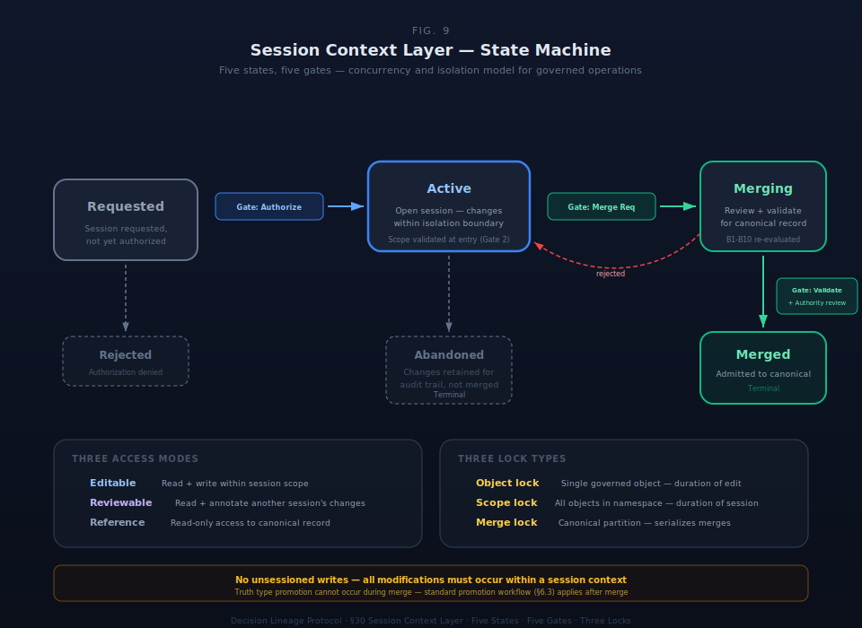

# §30 Session Context Layer (SCL)

This specification section defines implementation contracts for the Decision Lineage Protocol substrate.

The Session Context Layer provides the concurrency and isolation model for governed operations. When multiple actors (human or AI) interact with the organizational world model simultaneously, SCL governs how their changes are isolated, reviewed, and merged into the canonical record.

SCL is an implementation infrastructure section (specification tier). It defines the contract — session lifecycle, checkout semantics, and the lock model — that other sections reference for session isolation. Specific storage implementation details (Dolt branching, PostgreSQL schema DDL, sync protocols) are build-phase infrastructure and do not enter this specification.

---

## §30.1 Architectural Position

SCL sits between the primitive operations (§27) and the storage layer. Every write operation against a governed object occurs within a session context. The session provides:

- **Isolation.** Changes made within a session are invisible to other sessions until merge.
- **Auditability.** The session boundary captures who made what changes, when, and the review process that admitted them to the canonical record.
- **Concurrency.** Multiple sessions may operate simultaneously on different (or overlapping) portions of the world model.

SCL provides the infrastructure for multi-agent collaboration (§A1 describes interaction patterns; SCL governs those interactions at the primitive level). QuickFire mode (§A1.6, Pattern 7), the drift circuit breaker (§A2.12), and session-scoped micro-graduation (§A1.5.1) all reference SCL for session isolation semantics.

---

## §30.2 Session Lifecycle

Sessions transition through five states with gate authorization at each transition.

### Table 30.2.1: Session Lifecycle States

| State | Description | Entry Condition | Exit Transitions |
|---|---|---|---|
| **Requested** | A session has been requested but not yet authorized | Actor requests a session with specified scope | → Active (authorized) or → Rejected (denied) |
| **Active** | Session is open; changes are being made within the isolation boundary | Authority holder authorizes the session request | → Merging (merge requested) or → Abandoned (session discarded) |
| **Merging** | Session changes are being reviewed and validated for merge into the canonical record | Session holder requests merge | → Merged (all gates pass) or → Active (merge rejected, session returns to editing) |
| **Merged** | Session changes have been admitted to the canonical record | All merge validation gates pass | Terminal |
| **Abandoned** | Session discarded without merge; changes are retained for audit trail but do not enter the canonical record | Session holder or authority holder abandons | Terminal |

### Five Gate Authorization

Each state transition requires authorization through one of five gates:

| Gate | Transition | Authorization | Rationale |
|---|---|---|---|
| **Session Authorization** | Requested → Active | Authority holder for the session scope (B5) | Governs who may open sessions and what scope they may touch |
| **Scope Validation** | At Active entry | System validates that requested scope is within the actor's delegation | Prevents scope overreach — actors cannot session into areas outside their authority |
| **Merge Request** | Active → Merging | Session holder | Only the session holder may initiate merge |
| **Merge Validation** | Merging → Merged | System (constraint validation) + Authority holder (review) | Validates that session changes pass all invariant shapes (B1–B10, §5) and constraint evaluation. Authority review ensures human judgment on significant changes. |
| **Conflict Resolution** | During Merging, if canonical record has changed | Authority holder for conflicting scope | When the canonical record was modified by another session during this session's lifetime, the conflict must be resolved by authority |

---

## §30.3 Checkout Model

Sessions operate through a checkout model with three access modes:

| Access Mode | Capabilities | Use Case |
|---|---|---|
| **Editable** | Read and write within session scope | Active work — creating, modifying, or composing governed objects |
| **Reviewable** | Read within session scope + annotation | Review of another session's changes before merge authorization |
| **Reference** | Read-only access to canonical record | Consulting the current state without creating a session |

### Lock Semantics

Three lock types prevent conflicting concurrent modifications:

| Lock Type | Scope | Duration | Conflict Resolution |
|---|---|---|---|
| **Object lock** | Single governed object instance | Duration of active edit | Later session must wait or request conflict resolution |
| **Scope lock** | All objects within a namespace or authority scope | Duration of session | Prevents overlapping sessions on same scope; authority holder may override |
| **Merge lock** | Canonical record partition | Duration of merge validation | Serializes merges to prevent race conditions |

---

## §30.4 Merge Validation

Merge validation ensures that session changes maintain governance integrity when admitted to the canonical record.

**Invariant re-validation.** All behavioral invariant shapes (B1–B10, §5) are re-evaluated against the merged state. A session may internally satisfy all invariants, but the merged combination with canonical-record changes from other sessions may introduce violations.

**Constraint re-evaluation.** Active constraints are re-evaluated against the merged state. Constraint conflicts between session changes and canonical-record changes surface as B8 Signals.

**Truth type preservation.** Session changes cannot promote truth types (Derived → Declared → Authoritative) during merge. Promotion occurs through the standard promotion workflow (§6.3) after merge. This prevents session isolation from being used to bypass human epistemic review (B10, §5).

---

## §30.5 SDK Constraints

**MUST.** Provide session isolation for all write operations. Enforce the five-state lifecycle. Validate all invariant shapes at merge time. Preserve truth type boundaries through session lifecycle. Record session metadata (initiator, scope, duration, merge decision) as governance lineage.

**MUST NOT.** Allow unsessioned writes to the canonical record (all modifications must occur within a session context). Allow truth type promotion during merge. Allow scope overreach (actor cannot modify objects outside their delegation).

**DESIGN SPACE.** Storage implementation (Dolt branching, Git branching, PostgreSQL schema partitioning, or other isolation mechanisms). Lock granularity and timeout configuration. Merge conflict resolution UI and workflow. Session duration limits. Concurrent session limits per actor.

---

## Scope

Scope limited to logical model specification. Transport protocol, serialization format, and implementation languages are DESIGN SPACE.

## Implementation Requirements

SDK implementations MUST respect all invariant shapes, enforce truth type boundaries, and validate all constraints at specified passes. Specification is immutable during lock period. SHACL two-pass validation is mandatory. Truth type boundaries are preserved through all operations. Session isolation is required for all writes.
